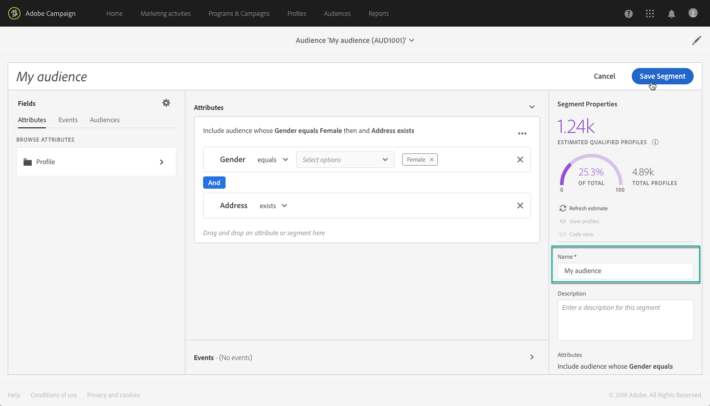

# Managing audiences {#about-audiences}

>[!IMPORTANT]
>
>This capability is currently in beta, and subject to frequent updates and modifications without notice. Data mapping is based on Adobe Experience Platform and requires a specific configuration. Please reach out to Adobe Customer Care if you plan to implement this capability.

## Accessing audiences

Adobe Experience Platform audiences are available from the **[!UICONTROL Audiences]** card on Campaign Standard home page, or from the **[!UICONTROL Audiences]** link. You can duplicate, delete or edit them directly from this list.

They can be identified by the **[!UICONTROL Data Services Query]** label in the **[!UICONTROL Type]** column.

## Creating audiences

Audiences are created directly from the list of audiences. To do this, follow these steps:

1. Go to the list of audiences, then click the **[!UICONTROL Create]** button.

    

1. Choose the **[!UICONTROL Adobe Experience Platform]** segment builder environment.

    

1. The Unified Segment Builder should now be displayed in your workspace. It allows you to build a segment using data from Adobe Experience Platform that will eventually be used to create your audience.

    In order to successfully create a segment, you must specify the desired **[!UICONTROL merge policy]**, name the segment in the right pane and enter a description (optional).

    For more information on merge policies, refer to the dedicated section from the [Segment Builder user guide](https://www.adobe.io/apis/experienceplatform/home/profile-identity-segmentation/profile-identity-segmentation-services.html#!api-specification/markdown/narrative/technical_overview/segmentation/segment-builder-guide.md)

    

1. Define the rules that will identify the profiles to be retrieved in your audience.

    To do this, drag the desired attributes from the left pane into the workspace, define the corresponding rules then click the **[!UICONTROL Create Segment]** button to save the segment (see [Using the Unified Segment Builder](../../audiences/using/aep-using-segment-builder.md)).

    

The audience is now ready to be activated, you can use it as a target for your campaigns (see [Targeting Adobe Experience Platform audiences](../../automating/using/aep-targeting-audiences.md)).

## Deleting and duplicating audiences

To delete or duplicate an audience, hover over it then click the **[!UICONTROL Delete element]** or **[!UICONTROL Duplicate element]** button.

Once duplicated, a copy of the audience is created.

The copy of the audience has the same segment definition as the duplicated audience. The Segment name field is therefore identical for both audiences. If you intend to modify the segment's rules, thereby essentially creating a new segment, we strongly recommend changing its name.

## Editing audiences

To edit an audience, open it and modify the rules as needed within the Unified Segment Builder interface (see [Using the Unified Segment Builder](../../audiences/using/aep-using-segment-builder.md)).

Once the changes have been completed, click the **[!UICONTROL Save Segment]** button to update your audience.

