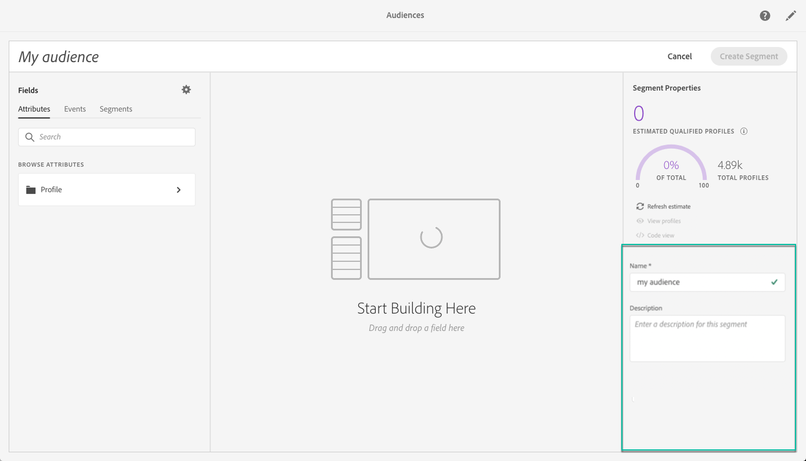

# Using the Unified Segment Builder {#using-the-unified-segment-builder}

>[!IMPORTANT]
>
>Adobe Experience Platform features are currently in beta, and subject to frequent updates and modifications without notice.

The Unified Segment Builder allows you to build audiences by defining rules based on data coming from the [Unified Profile Service](https://www.adobe.io/apis/experienceplatform/home/profile-identity-segmentation.html).

This section presents global concepts when building a segment. For detailed information on the Unified Segment Builder itself, refer to the [Segment Builder user guide](https://www.adobe.io/apis/experienceplatform/home/profile-identity-segmentation/profile-identity-segmentation-services.html#!api-specification/markdown/narrative/technical_overview/segmentation/segment-builder-guide.md).

The Unified Segment Builder interface is composed as follows:

* The left pane provides all fields (e.g., attributes, events and segments) available to build the segment by dragging and dropping desired fields into the segment builder workspace.
* The center area provides a workspace to build the segment by defining and combining rules from the available fields.
* The header and right pane displays the segment's properties (i.e., name, description, and estimated qualified profiles for the segment).

## Building a segment

To build a segment, follow these steps:

1. Name the segment, enter a description (optional), then specify the desired **[!UICONTROL merge policy ]** (this can be done after the rules have been built).

    

1. Look for the desired fields in the left pane, and drag them into the center workspace.

    

1. Configure the rules corresponding to the dragged fields.

    

1. Click the **[!UICONTROL Create segment]** button.

## Finding the right fields for a segment

The left pane lists fields (i.e., attributes, events and segments) that are available for use to construct rules.

The fields listed are attributes captured by your company and can be made available through the [Experience Data Model (XDM) System](https://www.adobe.io/apis/experienceplatform/home/xdm.html).

Fields are organized into tabs:

* **[!UICONTROL Attributes]**: Existing profiles attributes that can originate from your Adobe Campaign database and/or Adobe Experience Platform. They refer to static information attached to a profile (e.g., email address, country of residence, loyalty program status, etc.).

    

* **[!UICONTROL Events]**: Activities that identify consumers who have had some interaction with your company's customer touchpoints, such as “anyone who has ordered twice in two weeks”. This can be streamed from Adobe Analytics, or ingested directly into the Adobe Experience Platform using third-party ETL tools.

    

By default, the Unified Segment builder displays fields for which data is present. To display the full schema, including fields for which data is not present, unselect the option from the settings.

The symbol at the end of each field provides additional information about the attribute and how to use it.

## Defining rules for a segment

>[!NOTE]
>
>The section below provides global information on rules definition. For more on this, refer to the [Segment Builder user guide](https://www.adobe.io/apis/experienceplatform/home/profile-identity-segmentation/profile-identity-segmentation-services.html#!api-specification/markdown/narrative/technical_overview/segmentation/segment-builder-guide.md).

To build a rule, follow these steps:

1. Find the field from the left pane that reflects the attributes or events to which the rule will be based on.

1. Drag the field onto the center workspace, then configure it according to the desired segment definition. To do this, several string and date/time functions are available.

    In the example below, the rule will target all profiles with gender that equals to "Male".

    

    The estimated population corresponding to the segment is automatically recalculated in the **[!UICONTROL Segment Properties]** section. 

1. The **[!UICONTROL View Profiles]** button gives you a preview of the first 20 records corresponding to the rule, enabling you to quickly validate the segment.

    

    You can add as many additional rules as desired, in order to target the right profiles.

    When adding a rule to a container, it will be appended to any existing rules with the AND operator. Click the operator to access the option to change it to OR.

    

Once linked together, the two rules form a container.

## Comparing fields

The Unified Segment Builder lets you compare two fields to define a rule. For example, females whose home address is in a different ZIP code from their work address.

To do this, follow these steps:

1. Drag the first field that you want to compare (e.g., the home address postal code) onto the center workspace.

    

1. Select the second field (e.g., the work address postal code) that will be compared with the first field.

    Drag it onto the center workspace, in the same container as the first field, in the **[!UICONTROL Drop here to compare operands]** box.

    

1. Configure the operator between the two fields as desired. In this example, our segment requires that the home address postal code does not equal the work address one.

    

The rule is now configured and ready to be activated as an audience.
