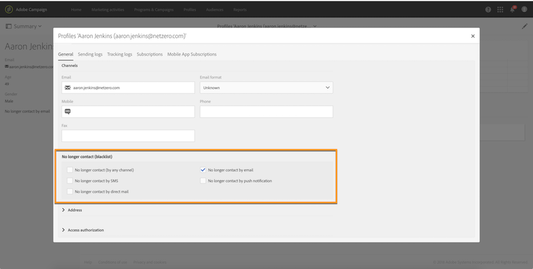

# Blacklisting process

Blacklisting process

## Blacklisting from a recipient's profile

A recipient can be blacklisted (opt-out) by an operator directly from the profile **General** tab.

Select the channel from which you want to exclude the recipient, or the **No longer contact (by any channel)** option to exclude the recipient from all deliveries.

## Blacklisting from a landing page

To give your recipients the ability to be blacklisted (opt-out) from any delivery, you have to create and publish a **BlackList** landing page. For more on landing pages creation, refer to [this page](../../channels/using/about-landing-pages.md).

Once a recipient clicks on the landing page link, the **No longer contact (by any channel)** option in the recipient's profile is automatically selected.

To give your recipients the ability to be blacklisted from a specific channel, you have to create and publish a **Profile acquisition** landing page. The recipients will then be able to select the channels from which they want to be blacklisted. 
