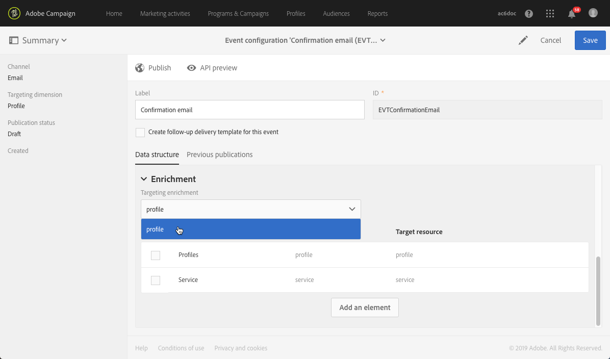
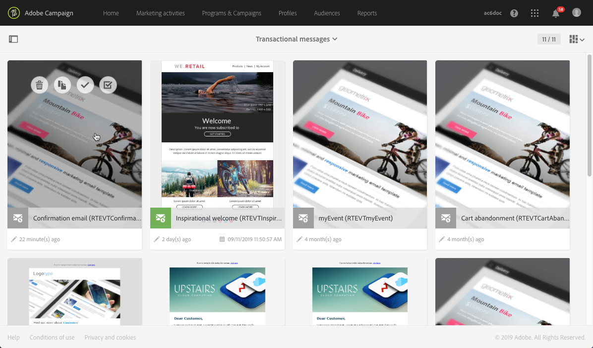

# Confirming subscription to a service{#confirming-subscription-to-a-service}

## About sending subscription confirmation {#sending-subscription-confirmation}

This section describes how to send an automatic custom confirmation email to the profiles who subscribe to a specific service.

To do this, you must create and configure a transactional message. This message can be referenced :
* From the service itself. For more on this, see [Configuring confirmation message from a service](../../audiences/using/confirming-subscription-to-a-service.md#configuring-confirmation-message-from-service]).
* From a subscription landing page. For more on this, see [Configuring confirmation message from a landing page](../../audiences/using/confirming-subscription-to-a-service.md#configuring-confirmation-message-from-landing-page).

## Configuring confirmation message from a service {#configuring-confirmation-message-from-service}

For example, you want to automatically send a confirmation message to the visitors of your website when they subscribe to your brand newsletter.

You need to configure a transactional message so that it can be reconciled with a service, and reference that message from the desired service (in this case, the service being subscription to your brand newsletter).

>[CAUTION]
>
>To link a confirmation message to a service, you must use the **[!UICONTROL publicLabel]** field in your event configuration. This field will be reconciled with the **[!UICONTROL Service label]** of the service. See [Create the event](../../audiences/using/confirming-subscription-to-a-service.md#create-the-event-1).

When configuring it from the service, the confirmation the transactional message will be sent only the first time each visitor subscribes to that service. If a profile is already subscribed, no confirmation message will be sent again to that profile.

### Step 1: Create the confirmation email {#step-1--create-the-confirmation-email-1}

A confirmation email will be automatically sent to each profile subscribing to the newsletter (through a landing page or any other means). The subscription is considered as an event and the email is a [transactional message](../../channels/using/about-transactional-messaging.md) which will target each profile that subscribes to the service.

Steps to create the confirmation email are described below. As the transactional message will be referenced in the service, you need to create it first.

#### Create the event {#create-the-event-1}

The confirmation email is a [transactional message](../../channels/using/about-transactional-messaging.md) as it reacts to an event: the subscription to a service. This message will be sent to confirm subscription to your newsletter.

1. Create an event from the **[!UICONTROL Marketing plans]** > **[!UICONTROL Transactional messages]** > **[!UICONTROL Event configuration]** menu, accessible from the Adobe Campaign logo.
1. Enter a label, select the **[!UICONTROL Profile]** targeting dimension and click **[!UICONTROL Create]**.

   

    The configuration steps are presented in the [Profile-based transactional messages](../../administration/using/configuring-transactional-messaging.md#profile-based-transactional-messages) section.

1. In the **[!UICONTROL Fields]** section, click **[!UICONTROL Create element]** and add **[!UICONTROL publicLabel]** in the data structure to enable reconciliation.

    

    >[NOTE]
    >
    >The **[!UICONTROL publicLabel]** field is mandatory. If you do not add it to the event data structure, Adobe Campaign will not be able to perform reconciliation with the subscribed service. When subscribing to a service, this field will be filled with the **[!UICONTROL Service label]** of the corresponding service.
    
1. Click **[!UICONTROL Add field]** and add another field such as **[!UICONTROL Email]** to the data structure, in order to enable enrichment and reconciliation with the **[!UICONTROL Profiles]** resource.
1. In the **[!UICONTROL Enrichment]** section, click **[!UICONTROL Create element]** and select the **[!UICONTROL Service]** target resource.

    

1. Map the **[!UICONTROL publicLabel]** field of the **[!UICONTROL Service]** resource with the **[!UICONTROL publicLabel]** field of the event configuration in the **[!UICONTROL Join definition]** section.

   

    >[NOTE]
    >
    >This will enable you to use personalization fields from the **[!UICONTROL Service]** resource in the transactional message.

    <!--To be able to personalize the confirmation transactional message with fields from the Service resource, you must enrich the event configuration on **[!UICONTROL Service]** using the **[!UICONTROL publicLabel]** field.-->

1. In the **[!UICONTROL Enrichment]** section, add the **[!UICONTROL Profiles]** resource and set reconciliation on the **[!UICONTROL Email]** field.

    

1. Select **[!UICONTROL profile]** as the **[!UICONTROL Targeting enrichment]** in the drop-down list. Selecting a targeting enrichment is mandatory for profile-based events.

    

1. Save the event configuration and click **[!UICONTROL Publish]** to publish the event.

The event is ready. You can now design the transactional email message.

#### Design the confirmation message {#design-the-confirmation-message-1}

The confirmation email is a transactional message based on the event that you just published.

1. From the Adobe Campaign logo, select **[!UICONTROL Marketing plans]** > **[!UICONTROL Transactional messages]** and click **[!UICONTROL Transactional messages]**.
1. Select the transactional email corresponding to the event that you just published.

    

1. Click the **[!UICONTROL Content]** section and select an email template. For more on editing a transactional message content, see [Profile transactional messages](../../channels/using/profile-transactional-messages.md).
1. As you have direct access to all profile and service information, you can select any field from the **[!UICONTROL Context]** > **[!UICONTROL Service]** node to personalize your content. For more on this, see See [Inserting a personalization field](../../designing/using/inserting-a-personalization-field.md).

    

1. Preview your message using a test profile. For more on this, see [Defining a test profile in a transactional message](../../channels/using/event-transactional-messages.md#defining-a-test-profile-in-a-transactional-message).
    <!--Is it possible to preview with fields from the Service resource? Seems like doesn't work for me-->
1. Click **[!UICONTROL Save & close]** to save your content.
1. Publish the transactional message. See [Publishing a transactional message](../../channels/using/event-transactional-messages.md#publishing-a-transactional-message).

### Step 2: Create and configure the service {#step-2--create-and-configure-the-service-1}

1. From the advanced menu **Profiles & audiences** > **Services** via the Adobe Campaign logo, create a service.
1. Go to the **[!UICONTROL Service properties]** section, accessed via the  button in the service dashboard.
1. Fill in the **[!UICONTROL Service label]** field. This label will be displayed in the confirmation message and in the subscription landing page if any.

    

1. In the **[!UICONTROL Confirmation messages]** section, select **[!UICONTROL Custom message]**: this mode allows you to reference a specific confirmation message for profiles subscribing to your service.
1. Select the **[!UICONTROL Custom subscription event configuration]** associated with the transactional message that you created.

    

1. Click **[!UICONTROL Confirm]** and save the service. It is now ready to be used.

### Step 3: Publish the transactional message {#step-3--publish-transactional-message-1}

1. Go back to the transactional message through the **[!UICONTROL Marketing plans]** > **[!UICONTROL Transactional messages]** > **[!UICONTROL Transactional messages]** menu.
1. Preview your message using a test profile. For more on this, see [Defining a test profile in a transactional message](../../channels/using/event-transactional-messages.md#defining-a-test-profile-in-a-transactional-message).
    <!--Is it possible to preview with fields from the Service resource? Seems like doesn't work for me: ISSUE-->
1. Publish the transactional message. See [Publishing a transactional message](../../channels/using/event-transactional-messages.md#publishing-a-transactional-message).

Now each time a profile subscribes to this service, he receives the transactional message that you defined, with personalized fields mapped to the selected service. A message will be sent only the first time the user subscribes.
<!--ISSUE: Transactional message is received but not personalized with Service field.-->

## Configuring confirmation message from a landing page {#configuring-confirmation-message-from-landing-page}

You can also reference the confirmation message from a subscription landing page by using the **[!UICONTROL Start sending messages]** option from the **[!UICONTROL Job]** section of the landing page.

>[CAUTION]
>
>To link a confirmation message to a landing page, you must use the **[!UICONTROL serviceName]** field in your event configuration. This field will be reconciled with the **[!UICONTROL @name]** attribute of the service. See [Create the event](../../audiences/using/confirming-subscription-to-a-service.md#create-the-event-2).

When referencing the confirmation message from the landing page, a message will be sent each time the landing page is submitted (even if the user is already subscribed).

### Step 1: Create the confirmation email {#step-1--create-the-confirmation-email-2}

A confirmation email will be automatically sent to each profile subscribing to the newsletter through a landing page. The subscription is considered as an event and the email is a is a [transactional message](../../channels/using/about-transactional-messaging.md) which will target each profile that subscribes to the service.

Steps to create these elements are described below. As the transactional message will be referenced in the landing page, you need to create it first.

#### Create the event {#create-the-event-2}

The confirmation email is a [transactional message](../../channels/using/about-transactional-messaging.md) as it reacts to an event: the subscription to a service. This message will be sent to confirm subscription to your newsletter.

1. Create an event from the **[!UICONTROL Marketing plans]** > **[!UICONTROL Transactional messages]** > **[!UICONTROL Event configuration]** menu, accessible from the Adobe Campaign logo.
1. Enter a label, select the **[!UICONTROL Profile]** targeting dimension and click **[!UICONTROL Create]**.
The configuration steps are presented in the [Profile-based transactional messages](../../administration/using/configuring-transactional-messaging.md#profile-based-transactional-messages) section.

1. In the **[!UICONTROL Fields]** section, click **[!UICONTROL Create element]** and add **[!UICONTROL serviceName]** in the data structure to enable reconciliation.
    
   

    >[NOTE]
    >
    >The **[!UICONTROL serviceName]** field is mandatory. If you do not add it to the event data structure, Adobe Campaign will not be able to perform reconciliation with the subscribed service.

1. Click **[!UICONTROL Add field]** and add another field such as **[!UICONTROL Email]** to the data structure, in order to enable enrichment and reconciliation with the **[!UICONTROL Profiles]** resource.
1. In the **[!UICONTROL Enrichment]** section, click **[!UICONTROL Create element]** and select the **[!UICONTROL Service]** target resource.
1. Map the **[!UICONTROL serviceName]** field of the **[!UICONTROL Service]** resource with the **[!UICONTROL name]** field of the event configuration in the **[!UICONTROL Join definition]** section.

   

    >[NOTE]
    >
    >This will enable you to use personalization fields from the [!UICONTROL Service]  resource in the transactional message.

1. In the **[!UICONTROL Enrichment]** section, add the **[!UICONTROL Profiles]** resource and set reconciliation on the **[!UICONTROL Email]** field.
1. Select **[!UICONTROL profile]** as the **[!UICONTROL Targeting enrichment]** in the drop-down list. Selecting a targeting enrichment is mandatory for profile-based events.
1. Save the event configuration and and click **[!UICONTROL Publish]** to publish the event.

The event is ready. You can now design the transactional email message.

#### Design the confirmation message {#design-the-confirmation-message-2}

The steps for designing the transactional message are presented in this [section](../../audiences/using/confirming-subscription-to-a-service.md#design-the-confirmation-message-1).

### Step 2: Create and configure the service {#step-2--create-and-configure-the-service-2}

1. From the advanced menu **[!UICONTROL Profiles & audiences]** > **[!UICONTROLServices]** via the Adobe Campaign logo, create a service.
1. Go to the **[!UICONTROL Service properties]** section, accessed via the  button in the service dashboard.
1. Fill in the **[!UICONTROL Service label]** field. This label will be displayed in the confirmation message and in the subscription landing page.
1. Click **[!UICONTROL Confirm]** and save the service.

### Step 3: Publish the transactional message {#step-3--publish-transactional-message-2}

The steps for publishing the transactional message are presented in this [section](../../audiences/using/confirming-subscription-to-a-service.md##step-3--publish-transactional-message-1).

### Step 4: Create and configure the landing page {#step-4--create-and-configure-the-landing-page}

Create a subscription landing page which will be published on your website.

To create and configure this landing page, follow the steps below:

1. Design a [new landing page](../../channels/using/about-landing-pages.md) based on the **[!UICONTROL Subscription]** template.
1. Edit the landing page properties. In the **[!UICONTROL Job]** > **[!UICONTROL Specific actions]** section, select the **[!UICONTROL Specific service]** option and choose the service that you just created from the drop-down list.

    

1. Select the **[!UICONTROL Start sending message]** option and choose the transactional message that you just created from the drop-down list.

   

1. Customize the content of the landing page.

1. [Test and publish](../../channels/using/sharing-a-landing-page.md) the landing page.

Now each time a profile subscribes to your newsletter by submitting the landing page, he receives the confirmation message that you defined with personalized fields mapped to the service.

>[NOTE]
>
>A message will be sent each time the landing page is submitted, even if the profile is already subscribed.
