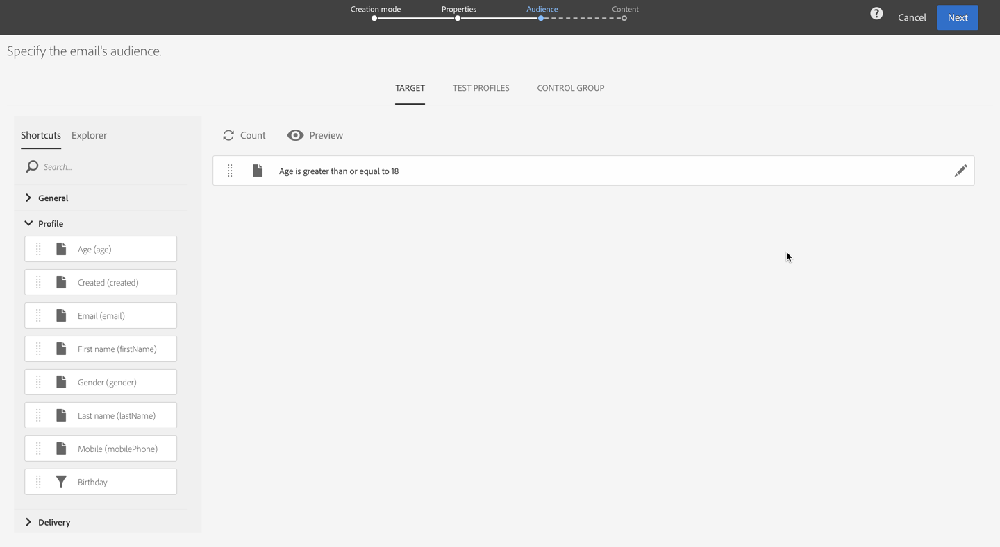
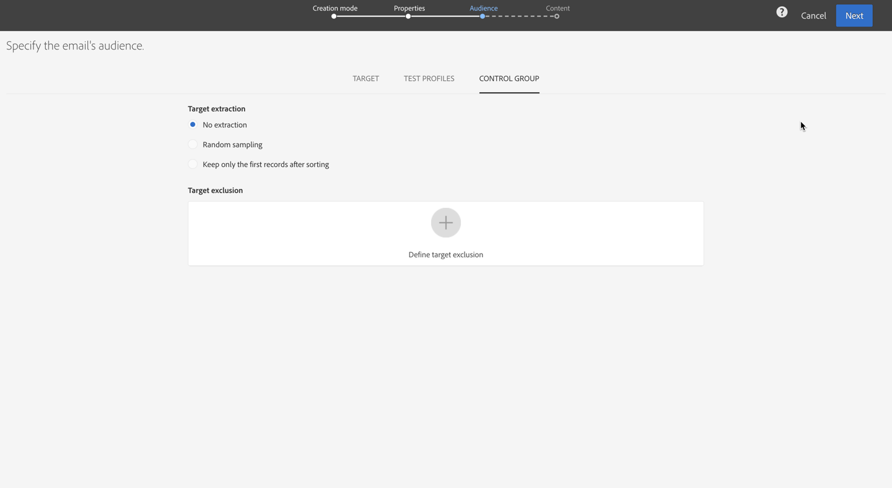
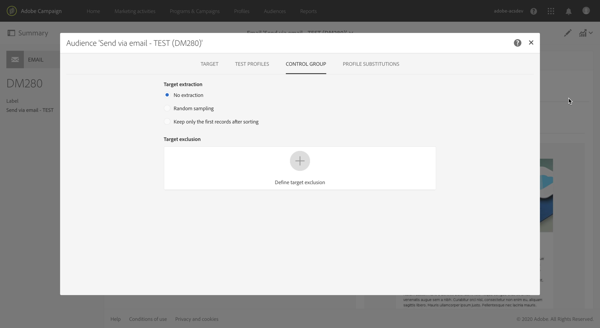
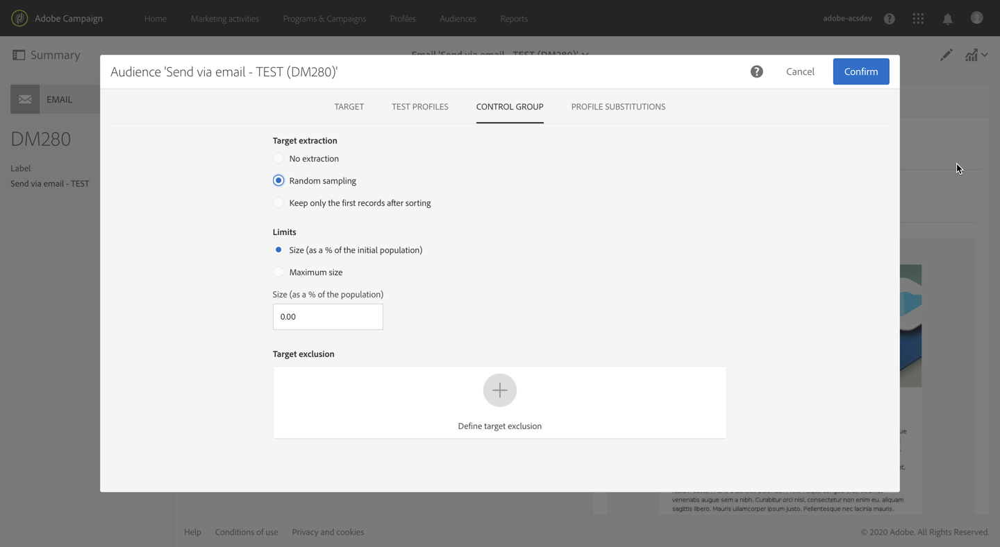
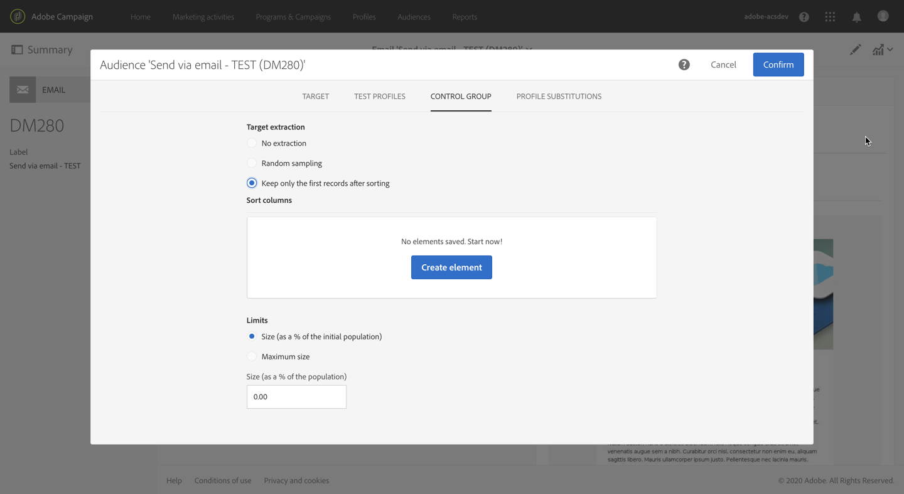
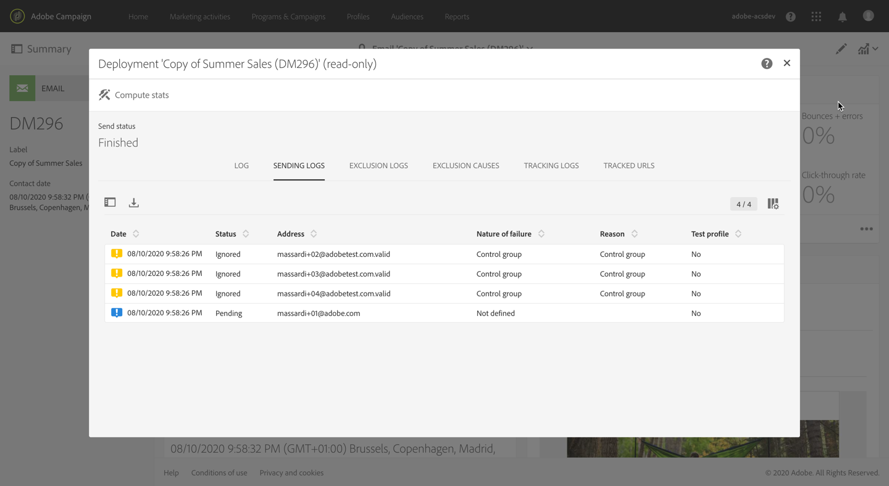
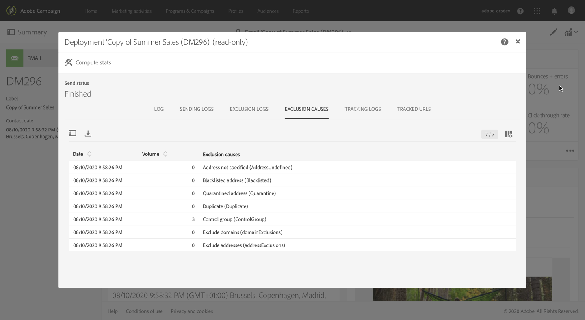

# Defining a control group {#defining-control-group}

To measure the impact of a delivery, you may want to exclude some profiles from your target so that they will not receive a given message. This control group can be used to make a comparison with the behavior of the target population which received the message.

To do this in Adobe Campaign Standard, you can create a control group when defining your main target.

## Overview {#overview}

The control group can be extracted from the main target and/or come from a specific group or query?

There are two main ways you can define a control group:
* Extracting part of your target (percentage or fixed number), randomly or based on a sorting. To do this, use the **[!UICONTROL Target extraction]** option.
* Excluding some profiles based on criteria that you define. To do this, use the **[!UICONTROL Target exclusion]** option.

You can use a combination of the two. All profiles that are extracted and excluded will be removed from the main target and will not receive the delivery.

There are four options to define a control group:
* Select a percentage of the population, randomly or based on a sorting. See 
* Select a fixed number of profiles to exclude, randomly or based on a sorting. See 
* Select a pre-defined audience.
* Select profiles based on a query.

<!--You can define a control group at the delivery level or in a workflow.
Can you define it at the campaign level? If so, how?
Can you define it for anything else?
Can you reuse a control group in a delivery, a workflow, a campaign, something else?
Can you use a control group for all channels? email, SMS, direct mail-->

## Percentage of the population

Select a percentage of the population, randomly or based on a sorting.

To do this:
1. Under the **[!UICONTROL Target extraction]** section, do either one of the following:
    
    * Select **[!UICONTROL Random sampling]**.
    * Or select **[!UICONTROL Keep only the first records after sorting]** and define an expression
    
1. Select **[!UICONTROL Size (as a % of the initial population)]**.
1. Fill in the **[!UICONTROL Size (as a % of the population)]** frame.

## Fixed number of profiles

Select a fixed number of profiles to exclude, randomly or based on a sorting.

To do this:
1. Under the **[!UICONTROL Target extraction]** section, do either one of the following:

    * Select **[!UICONTROL Random sampling]**.
    * Or select **[!UICONTROL Keep only the first records after sorting]** and define an expression.

1. Select **[!UICONTROL Maximum size]** and fill in the corresponding frame.

## Audience

Select a pre-defined audience.

To do this:

1. Under the **[!UICONTROL Target extraction]** section, select **[!UICONTROL No extraction]**.
1. From the **[!UICONTROL Target exclusion]** section, click the **[!UICONTROL Define target exclusion button]**
1. Select an audience.

>[!NOTE]
>
>For more on creating an audience, see [this section](../../audiences/using/creating-audiences.md).
>For more on audiences, see [this section](../../audiences/using/about-audiences.md).

## Based on a query

Select profiles based on a query.

To do this:

1. Under the **[!UICONTROL Target extraction]** section, select **[!UICONTROL No extraction]**.
1. From the **[!UICONTROL Target exclusion]** section, click the **[!UICONTROL Define target exclusion button]**
1. Define a query.

The profiles matching the query criteria will be excluded from the target. For more on using the query editor, see the [Editing queries](automating/using/editing-queries.md) section.

## Example {#creating-a-control-group}

1. Create a delivery. For more on this, see [Creating a marketing activity](../../start/using/marketing-activities.md#creating-a-marketing-activity) section.
1. Define the target of your message. For more on this, see [About profiles](../../audiences/using/about-profiles.md).

    

    When editing a delivery, from the delivery dashboard, click the **[!UICONTROL Audience]** block.

1. Select the **[!UICONTROL Control group]** tab.

    

1. From the **[!UICONTROL Target extraction]** section, select one of the following options:

    * **[!UICONTROL No extraction]**: select this option if you do not want to use the **[!UICONTROL Target extraction]** option. You must define a control group in the **[!UICONTROL Target exclusion]** section. (The target that you define as the control group will simply be excluded.)

    

    * **[!UICONTROL Random sampling]**: you can define a percentage or a maximum number of the targeted population. For example, if you enter 10%, the control group will be made up of 10% from the targeted population, selected randomly.

    

    * **[!UICONTROL Keep only the first records after sorting]**: select a criterion, for example "email", to sort on the email: 10% of the targeted population will be excluded based on the email taken in descending alphabetical order.
    Another example: if you sort on the age and set 20 as the maximum size, leaving the Descending sort option checked, the 20 older profiles from your target will be excluded. If you uncheck the Descending sort option, the 20 younger profiles will be excluded.

    

1. From the **[!UICONTROL Target exclusion]** section, define the profiles that will be excluded from your target based on the criteria of your choice using the query editor. For more on using the query editor, see the [Editing queries](automating/using/editing-queries.md) section. For example, Email starts with "ba" or "Age is greater than 20".

1. Launch the delivery preparation. See [Preparing the send](../../sending/using/preparing-the-send.md).
1. Confirm sending (see [Preparing the send](../../sending/using/preparing-the-send.md)).
The control group will be excluded from the delivery.

## Reporting {#reporting}

1. Check the **[!UICONTROL Sending logs]**. You can see the excluded profiles with the **[!UICONTROL Ignored]** status and **[!UICONTROL Control group]** as the reason of failure.

    

1. You can also check the **[!UICONTROL Exclusion causes]** tab to see the number of profiles excluded from the delivery.

    

1. You can extract logs to compare how the control group that did not receive the communication reacted compared to the effective target.

>[!NOTE]
>
>As dynamic reporting is based on the delivery dimension, no report is available to analyze the control group that is excluded.

<!--As Dynamic Reporting are based on Delivery dimension, we cannot analyze what is excluded. We won’t change this behavior and this is the reason why Dynamic Reporting cannot help us here.
Also, we won’t build dedicated report for this.

## Reusing the same control group {#reusing-same-control-group}

The example above enables to create a global control group, as this is stored as a profile attribute independently from deliveries.

Consequently, next time you want to use the same control group, you can segment on the new “Control group” field rather than doing a random segmentation.

Can you do this?-->
