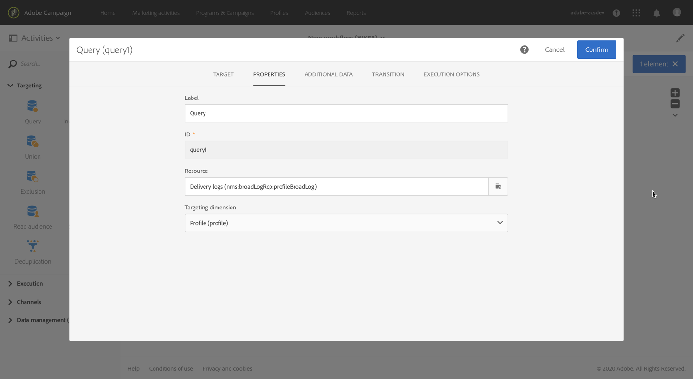

# Defining a control group {#defining-control-group}

To measure the impact of a delivery, you may want to exclude some profiles from your target so that they will not receive a given message.

This control group can be used to make a comparison with the behavior of the target population which received the message and the sending logs can be used in other campaigns.

To do this in Adobe Campaign Standard, you can create a control group when defining the main target of your delivery.

The control group is built when the delivery is prepared.

## Overview {#overview}

The control group can be extracted from the main target and/or come from a specific group or query.

There are two main ways you can define a control group:
* Extract a percentage or a number of profiles from the main target, randomly or based on a sorting.
* Exclude some profiles based on criteria that you define.

All profiles that are extracted and/or excluded will be removed from the main target and will not receive the delivery.

There are four options to define a control group:
* Select a percentage of the population, randomly or based on a sorting. See 
* Select a fixed number of profiles to exclude, randomly or based on a sorting. See 
* Select a pre-defined audience.
* Select profiles based on a query.

<!--You can define a control group at the delivery level or in a workflow.
Can you define it at the campaign level? If so, how?
Can you define it for anything else?
Can you reuse a control group in a delivery, a workflow, a campaign, something else?
Can you use a control group for all channels? email, SMS, direct mail-->

## Extracting part of the target population

To define your control group, you can choose to extract a percentage or a fixed number of profiles from the target population, randomly or based on a sorting.

### Target extraction

First, define the way the profiles will be extracted from the target: randomly or based on a sorting.

Under the **[!UICONTROL Target extraction]** section, select one of the following:
    
* **[!UICONTROL Random sampling]**. When preparing the delivery, Adobe Campaign will randomly extract a number of profiles corresponding to the percentage or to the maximum number that you will set.
* **[!UICONTROL Keep only the first records after sorting]** and define an expression. For example, you can select the age.

>[!NOTE]
>
>Select the **[!UICONTROL No extraction]** option if you do not want to use the **[!UICONTROL Target extraction]** option.

### Size limit
    
Set how you are going to limit the profiles that you extract from the main target. Do either one of the following:
    
* Select **[!UICONTROL Size (as a % of the initial population)]** and fill in the **[!UICONTROL Size (as a % of the population)]** frame. For example, if you set 2, depending on the option you selected above, Adobe Campaign will either:
    * Randomly extract 2% of the population.
    * Extract the 2% youngest profiles of the population.

* Select **[!UICONTROL Maximum size]** and fill in the corresponding frame. For example, if you set 50, Adobe Campaign will either:
    * Randomly extract 50 profiles from the target population.
    * Extract the 50 youngest profiles of the population.

## Excluding a specific group

Another way to define a control group is to exclude a specific group from the target using a query.

To do this:

1. From the **[!UICONTROL Target exclusion]** section, click the **[!UICONTROL Define target exclusion button]**
1. You can either:
    * Select an audience that was previously created from the left palette and drag it to the main area.
    * Define any other query through the query editor.

>[!NOTE]
>
>For more on creating an audience, see [this section](../../audiences/using/creating-audiences.md).
>For more on audiences, see [this section](../../audiences/using/about-audiences.md).

The profiles matching the audience or the query criteria will be excluded from the target. For more on using the query editor, see the [Editing queries](automating/using/editing-queries.md) section.

## Example {#creating-a-control-group}

1. Create a workflow. The detailed steps to create a workflow are presented in the [Building a workflow](../../automating/using/building-a-workflow.md) section.
1. In **[!UICONTROL Activities]** > **[!UICONTROL Targeting]**, drag and drop a [Query](../../automating/using/query.md) activity.
1. Double-click the activity to define your target. For example, in **[!UICONTROL Shortcuts]**, drag and drop **[!UICONTROL Profile]**, select **[!UICONTROL Age]** with the operator **[!UICONTROL Greater than]** and type 25 in the **[!UICONTROL Value]** field.

    

1. In **[!UICONTROL Activities]** > **[!UICONTROL Channels]**, drag and drop an [Email delivery](../../automating/using/email-delivery.md) activity after the main target segment and edit it.
1. Double-click the Email delivery activity and click the **[!UICONTROL Audience]** block from the delivery dashboard.

1. Select the **[!UICONTROL Control group]** tab.

    

1. From the **[!UICONTROL Target extraction]** section, select one of the following options:

    * **[!UICONTROL Random sampling]**: you can define a percentage or a maximum number of the targeted population. For example, if you enter 10%, the control group will be made up of 10% from the targeted population, selected randomly.

    

    * **[!UICONTROL Keep only the first records after sorting]**: select a criterion, for example "email", to sort on the email: 10% of the targeted population will be excluded based on the email taken in descending alphabetical order.
    Another example: if you sort on the age and set 20 as the maximum size, leaving the Descending sort option checked, the 20 older profiles from your target will be excluded. If you uncheck the Descending sort option, the 20 younger profiles will be excluded.

    

1. From the **[!UICONTROL Target exclusion]** section, define the profiles that will be excluded from your target based on the criteria of your choice using the [query editor](../../automating/using/editing-queries.md). For example, Email starts with "ba" or "Age is greater than 20".

1. Launch the delivery preparation. See [Preparing the send](../../sending/using/preparing-the-send.md).
1. Confirm sending (see [Confirming the send](../../sending/using/confirming-the-send.md)).

The profiles that were extracted from the target and the ones that were defined based on the query will be excluded from the delivery.

## Using the logs {#using-logs}

Check the **[!UICONTROL Sending logs]**. You can see the extracted and excluded profiles with the **[!UICONTROL Ignored]** status and **[!UICONTROL Control group]** as the reason of failure.

You can also check the **[!UICONTROL Exclusion causes]** tab to see the number of profiles excluded from the delivery.

Now that you sent your delivery, what can you do with the control group?

You can extract the sending logs to compare how the control group that did not receive the communication reacted compared to the effective target.

You can also use the sending logs to do another targeting. To do this:

1. Create a workflow. The detailed steps to create a workflow are presented in the [Building a workflow](../../automating/using/building-a-workflow.md) section.
1. In **[!UICONTROL Activities]** > **[!UICONTROL Targeting]**, drag and drop a [Query](../../automating/using/query.md) activity.
1. In the **[!UICONTROL Properties]** tab, set **[!UICONTROL Delivery logs]** as the **[!UICONTROL Resource]** and **[!UICONTROL Profile]** as the **[!UICONTROL Targeting dimension]**.

    

1. In the **[!UICONTROL Target]** tab, go to **[!UICONTROL Delivery logs]**.
1. Drag and drop **[!UICONTROL Status]** and select **[!UICONTROL Ignored]**.

    

1. Drag and drop **[!UICONTROL Nature of failure]** and select **[!UICONTROL Control group]**.

    

1. Click **[!UICONTROL Confirm]**.

    

You can now target the control group using the sending logs of your delivery.
