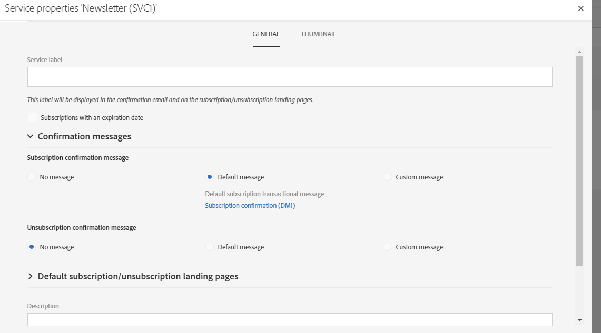

# Creating a service{#creating-a-service}

Creating a service

In order to be able to manage subscriptions, you first need to create a service and configure it. Configuring a new service allows you to specify the email confirmations that the profiles will receive when they subscribe to or unsubscribe from the service. You will also define the subscription and unsubscription landing pages linked to the service. For example, a service subscription link inserted into an email will automatically direct the profile to the subscription landing page that is specified in the service.

To configure a service:

1. From the advanced menu **Profiles & audiences** > **Services** via the Adobe Campaign logo, add a new service or select an existing service. If you create a new service, simply follow the steps shown on the screen.

   A default service template is available. This template is pre-configured with default landing pages and confirmation emails. You can create other templates to define specific configurations. For more on this, refer to the [Managing templates](../../start/using/about-templates.md) section.

1. In the **Service properties** section, accessed via the  button in the service dashboard, configure the confirmation messages for subscriptions and unsubscriptions.

   

1. Select a confirmation message template for subscriptions and unsubscriptions. Three modes are available:

    * **[!UICONTROL No message]** : this mode allows you to create a service without a confirmation message.
    * **[!UICONTROL Default message]** : this mode will use the default subscription or unsubscription confirmation transactional message. The default confirmation messages are generic and will be the same for all services that use the default mode.
    * **[!UICONTROL Custom message]** : this mode allows you to handle custom confirmation messages, specific for each service. You then select the **[!UICONTROL Custom subscription event configuration]** which is associated with a specific transactional message template. Refer to [Transactional messages](../../channels/using/about-transactional-messaging.md) for more information on transactional event and message configuration.

1. Save the service. It is now ready to be used.

Once a service has been created, you can start promoting it.

**Related topics:**

* [Managing a service and subscriptions](https://helpx.adobe.com/campaign/kt/acs/using/acs-services-and-subscriptions-feature-video-use.html) video
* 
* 
*

