# Creating audiences{#creating-audiences}

Creating audiences

## Creating query audiences {#creating-query-audiences}

This section describes how to create a **Query** audience. You can also create audiences from importing a file or targeting in a [workflow](../../automating/using/discovering-workflows.md).

From the audience list, you can create audiences by performing queries on Adobe Campaign profiles or importing an Adobe Experience Cloud audience.

1. Go to the audience list via the **[!UICONTROL Audiences]** tab or card.

   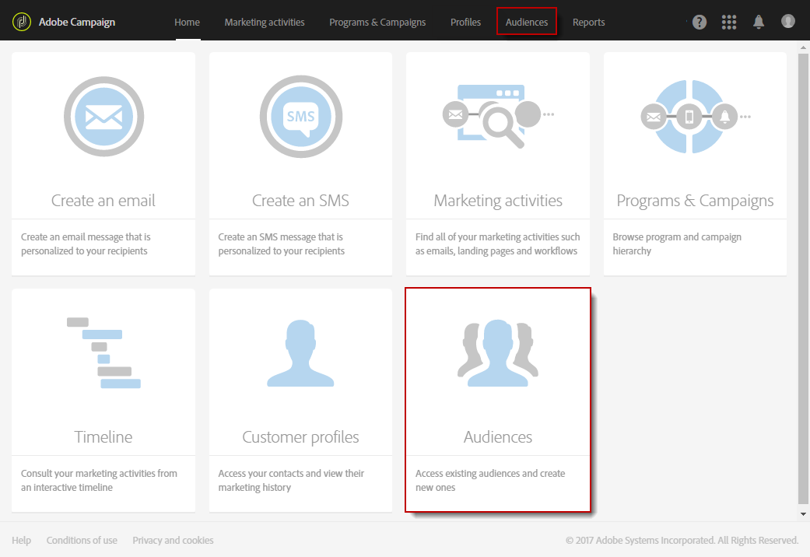

1. Select **[!UICONTROL Create]** to access the screen to create a new audience.

   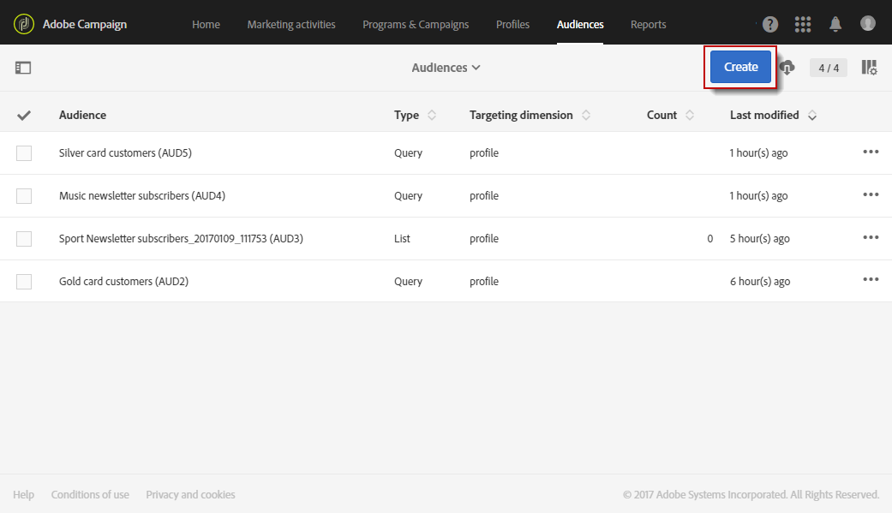

1. Name your audience. The audience label is used in the list of audiences and in the palette of the query tool.
1. Choose a **[!UICONTROL Query]** audience type: the audiences defined by a query are recomputed at each further use.

   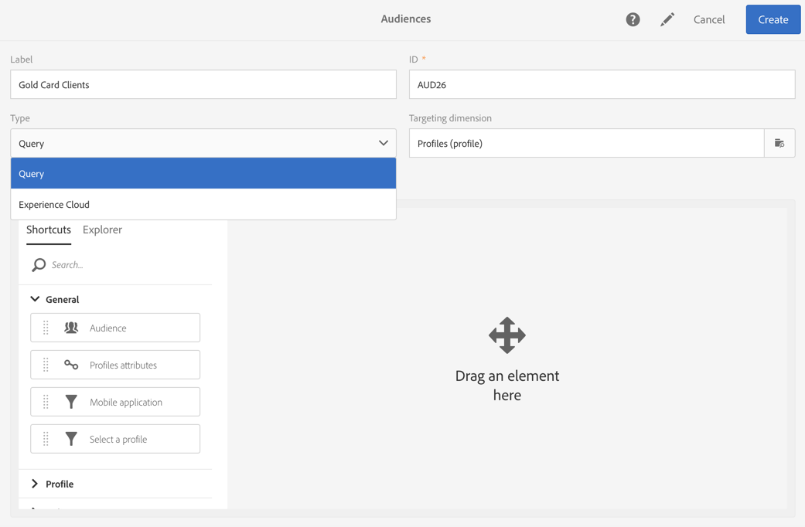

1. Then select the **[!UICONTROL Targeting dimension]** that you would like to use to filter your customers. Each audience is made up of a single targeting dimension. For example, you cannot create an audience made up of both profiles, test profiles and subscribers. For more on targeting dimensions, refer to [this page](../../automating/using/query.md#targeting-dimensions-and-resources). 
1. Create the query to define the audience population. Refer to the section on [editing queries](../../automating/using/editing-queries.md).
1. Click the **[!UICONTROL Create]** button to save your audience.

>[!NOTE]
>
>You can add a description to this audience and define the access authorizations via the **[!UICONTROL Edit properties]** icon.

## Creating list audiences {#creating-list-audiences}

This section describes how to create a **List** audience after targeting in a workflow. You can also create audiences by importing a file into a [workflow](../../automating/using/discovering-workflows.md) or via a query from the **[!UICONTROL Audiences]** menu.

To create a **List** audience, the steps are as follows:

1. In the **Marketing activities** tab, click **Create** then select **Workflow**.

   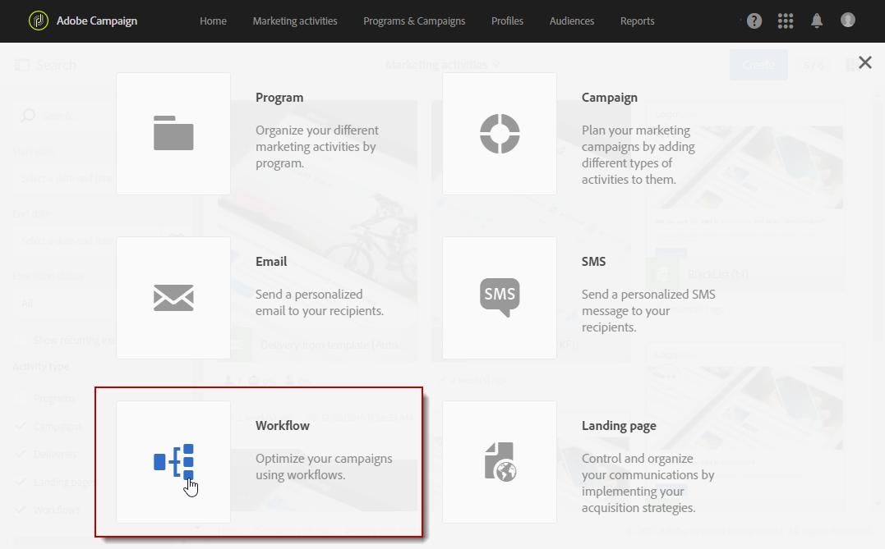

1. Drag and drop, and then configure the targeting activities which will allow you to select a population that has a **known** dimension. The list of available activities and their configuration are detailed in the [Targeting activities](../../automating/using/about-targeting-activities.md) section.

   You can use a **[!UICONTROL Query]** activity, or import data using a **[!UICONTROL Load file]** activity before using a **[!UICONTROL Reconciliation]** activity to identify the dimension of the data imported. Here, we want to target recipients who subscribed to the Sport Newsletter with a **[!UICONTROL Query]** activity .

   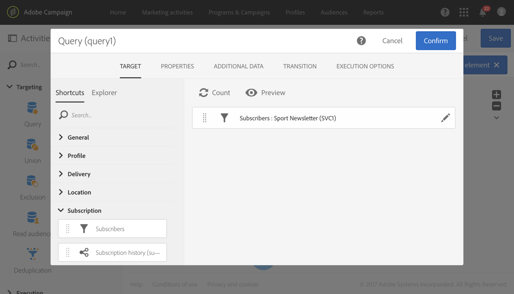

1. After your targeting, drag and drop a **[!UICONTROL Save audience]** activity into your workflow. For example, you can chose to **[!UICONTROL Create or update an audience]** , this allows you to create then automatically update your audience with new data. In this case, add a **[!UICONTROL Scheduler]** activity at the beginning of your workflow.

   For more information on configuring this activity, refer to the [Save audience](../../automating/using/save-audience.md) section.

   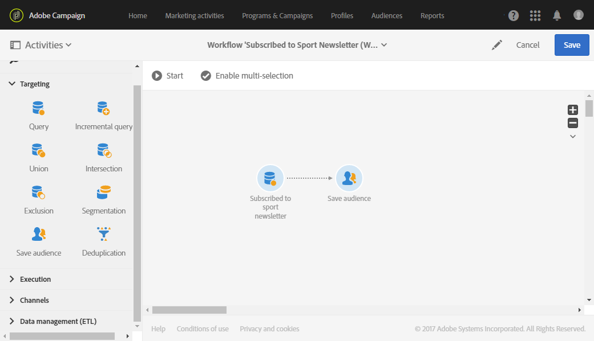

1. Save and start the workflow.

   As the **[!UICONTROL Save audience]** is placed after a targeting with a known dimension, the audiences created via this activity are **List** audiences.

   The content of the saved audience is then available in the audience's detailed view that can be accessed via the list of audiences. The columns available from this view correspond to the columns of the inbound transition of the workflow's save activity. For example: the columns of the file imported, the additional data added from a query.

   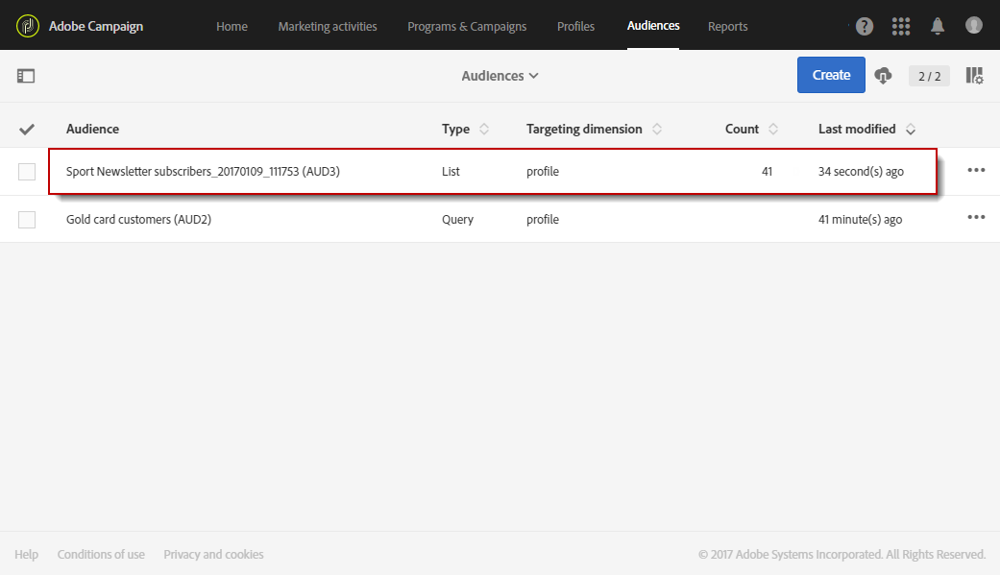

## Creating file audiences {#creating-file-audiences}

This section details how to create a **File** audience by importing a file into a workflow. You can also create audiences from a targeting activity in a [workflow](../../automating/using/discovering-workflows.md) or via a query from the **[!UICONTROL Audiences]** menu.

To create a **File** audience, the steps are as follows:

1. In the **Marketing activities** tab, click **Create** then select **Workflow**.
1. Drag and drop, and then configure a **[!UICONTROL Load file]** activity which will allow you to import a population that has an **unknown** dimension when the workflow is executed. For more information on configuring this activity, refer to the [Load file](../../automating/using/load-file.md) section.

   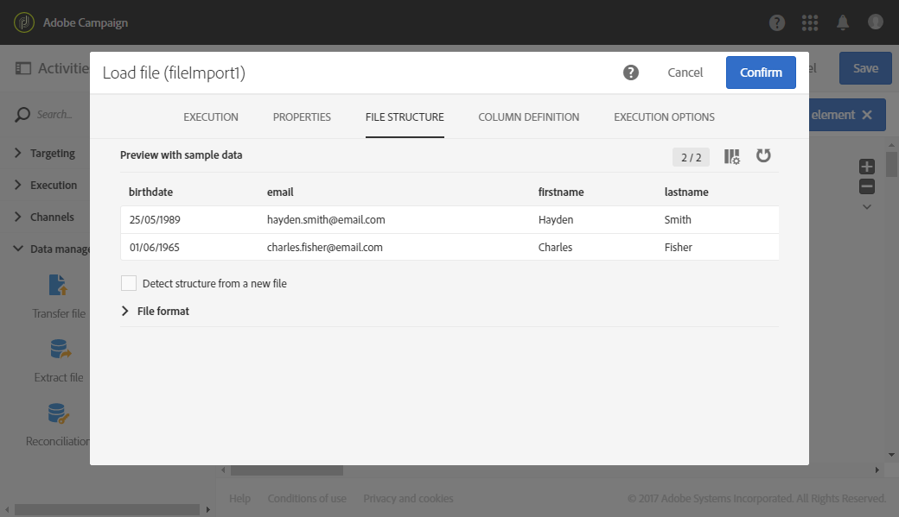

1. Drag and drop a **[!UICONTROL Save audience]** activity after the **[!UICONTROL Load file]** activity. For more information on configuring this activity, refer to the [Save audience](../../automating/using/save-audience.md) section.
1. Save and start the workflow.

   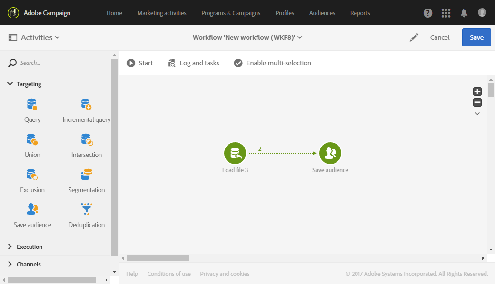

   As the **[!UICONTROL Save audience]** is placed after an import, the data dimension is unknown and the audiences created via this activity are **File** audiences.

   The content of the saved audience is then available in the audience's detailed view that can be accessed via the list of audiences. The columns available from this view correspond to the columns of the inbound transition of the workflow's save activity. For example: the columns of the imported file, the additional data added from a query.

   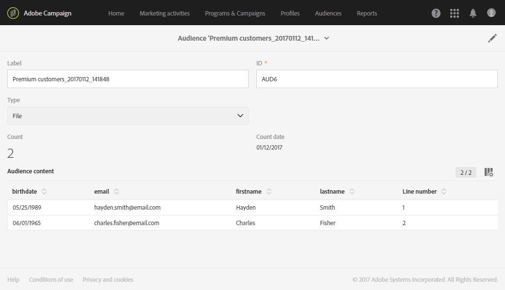

## Creating Experience Cloud audiences {#creating-experience-cloud-audiences}

Adobe Campaign allows you to share and exchange audiences with Adobe Experience Cloud. An **Experience Cloud** type audience is directly imported from People core service to Adobe Campaign with the **[!UICONTROL Import shared audience]** technical workflow.

Unlike **Query** type audience which will query profiles from Adobe Campaign, the **Experience Cloud** audience is composed of a list of Visitor IDs.

For this integration to work, you first need to configure it. For more information on configuration and how to import or export audiences with People core service, refer to the following [section](../../integrating/using/sharing-audiences-with-audience-manager-or-people-core-service.md).

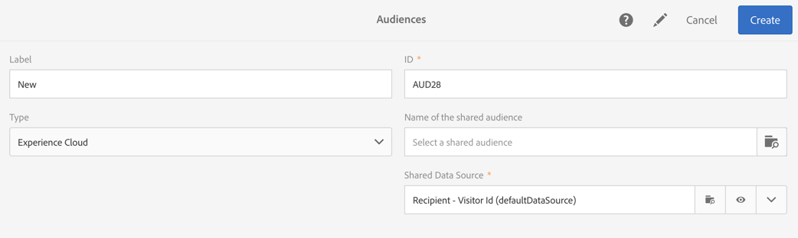

## Editing audiences {#editing-audiences}

There are different ways to edit an audience depending on the audience type:

* To edit a **Query** audience, go to the list of audiences via the **[!UICONTROL Audiences]** menu, or the **[!UICONTROL Audiences]** card from the Adobe Campaign home page.

  Open the relevant audience. All of the elements of a previously created audience can be edited.

  >[!CAUTION]
  >
  >If you change the **[!UICONTROL Filtering dimension]** in the query, the rules that have previously been defined will be lost.

* To edit a **List** or **File** audience, edit the workflow from which it was created and modify the **[!UICONTROL Save audience]** activity. Start the workflow so that the audience is modified.
* To edit an **Experience Cloud** audience, refer to the [Importing/Exporting audiences with People core service](../../integrating/using/sharing-audiences-with-audience-manager-or-people-core-service.md) section.

## Deleting audiences {#deleting-audiences}

There are two ways to delete one or multiple audiences. First you can add an expiration date to your audience

To do so:

1. Access one of your audience.
1. Click the  

   button to access your audience's configuration.

   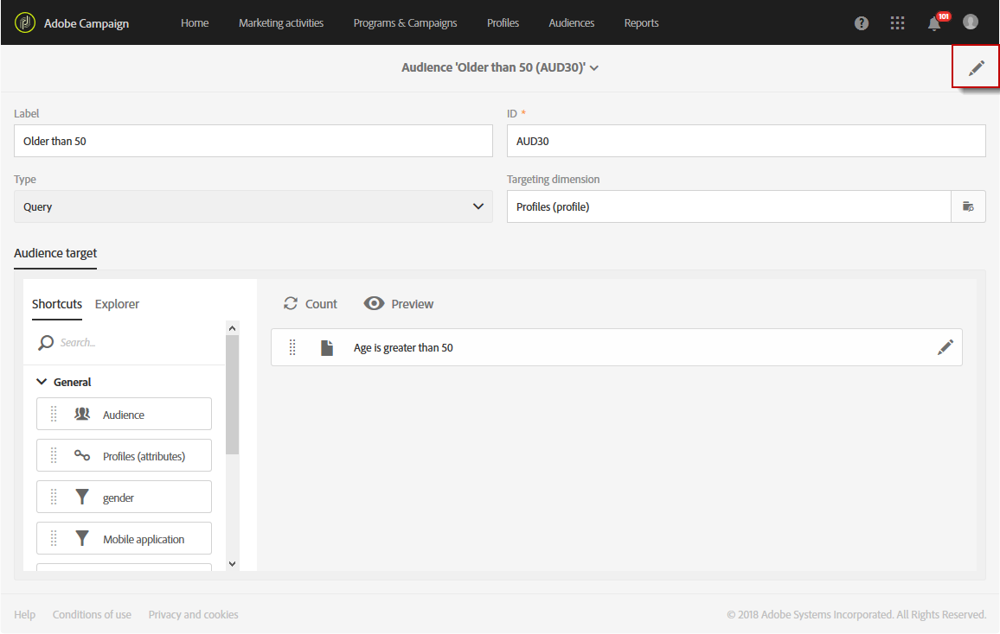

1. In the **[!UICONTROL Expires on]** field, add an expiration date to your audience.

   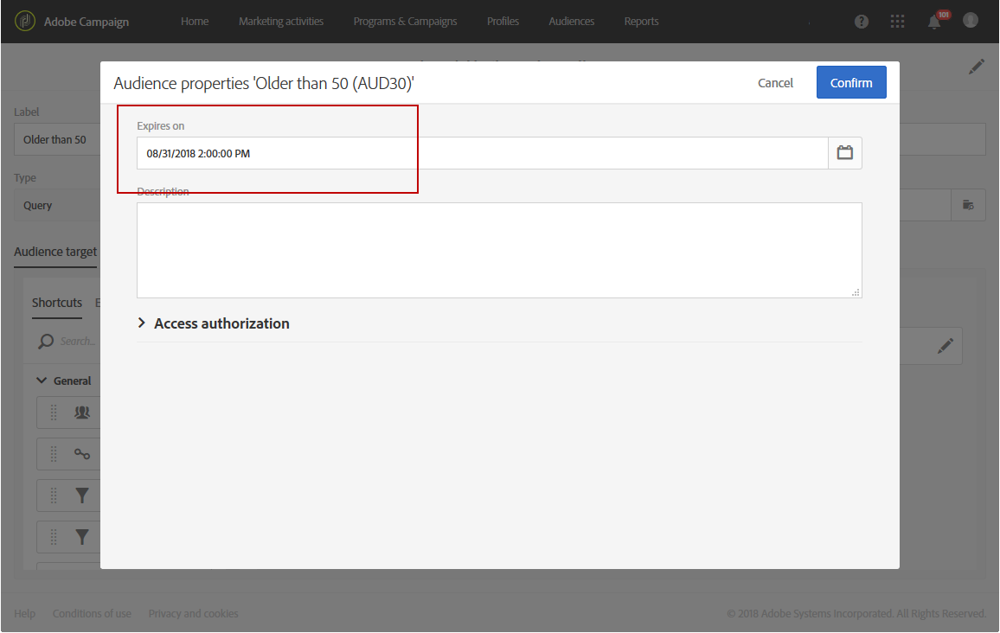

1. Click **[!UICONTROL Confirm]** then **[!UICONTROL Save]** .

Your expiration date is now configured. As soon as this date is reached, your audience will be automatically deleted.

Or if you need to delete an audience, you can simply select one or several audiences then click the **[!UICONTROL Delete element]** button.

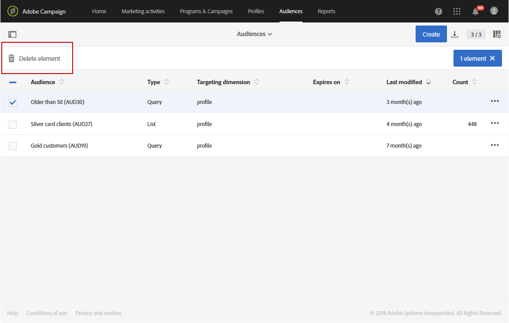

