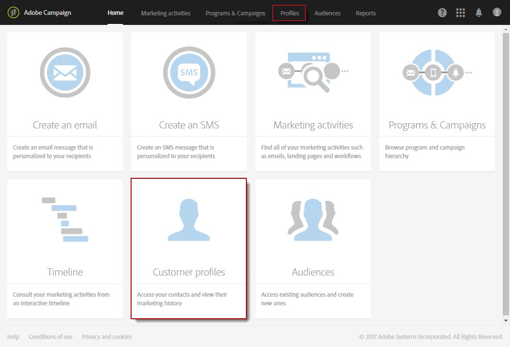
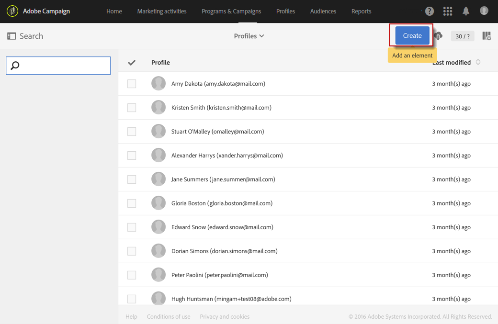
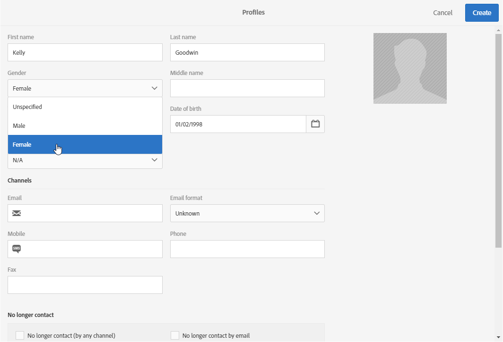

# Creating profiles{#creating-profiles}

In Adobe Campaign, profiles are used by default to define the main target of messages.

>[!NOTE]
>
>Profiles creation is also possible using the Adobe Campaign Standard API. For more on this, refer to the [dedicated documentation](../../api/using/creating-profiles-api.md).

 [Discover how to import profiles using a workflow in video](#video)

To create or update a profile in Campaign, you can:

* Import a profile list from a file, via a [workflow](../../automating/using/creating-import-workflow-templates.md)
* Collect data online, via [landing pages](../../channels/using/getting-started-with-landing-pages.md)
* Create bulk via [REST API](../../api/using/get-started-apis.md)
* Synchronize profiles from [Microsoft Dynamics](../../integrating/using/d365-acs-get-started.md)
* Enter data using the user interface, as explained below

As an example, to create a new profile directly in the user interface, follow the steps below:

1. From the Adobe Campaign home page, click the **Customer Profiles** card or the **Profiles** tab to access the list of profiles.

   

1. Click **[!UICONTROL Create]**.

   

1. Enter the profile data.

   

    * The contact information, such as first name, last name, gender, date of birth, photo, preferred language (for [multilingual emails](../../channels/using/creating-a-multilingual-email.md)) helps better personalize deliveries.
    * The profile's **[!UICONTROL Time zone]** is used to send deliveries at the profile's time zone. For more on this, refer to this [section](../../sending/using/sending-messages-at-the-recipient-s-time-zone.md). 
    * The **[!UICONTROL Channels]** category, which contains the email address, mobile phone number, opt-out information, lets you know on which channel the profile is reachable.

      >[!NOTE]
      > Mobile phone numbers must always be in international format (`+<country><number>`) format in the profile table.

    * The **[!UICONTROL No longer contact]** category is updated as soon as the profile unsubscribe to a channel.
    * The **[!UICONTROL Address]** category contains the postal address that needs to be filled along with the **[!UICONTROL Address specified]** option to send [direct mail](../../channels/using/about-direct-mail.md) to this profile. If the **[!UICONTROL Address specified]** option is not checked, this profile will be excluded from every direct mail delivery.
    * The **[!UICONTROL Access authorization]** category indicates the profile's organizational units to [manage permissions](../../administration/using/about-access-management.md). To add the organizational fields to your profiles, refer to the [Partitioning profiles](../../administration/using/organizational-units.md#partitioning-profiles) section.
    * The **[!UICONTROL Traceability]** category automatically updates with information concerning the user who created or modified the profile.

1. Click **[!UICONTROL Create]** to save the profile.

The profile will now appear in the list.

>[!NOTE]
>The preferred language field is used to select the language when sending multilingual messages. For more information about the multilingual messages [refer to this page](../../channels/using/creating-a-multilingual-email.md).

## Tutorial video {#video}

This video shows how to import profiles with a workflow.

>[!VIDEO](https://video.tv.adobe.com/v/24993?quality=12)
 
Additional Campaign Standard how-to videos are available [here](https://experienceleague.adobe.com/docs/campaign-standard-learn/tutorials/overview.html).
