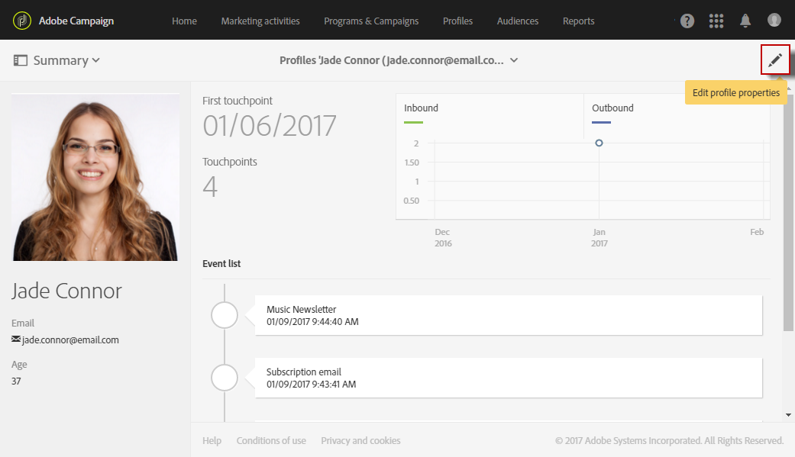
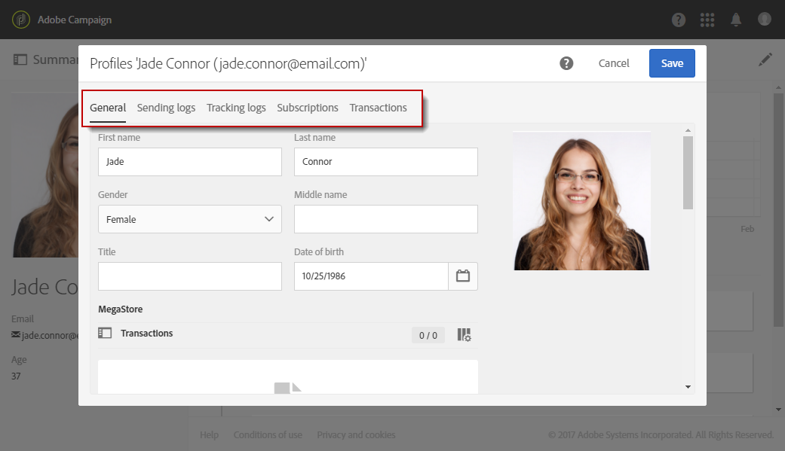

# Editing profiles{#editing-profiles}

## Accessing profile properties {#accessing-profile-properties}

To edit an existing profile and consult the data associated to it, or modify it, the steps are as follows:

1. From the Adobe Campaign home page, click the **[!UICONTROL Customer profiles]** card or the **[!UICONTROL Profiles]** tab.
1. Select a contact.
1. Click the **[!UICONTROL Edit profile properties]** icon to access the profile's detailed information.

   

   The profile's properties window offers several tabs that give access to all profile information.

   Other tabs may also appear depending on the custom resources that have been created or extended in Adobe Campaign. For more information about custom resources, see [About custom resources](../../developing/using/data-model-concepts.md).

   >[!NOTE]
   >
   >You can only modify the information in the **[!UICONTROL General]** tab - except for the **[!UICONTROL Traceability]** section.

Profiles edition is also possible using the Adobe Campaign Standard API. For more on this, refer to the [dedicated documentation](../../api/using/updating-profiles.md) .

Related topic:

* [Integrated customer profile](../../audiences/using/integrated-customer-profile.md)
* [Sending at the recipient's time zone](../../sending/using/sending-messages-at-the-recipient-s-time-zone.md)

## General profile data {#general-profile-data}

The **[!UICONTROL General]** tab groups the following information about the profile:

* Contact information, which contains the recipient's first name, last name, date of birth, photo, preferred language (for [multilingual emails](../../channels/using/creating-a-multilingual-email.md)), etc.
* Channels on which the profile can be contacted, which contains the recipient's email address, mobile phone number, opt-out information. 
* Postal address (for [direct mail](../../channels/using/about-direct-mail.md)), and the contact's time zone (to [schedule messages in its time zone](../../sending/using/sending-messages-at-the-recipient-s-time-zone.md)).
* Access authorization, which indicates the recipient's organisational unit (to [manage permissions](../../administration/using/about-access-management.md)). See also [Partitioning profiles](../../administration/using/organizational-units.md#partitioning-profiles).

## Sending and tracking logs {#sending-and-tracking-logs}

The **[!UICONTROL Sending logs]** and **[!UICONTROL Tracking logs]** tabs group the list of deliveries that were sent to the profile, and all related tracking data.

For more on sending and tracking logs, refer to the [delivery logs](../../sending/using/monitoring-a-delivery.md#delivery-logs) and the [tracking messages](../../sending/using/tracking-messages.md) sections.

## Subscriptions {#subscriptions}

The contact's subscriptions are listed in the corresponding tab. For more on subscribing to a service, refer to [this section](../../audiences/using/about-subscriptions.md).

The **[!UICONTROL Mobile App Subscriptions]** tab refer to the push notifications. For more information, refer to the [Push notification](../../channels/using/about-push-notifications.md) channel.
