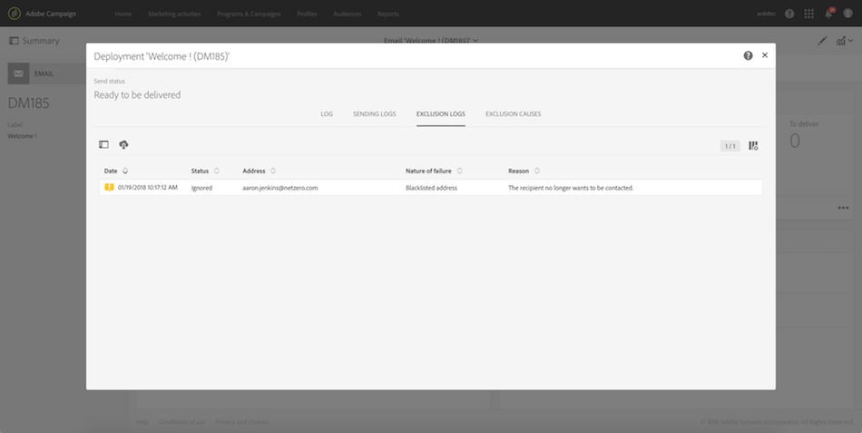

# Identifying opt-out profiles for a delivery{#identifying-opt-out-profiles-for-a-delivery}

Opt-out profiles for a specific delivery are listed after the preparation phase, in the **[!UICONTROL Exclusion logs]** tab of the delivery dashboard.

**Related topics:**

* [Monitoring a delivery](../../sending/using/monitoring-a-delivery.md#exclusion-logs).
* [Preparing the send](../../sending/using/preparing-the-send.md).
