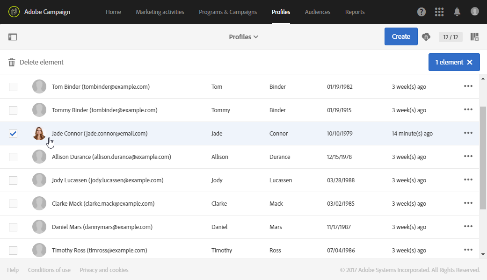
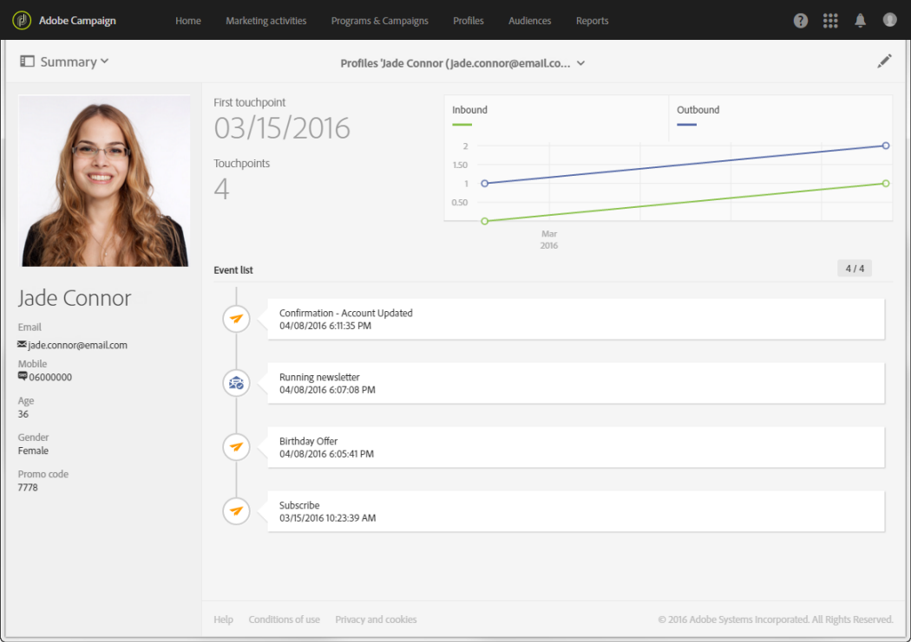

# Integrated customer profile{#integrated-customer-profile}

An integrated customer profile is available for each contact of your database. This marketing history combines all relevant marketing information concerning contact with a client into one single view. You can then access all digital behaviors, online and offline transactions in a central location: contact information, emails received, tracking logs, subscriptions and unsubscriptions, etc.

To access the integrated customer profile, steps are as follows:

1. From the Adobe Campaign home page, click the **[!UICONTROL Customer profiles]** card or the **Profiles** tab to display the profiles list.

1. To search a profile based on a specific field, open the search pane, then select the field on which you want to perform your search.

   

1. Specify the value that you want to search, then press Enter.

      >[!NOTE]
      >
      >Note that searches can be performed based on the email, first name and last name fields as well as custom fields that have been added when extending the resource.
      >
      >Searches are case-sensitive and performed on prefixes only. For example, you will not be able to look up for a profile using his last name's last letters.

1. Select a contact to open its profile.

   

You can then access the **Marketing history** of this contact.

Key information about the profile is gathered in this page, as well as the list of events.
   
Click an event in the list to open it: you can access the messages which have been sent or the services which the profile has subscribed to.

>[!NOTE]
>
>Marketing history is also accessible using the Adobe Campaign Standard API. For more on this, refer to the [dedicated documentation](../../api/using/interacting-with-marketing-history.md) .
