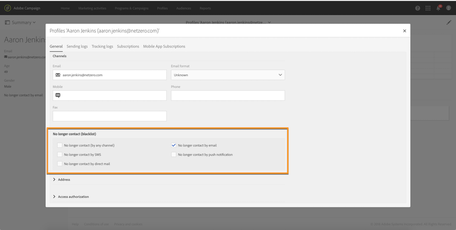
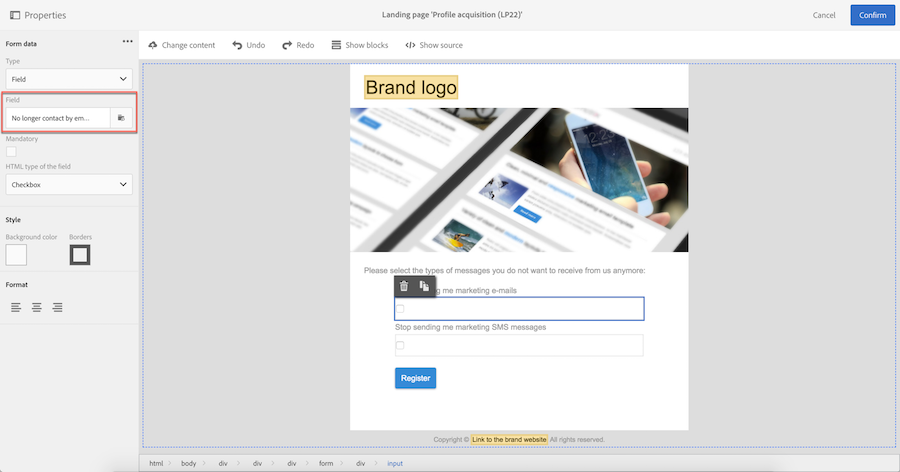
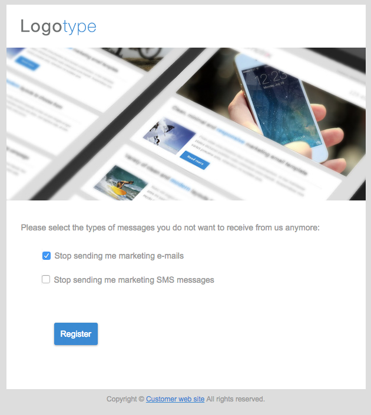

# Managing opt-in and opt-out in Campaign{#managing-opt-in-and-opt-out-in-campaign}

Managing opt-in and opt-out in Campaign

## Managing opt-in and opt-out from a profile {#managing-opt-in-and-opt-out-from-a-profile}

Users can be opted in or out by an operator directly from the profile **General** tab.

In the **No longer contact (blacklist)** section, the selected checkboxes correspond to the channels from which the user chose to opt out. Select the channels according to the user's needs.

## Setting up opt-in and opt-out landing pages {#setting-up-opt-in-and-opt-out-landing-pages}

To give users the ability to opt in or opt out, you have to create and publish a **Profile acquisition** landing page. They will then be able to select the channels according to their needs. To do this, follow the steps below.

You can also set up a **BlackList** landing page that will enable users to opt out from all deliveries. For more on this, refer to [Setting up a landing page to opt out from all deliveries](../../audiences/using/managing-opt-in-and-opt-out-in-campaign.md#setting-up-a-landing-page-to-opt-out-from-all-deliveries).

>[!NOTE]
>
>Landing pages can also be used to enable services subscription. For more on this, refer to [this page](../../channels/using/designing-a-landing-page.md#linking-a-form-to-a-service).

1. Create a **Profile acquisition** landing page (see [this section](../../channels/using/about-landing-pages.md)).
1. Add a checkbox in the landing page content for each desired channel, then link it to the corresponding field from the Campaign database.

   

1. Save the landing page and publish it.
1. In the landing page, the checkboxes are already selected according to the profile **General** tab. The user can select or unselect the channels according to his needs and submit the form.

   

1. Once the form submitted, the profile **General** tab is updated according to the user's selection.

   

### Setting up a landing page to opt out from all deliveries {#setting-up-a-landing-page-to-opt-out-from-all-deliveries}

To give users the ability to opt out from all deliveries, you have to create and publish a **BlackList** landing page. For more on landing pages creation, refer to [this page](../../channels/using/about-landing-pages.md).

Once a user clicks on the landing page link, the **No longer contact (by any channel)** option in the profile is automatically selected.

