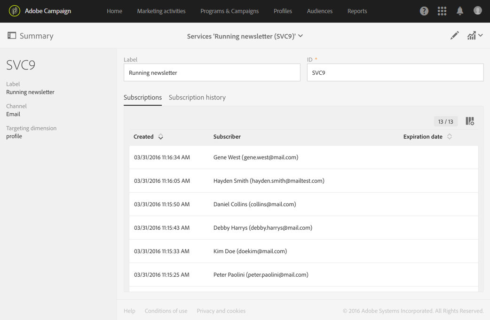
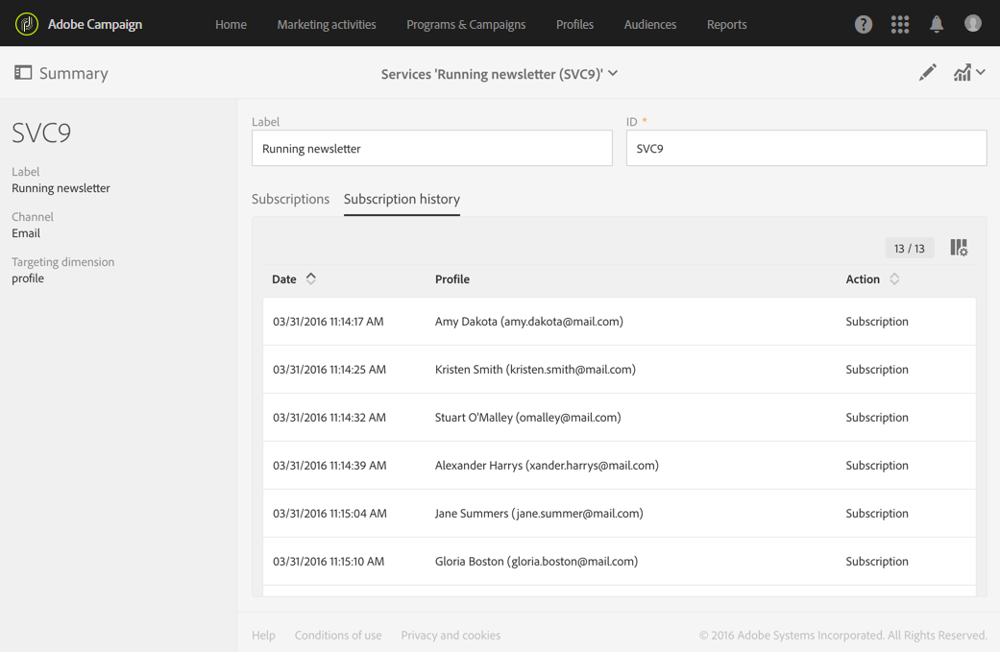
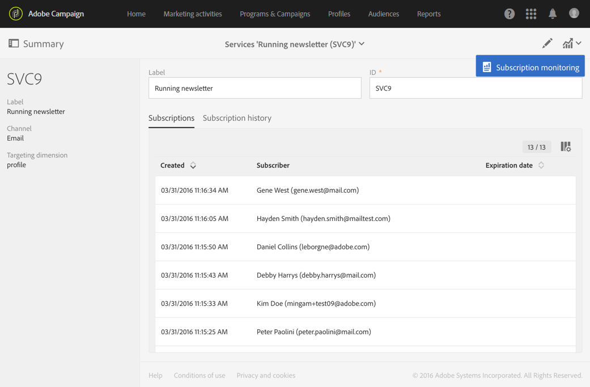
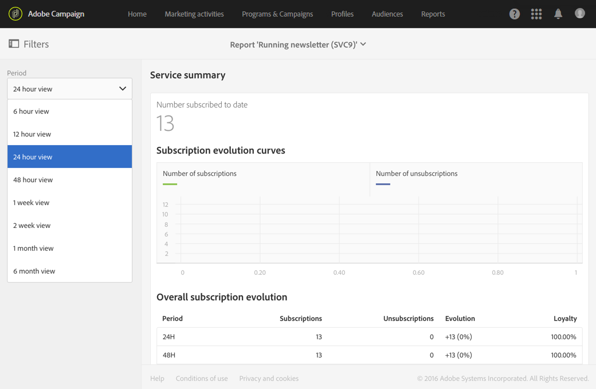
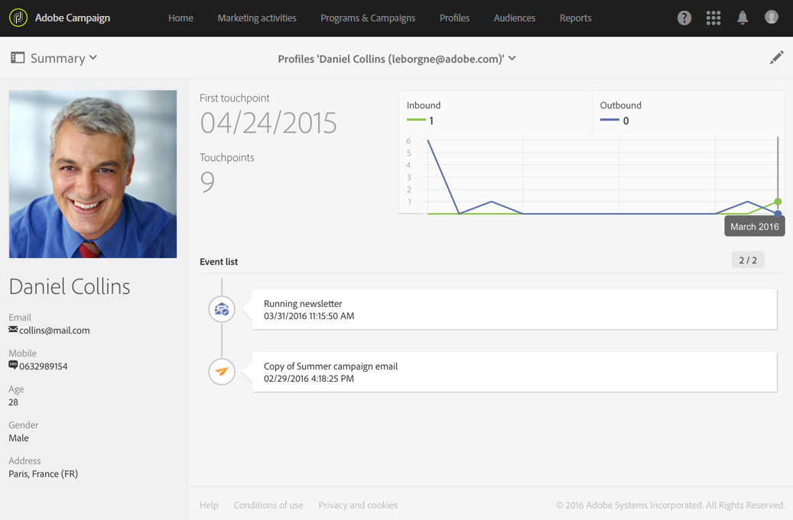

# Monitoring subscriptions{#monitoring-subscriptions}

Monitoring subscriptions

Use the Adobe Campaign interface to track your subscribers and measure the success of your services.

You have several options for monitoring subscriptions to and unsubscriptions:

* View the list of people currently subscribed to your service from the service dashboard. See [Service dashboard](../../audiences/using/monitoring-subscriptions.md#service-dashboard).
* consult the history of subscriptions and unsubscriptions from the **Subscription history** tab in the service dashboard. See [Subscription history](../../audiences/using/monitoring-subscriptions.md#subscription-history).
* display a report detailing the evolution of subscriptions and unsubscriptions in the service **Reports**. See [Service reports](../../audiences/using/monitoring-subscriptions.md#service-reports).
* find the list of services a person has subscribed from its **Profile**. See [History of events linked to a profile](../../audiences/using/monitoring-subscriptions.md#history-of-events-linked-to-a-profile).

## Service dashboard {#service-dashboard}

To view the list of people subscribed to a service:

1. Go to the list of services via the advanced menu **Profiles & audiences** > **Services**, which can be accessed from the Adobe Campaign logo.
1. Select the service of your choice to display the corresponding dashboard.
1. The list of people subscribed to the service can be found in the **Subscriptions** tab.

## Subscription history {#subscription-history}

To consult the subscription and unsubscription history:

1. Go to the list of services via the advanced menu **Profiles & audiences** > **Services**, which can be accessed from the Adobe Campaign logo.
1. Select the service of your choice to display the corresponding dashboard.
1. Select the **Subscription history** tab to display the dates on which each person subscribed and unsubscribed.

## Service reports {#service-reports}

To display a report detailing the evolution of subscriptions and unsubscriptions:

1. Go to the list of services via the advanced menu **Profiles & audiences** > **Services**, which can be accessed from the Adobe Campaign logo.
1. Select the service of your choice to display the corresponding dashboard.
1. Click the **Reports** button in the action bar, then **Subscription monitoring** in the selection screen.

   

1. The **Service summary** report presents the number of subscriptions, the overall evolution of subscriptions, and a curve showing the progress over time.

## History of events linked to a profile {#history-of-events-linked-to-a-profile}

To consult the list of services to which a contact has subscribed, you can consult its marketing history. For more on this, refer to the [Integrated customer profile](../../audiences/using/integrated-customer-profile.md) section.

