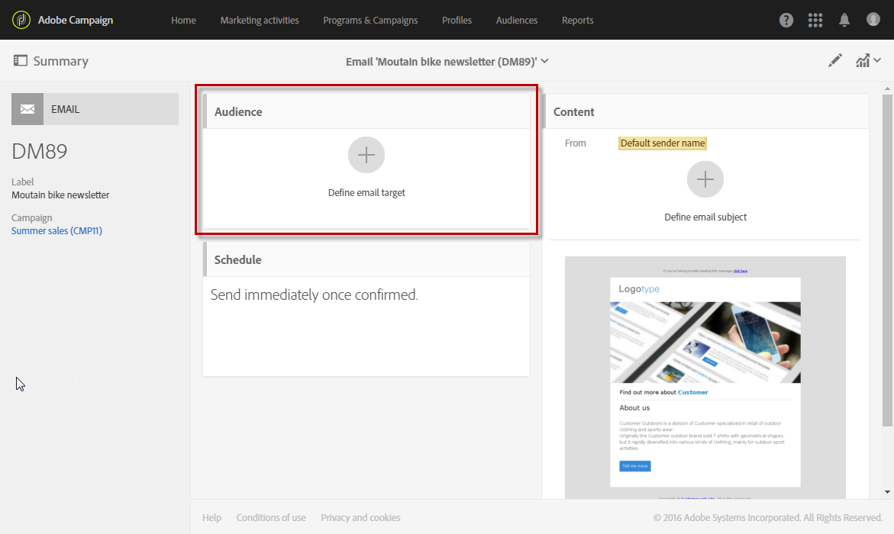
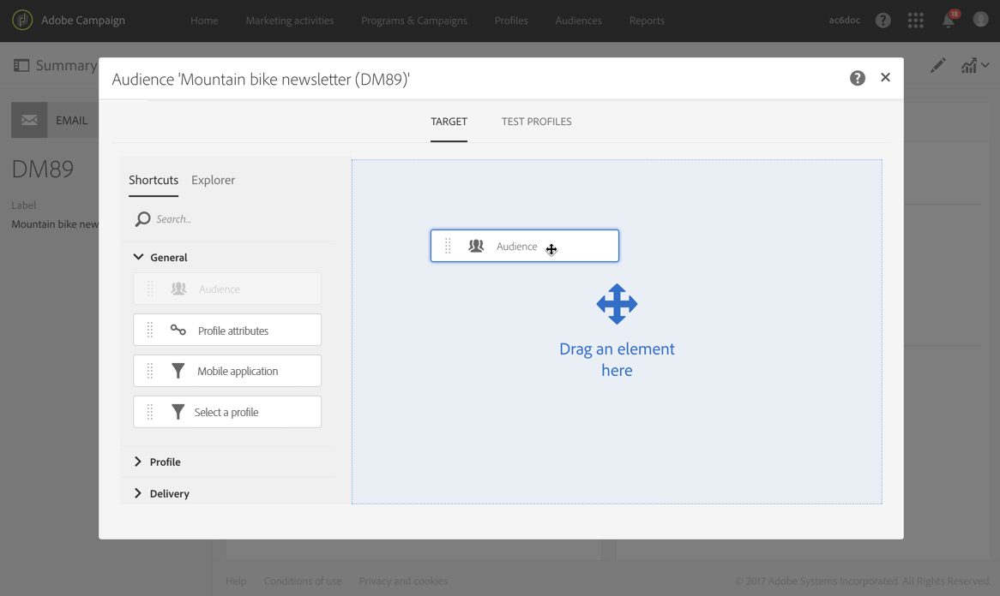
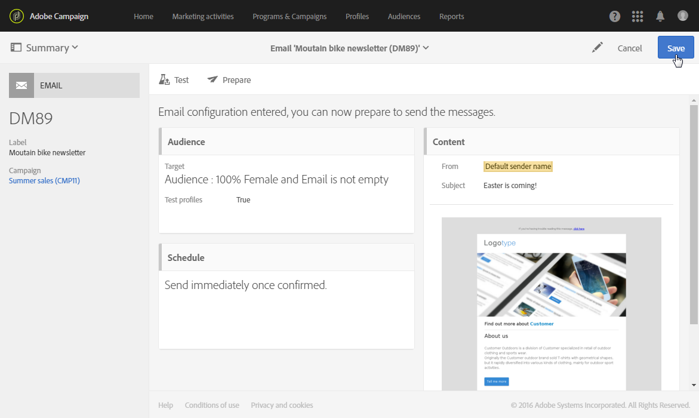

# Selecting an audience in a message

Selecting an audience in a message

Adobe Campaign lets you configure several profile types within a message's audience.

Audiences can be defined when creating the message via the creation wizard or from the message dashboard if the message has already been created.

1. From the dashboard, go to the audience block to start.

   

   The screen to define the audiences then opens. It has two tabs that allow you to separately define each type of audience that will receive the message:

    * Target
    * Test profiles

   

1. Define the main **Target** of the email. This is the regular target audience of the email.

   The target is defined in the **Target** tab and is made up of identified profiles from your database.

   You can establish your main target using the [query editor](../../automating/using/editing-queries.md#creating-queries) functionalities.

   In this tab, the **Shortcuts** palette only contains predefined filters and the audiences that have been defined in the identified profiles. The **Explorer** tab allows you to access additional configurations.

   You can therefore re-use and combine existing audiences, apply additional filters to them, etc.

1. Define the **Test profiles** you want to use for the email. The test profiles will receive the proofs that you can send before to test the email before sending it to the main target.

   For more information on configuring test profiles, refer to the [Test profiles](../../sending/using/managing-test-profiles-and-sending-proofs.md) section.

The audiences block is then updated and shows that a target and test profiles have been selected for the email in question.

