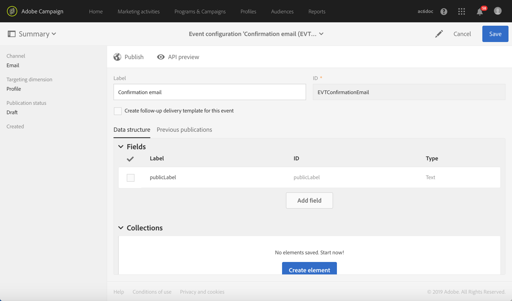

# Confirming subscription to a service{#confirming-subscription-to-a-service}

## About sending subscription confirmation {#sending-subscription-confirmation}

This section describes how to send an automatic custom confirmation email to the profiles who subscribe to a specific service.

To do this, you must create and configure a transactional message. This message can be referenced :
* From the service itself. For more on this, see (Configuring confirmation message from a service)[../../audiences/using/subscription-to-a-service-example.md#configuring-confirmation-message-from-service].
* From a subscription landing page. For more on this, see .

## Configuring confirmation message from a service {#configuring-confirmation-message-from-service}

For example, you want to automatically send a confirmation message to the visitors of your website when they subscribe to your brand newsletter.

You need to configure a transactional message so that it can be reconciled with a service, and reference that message from the desired service.

>[CAUTION]
>
>To link a confirmation message to a service, you MUST use the **[!UICONTROL publicLabel]** field in your event configuration. This field will be reconciled with the **[!UICONTROL Service label]** of the service. See .

>[NOTE]
>
>When referencing the transactional message from the service, the confirmation will be sent only the first time the visitor subscribes to that service. If the user is already subscribed, no confirmation message will be sent.

### Step 1: Create the confirmation email {#step-2--create-the-confirmation-email}

A confirmation email will be automatically sent to each profile subscribing to the newsletter (through a landing page or any other means). The subscription is considered as an event and the email is a transactional message which will target each profile that subscribes to the service.

Refer to [Transactional messages](../../channels/using/about-transactional-messaging.md) for more information on transactional event and message configuration.

Steps to create these elements are described below. As the transactional message will be referenced in the service, you need to create it first.

#### Create the event {#create-the-event}

The confirmation email is a [transactional message](../../channels/using/about-transactional-messaging.md) as it reacts to an event: the subscription to a service. This message will be sent to confirm subscription to your newsletter.
(You must first create the event and then create the template of the transactional message.)

1. Create an event, from the **[!UICONTROL Marketing plans]** > **[!UICONTROL Transactional messages]** > **[!UICONTROL Event configuration]** menu, accessible from the Adobe Campaign logo, and enter a label.
1. Select the **[!UICONTROL Profile]** targeting dimension and click **[!UICONTROL Create]**. The configuration steps are presented in the [Configuring an event to send a profile transactional message](../../administration/using/configuring-transactional-messaging.md#use-case--configuring-an-event-to-send-a-transactional-message) section or the [Profile-based transactional messages](../../administration/using/configuring-transactional-messaging.md#profile-based-transactional-messages) section.

   

1. In the **[!UICONTROL Fields]** section, click **[!UICONTROL Create element]** and add **[!UICONTROL publicLabel]** in the data structure to enable reconciliation.

    

    Declaring the **[!UICONTROL publicLabel]** field in the event configuration is essential because when subscribing to a service, this field will be filled with the **[!UICONTROL Service label (publicLabel)]** of the corresponding service.

    >[NOTE]
    >
    >The **[!UICONTROL publicLabel]** field is mandatory. If you do not add it in the event fields, Adobe Campaign will not be able to retrieve the service(s) that will reference the transactional message.
    
1. Click **[!UICONTROL Add field]** and add a field such as **[!UICONTROL Email]** in the data structure to enable reconciliation with the **[!UICONTROL Profiles]** resource and enable enrichment.
1. To be able to personalize the confirmation transactional message, enrich the event configuration on **[!UICONTROL Service]** using the **[!UICONTROL publicLabel]** field.
In the **[!UICONTROL Enrichment]** section, click **[!UICONTROL Create element]** and select the **[!UICONTROL Service]** target resource.

    

1. Map the **[!UICONTROL publicLabel]** field of the **[!UICONTROL Service]** resource with the **[!UICONTROL publicLabel]** field of the event configuration in the **[!UICONTROL Join definition]** section.

   

    This will enable you to use personalization fields from the **[!UICONTROL Service]** resource in the transactional message.

1. Map the **[!UICONTROL Email]** field of the **[!UICONTROL Profiles]** resource with the **[!UICONTROL Email]** field of the event configuration in the **[!UICONTROL Join definition]** section.
1. Select **[!UICONTROL profile]** as the **[!UICONTROL Targeting enrichment]** in the dropdown list.
1. Click **[!UICONTROL Publish]** to publish the event.

The event is ready. You can now design the transactional email message.

#### Design the confirmation message {#design-the-confirmation-message}

The confirmation email is a transactional message based on the event you just created.

1. From the Adobe Campaign logo, select **[!UICONTROL Marketing plans]** > **[!UICONTROL Transactional messages]** and click **[!UICONTROL Transactional messages]**.
1. Edit the email template corresponding to the event that you just published.
1. Personalize it using fields from the **[!UICONTROL Service]** resource. (You can upload an existing content or use an out-of-box template.)
1. Click **[!UICONTROL Confirm]** to save modifications.?

   

1. Save and publish the transactional message.

### Step 2: Create and configure the service {#step-3--create-the-service}

1. From the advanced menu **Profiles & audiences** > **Services** via the Adobe Campaign logo, add a new service.
1. Go to the **[!UICONTROL Service properties]** section, accessed via the  button in the service dashboard.
1. Fill in the **[!UICONTROL Service label]** field. This label will be displayed in the confirmation message and in the subscription landing page if any.
1. Select **[!UICONTROL Custom message]** as the confirmation message: this mode allows you to reference a custom confirmation message, specific for your service.
1. Select the **[!UICONTROL Custom subscription event configuration]** associated with the transactional message that you created.
1. Save the service. It is now ready to be used.

Now each time a profile subscribes to this service, he receives the transactional message that you defined with personalized fields mapped to the service. A message will be sent only the first time the user subscribes.

## Configuring confirmation message from a landing page {#configuring-confirmation-message-from-landing-page}

You can also reference the confirmation message from a subscription landing page by using the **[!UICONTROL Start sending messages]** option from the **[!UICONTROL Job]** section of the landing page.

>[CAUTION]
>
>To link a confirmation message to a landing page, you MUST use the **[!UICONTROL serviceName]** field in your event configuration. This field will be reconciled with the **[!UICONTROL @name]** attribute of the service.

>[NOTE]
>
>When referencing the confirmation message from the landing page, a message will be sent each time the landing page is submitted (even if the user is already subscribed).

### Step 1: Create the confirmation email {#step-2--create-the-confirmation-email}

A confirmation email will be automatically sent to each profile subscribing to the newsletter through a subscribing landing page. The subscription is considered as an event and the email is a transactional message which will target each profile that subscribes to the service.

Refer to [Transactional messages](../../channels/using/about-transactional-messaging.md) for more information on transactional event and message configuration.

Steps to create these elements are described below.

#### Create the event {#create-the-event}

You must first create the event before being able to create and design the template of the transactional message.

1. Create an event, from the **[!UICONTROL Marketing plans]** > **[!UICONTROL Transactional messages]** > **[!UICONTROL Event configuration]** menu, accessible from the Adobe Campaign logo, and enter a label.
1. Select the **[!UICONTROL Profile]** targeting dimension and click **[!UICONTROL Create]**. The configuration steps are presented in the [Configuring an event to send a profile transactional message](../../administration/using/configuring-transactional-messaging.md#use-case--configuring-an-event-to-send-a-transactional-message) section or the [Profile-based transactional messages](../../administration/using/configuring-transactional-messaging.md#profile-based-transactional-messages) section.

   

1. In the **[!UICONTROL Fields]** section, click **[!UICONTROL Create element]** and add **[!UICONTROL serviceName]** in the data structure to enable reconciliation.
    >[NOTE]
    >
    >The **[!UICONTROL serviceName]** field is mandatory. If you do not add it in the event fields, Adobe Campaign will not be able to retrieve the landing page(s) that will reference the transactional message.
1. In the **[!UICONTROL Enrichment]** section, click **[!UICONTROL Create element]** and select the **[!UICONTROL Service]** target resource.
1. Map on the **[!UICONTROL serviceName]** field (with the name???) in the **[!UICONTROL Join definition]** section.
The **[!UICONTROL Name]** can now be used to reconcile the event configuration to the "@name" attribute of the service.
This will enable you to use personalization fields from the Service resource in the transactional message.

   
1. Select **[!UICONTROL Profile or Service]** as the **[!UICONTROL Targeting enrichment]** in the dropdown list.??
1. Click **[!UICONTROL Publish]** to publish the event.

The event is ready. You can now design the email template.

#### Design the confirmation message {#design-the-confirmation-message}

The confirmation email is a transactional message based on the event created before.

1. From the Adobe Campaign logo, select **[!UICONTROL Marketing plans]** > **[!UICONTROL Transactional messages]** and click **[!UICONTROL Transactional messages]**.
1. Edit the email template corresponding to the event that you just published.
1. Personalize it using fields from the **[!UICONTROL Service]** resource. (You can upload an existing content or use an out-of-box template.)
1. Click **[!UICONTROL Confirm]** to save modifications.?

   

1. Save and publish the transactional message.

### Step 2: Create and configure the service {#step-3--create-the-service}

1. From the advanced menu **[!UICONTROL Profiles & audiences]** > **[!UICONTROLServices]** via the Adobe Campaign logo, create a service.
1. Go to the **[!UICONTROL Service properties]** section, accessed via the  button in the service dashboard.
1. Fill in the **[!UICONTROL Service label]** field. This label will be displayed in the confirmation message and in the subscription landing page.
1. Need to do anyting else?
1. Save the service. It is now ready to be used.

### Step 3: Create and configure the landing page

Create a subscription landing page which will be published on your website.

To create and configure this landing page:

1. Design a [new landing page](../../channels/using/about-landing-pages.md) based on the **[!UICONTROL Subscription]** template. Enter the label '**Subscription**'.
1. Edit the landing page properties. In the **[!UICONTROL Job]** > **[!UICONTROL Specific actions]** section, select the **[!UICONTROL Start sending messages]** option.
1. In the associated drop-down list, choose the transactional message that you created.

   

1. Customize the content of the landing page.

   

1. If needed, customize the confirmation page.

   

1. [Test and publish](../../channels/using/sharing-a-landing-page.md) the landing page.

Now each time a profile subscribes to your newsletter, he receives the transactional message that you defined with personalized fields mapped to the service.
