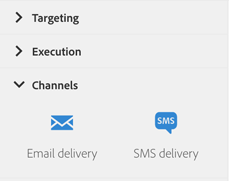

# About channel activities{#about-channel-activities}

About channel activities

From the palette, on the left-hand side of the screen, unfold the **Channels** section.

These activities represent the different available communication channels. You can combine them to create a cross-channel workflow.

