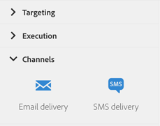

# About channel activities{#about-channel-activities}

From the palette, on the left-hand side of the screen, unfold the **[!UICONTROL Channels]** section.

These activities represent the different available communication channels. You can combine them to create a cross-channel workflow.

The **[!UICONTROL Channels]** section provides the following activities:

* [Email delivery](../../automating/using/email-delivery.md)
* [SMS delivery](../../automating/using/sms-delivery.md)
* [Push notification delivery](../../automating/using/push-notification-delivery.md)
* [Direct mail delivery](../../automating/using/direct-mail-delivery.md)
* [In-App delivery](../../automating/using/in-app-delivery.md)
