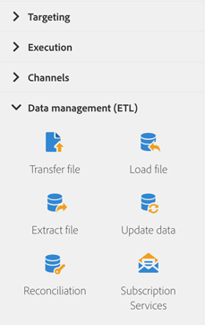

# About data management activities{#about-data-management-activities}

From the palette, on the left-hand side of the screen, unfold the **[!UICONTROL Data management (ETL)]** section.

These activities let you manipulate data. They allow you, for example, to import data, perform mass updates on database fields, receive or send file, or link unidentified data to existing resources.

The **[!UICONTROL Data management (ETL)]** section provides the following activities:

* [Update data](../../automating/using/update-data.md)
* [Load file](../../automating/using/load-file.md)
* [Transfer file](../../automating/using/transfer-file.md)
* [Reconciliation](../../automating/using/reconciliation.md)
* [Extract file](../../automating/using/extract-file.md)
* [Subscription Services](../../automating/using/subscription-services.md)

**[!UICONTROL Data management (ETL)]** activities allows you to define **segment codes** for their outbound transitions. You can then create reports based on these segment codes in order to measure the efficiency of your maketing campaigns. For more on this, refer to [this section](../../reporting/using/creating-a-report-workflow-segment.md).
