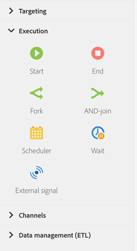

# About execution activities{#about-execution-activities}

From the palette, on the left-hand side of the screen, unfold the **[!UICONTROL Execution]** section.

The following activities are specific to organizing and executing workflows. Their main task is to coordinate the other activities. 

The **[!UICONTROL Execution]** section provides the following activities:

* [Start and end](../../automating/using/start-and-end.md)
* [Fork](../../automating/using/fork.md)
* [AND-join](../../automating/using/and-join.md)
* [Scheduler](../../automating/using/scheduler.md)
* [Wait](../../automating/using/wait.md)
* [External signal](../../automating/using/external-signal.md)
* [Test](../../automating/using/test.md)
