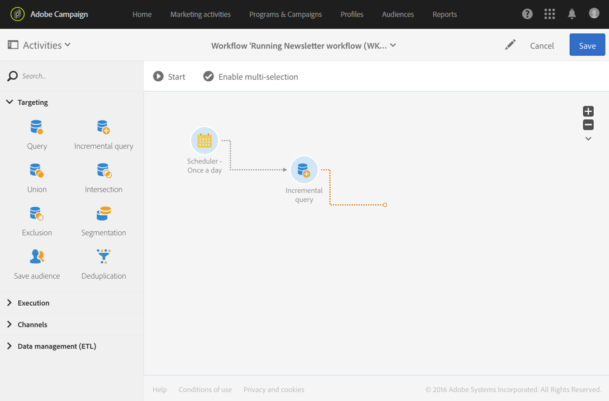
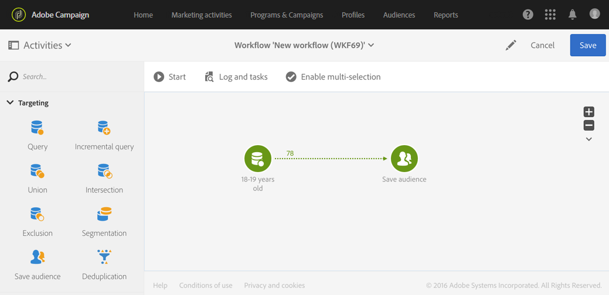

# About workflow execution {#about-workflow-execution}

A workflow is always started manually. However, once started, it can remain inactive, depending on the information specified in a [Scheduler](../../automating/using/scheduler.md) activity.

>[!CAUTION]
>
> Adobe recommends customers prioritize workflow executions and run up to twenty concurrent workflow executions to consistently achieve maximum performance across your instance. More than twenty concurrent workflow executions may be planned and will execute sequentially by default. You may adjust the default settings for maximum number of concurrent workflow executions by submitting a ticket to Customer Care.

Execution related actions (start, stop, pause, etc.) are **asynchronous** processes: the command is saved and will become effective once the server is available to apply it.

In a workflow, the result of each activity is generally sent to the following activity via a transition, represented by an arrow.

A transition is unterminated if it is not linked to a destination activity.

>[!NOTE]
>
>A workflow containing unterminated transitions can still be executed: a warning message will be generated and the workflow will pause once it reaches the transition, but this will not generate an error. You can also start a workflow without having completely finished the design and you can complete it as you go along.

Once an activity has been executed, the number of records sent in the transition is displayed above it.

You can open transitions to check that the data sent is correct during or after executing the workflow. You can view the data and the data structure.

By default, only the details of the last transition of the workflow can be accessed. To be able to access the results of the preceding activities, you need to check the **[!UICONTROL Keep interim results]** option in the **[!UICONTROL Execution]** section of the workflow properties, before starting the workflow.

>[!NOTE]
>
>This option consumes a lot of memory and is designed to help constructing a workflow and ensuring it is correctly configured and behaving. Leave it unchecked on production instances.

When a transition is open, you can edit its **[!UICONTROL Label]** or link a **[!UICONTROL Segment code]** to it. To do this, edit the corresponding fields and confirm your modifications.

Using Campaign Standard REST APIs, you can **start**, **pause**, **resume** and **stop** a workflow. You can find more details and examples of REST calls in the [API documentation.](../../api/using/controlling-a-workflow.md)
