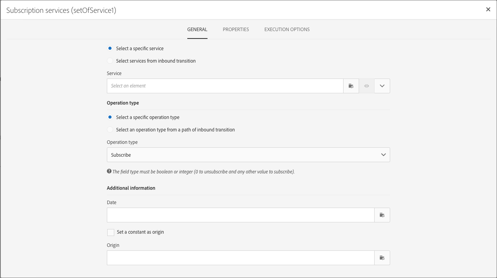
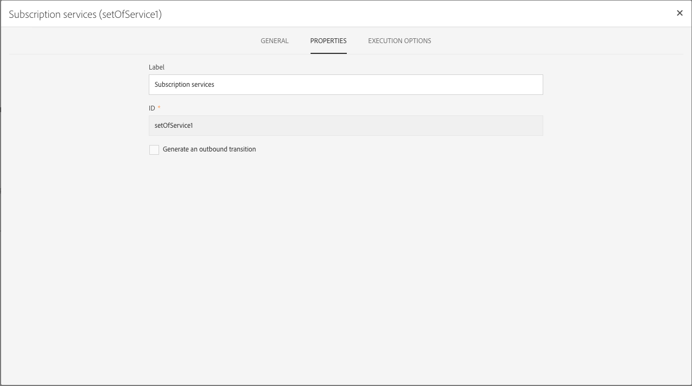
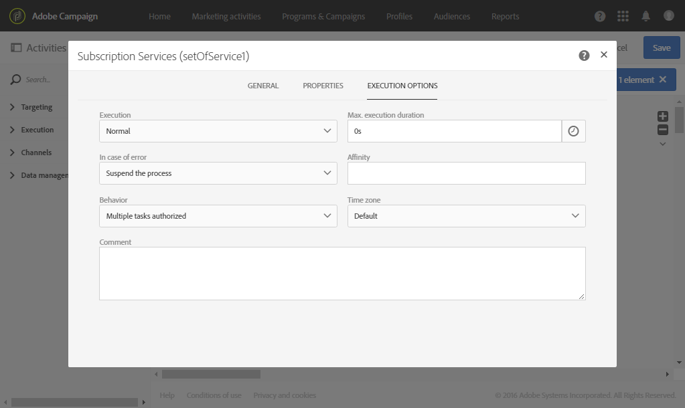

# Managing activities' properties {#activity-properties}

## Global properties of an activity {#global-properties-of-an-activity}

Each activity has a **[!UICONTROL General]** tab, which allows you to modify general parameters that are specific to the activity.

The **[!UICONTROL Properties]** tab allows you to modify the activity's global parameters, particularly the label and the ID. Configuring this tab is optional.

## Managing an activity's outbound transitions {#managing-an-activity-s-outbound-transitions}

By default, certain activities do not have an outbound transition. You can add one from the **[!UICONTROL Transitions]** tab or from the activity's **[!UICONTROL Properties]** tab to apply other processes to your population in the same workflow.

Depending on the activities, you can add several types of outbound transitions:

* **Standard transition**: population computed by the activity
* **Transition without population**: this type of outbound transition can be added to continue the workflow and does not contain any population to not consume any unnecessary space on the system.
* **Rejects**: population rejected. For example, if the activity's inbound data could not be processed because it was incorrect or incomplete.
* **Complement**: population remaining after executing the activity. For example, if a segmentation activity is configured to only save a percentage of the inbound population.

If applicable, specify a **[!UICONTROL Segment code]** for the activity's outbound transition. This segment code will allow you to identify where subsets from the target population come from, and may, later on, serve for message personalization purposes.

## Activity execution options {#activity-execution-options}

In the activity's properties screen, there is an **[!UICONTROL Advanced options]** tab that lets you define the activity's execution mode and behavior in case of errors.

To access these options, select an activity in a workflow, then open it using the  button from the action bar.

The **[!UICONTROL Execution]** field allows you to define the action to be carried out when the task is started. There are three options for this:

* **Normal**: the activity is executed normally. 
* **Enable but do not execute**: the activity is paused, and as a consequence so are any future processes that follow. This can turn out to be useful if you would like to be present when the task is started.
* **Do not enable**: the activity is not executed, and as a consequence, neither are all the activities that follow (in the same branch).

The **[!UICONTROL In case of error]** field allows you to specify the action to be carried out should the activity encounter an error. There are two options available for this:

* **Suspend the process**: the workflow is automatically suspended. The workflow status is then **Erroneous** and the color associated turns red. Once the problem is resolved, restart the workflow.
* **Ignore**: the activity is not executed, and as a result neither are any of the activities that follow it (in the same branch). This may prove useful for recurring tasks. If the branch has a scheduler placed upstream, this should trigger on the next execution date.

The **[!UICONTROL Behavior]** field allows you to define the procedure to follow if asynchronous tasks are used. There are two options available for this:

* **Multiple tasks authorized**: multiple tasks can be executed at the same time even if the first one did not finish.
* **The current task has priority**: once a task is in progress, this takes priority. As long as one task is still in progress, no other task will be executed.

The **[!UICONTROL Max. execution duration]** field allows you to specify a duration such as "30s" or "1h". If the activity is not finished after the duration specified has been elapsed, an alert is triggered. This has no impact on how the workflow functions.

The **[!UICONTROL Affinity]** field allows you to force a workflow or a workflow activity to execute on a particular machine. To do this, you must specify one or several affinities for the workflow or activity in question.

The **[!UICONTROL Time zone]** field allows you to select the time zone of the activity. Adobe Campaign allows you to manage the time differences between multiple countries on the same instance. The setting applied is configured when the instance is created.

>[!NOTE]
>
>By default, if no time zone is selected, the activity will use the time zone defined in the workflow properties.

The **Comment** field is a free field that allows you to add a note.
