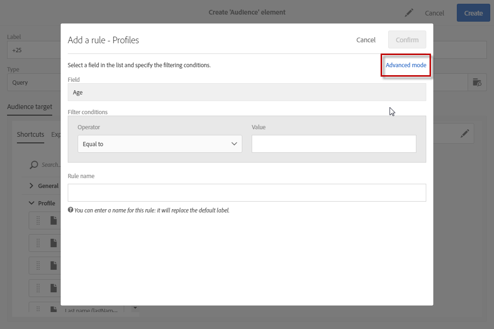
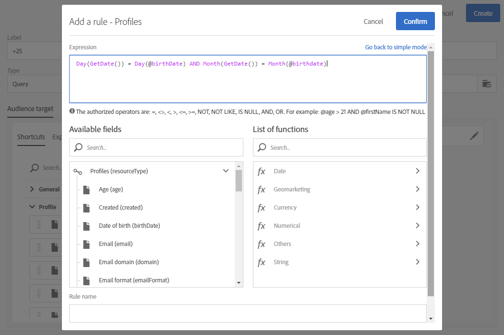

# Advanced expression editing{#advanced-expression-editing}

Advanced expression editing

## About advanced expression editing {#about-advanced-expression-editing}

Editing an expression involves manually entering conditions to form a rule.

This mode allows you to use advanced functions. These functions let you manipulate the values used to carry out specific queries such as manipulating dates, strings, numerical fields, sorting, etc.

You can edit expressions in order to:

* Define a query, via the **Advanced mode** option which is available when a rule is added.

  

* Edit an expression in a workflow. For example, to add additional data to an activity.
* Edit a visibility condition to define how a block in the HTML content editor is displayed. In this case, the expression is edited in JavaScript format and does not offer the use of advanced functions as standard.

## Edit an expression {#edit-an-expression}

Advanced expression edition lets you manually define an expression that corresponds specifically to your needs.

Editing expressions can be used in the Audience window while creating an email or in a Query activity while creating a workflow.

1. Access the expression editing window via one of the methods detailed in the [About advanced expression editing](../../automating/using/advanced-expression-editing.md#about-advanced-expression-editing) section. It involves the following elements:

    * An input field in which the expression is defined.
    * The list of available fields that can be used in the expression and correspond to the targeting dimension of the query (see [Targeting dimensions and resources](../../automating/using/query.md#targeting-dimensions-and-resources)).
    * The list of available functions, sorted by category.

   

1. Edit the expression by entering an expression directly in the corresponding field or by using the lists of available fields and functions.

   Double clicking a field or an expression adds it to the expression in which the cursor is placed.

1. Give your rule a specific name if needed. The name entered will appear as the rule name in the query editor workspace.

Editing an expression lets you personalize the Audiences expression to target your population as needed.

**Related Topics:**

* [Expression Syntax](../../automating/using/advanced-expression-editing.md#expression-syntax)
* [List of functions](../../automating/using/list-of-functions.md)

## Expression Syntax {#expression-syntax}

### Standard syntax {#standard-syntax}

The standard expressions are made up of one or several conditions that respect the following syntax elements:

* Each condition takes the form of **&lt;value1&gt; &lt;comparison operator&gt; &lt;value2&gt;** whereby:

    * **&lt;value1&gt;** is a field or a function. For example **@created** for the date a profile was created or **Year(@created)** for the year a profile was created.
    * **&lt;comparison operator&gt;** is one of the operators listed in the [Comparison operators](../../automating/using/advanced-expression-editing.md#comparison-operators) section. This operator defines the comparison method between **&lt;value1&gt;** and **&lt;value2&gt;**.
    * **&lt;value2&gt;** is a field, a function, or a value inputted manually.

  >[!NOTE]
  >
  >The **&lt;value1&gt;** and **&lt;value2&gt;** type data must be identical. For example, if **&lt;value1&gt;** is a date, then **&lt;value2&gt;** must also be a date.

* If you would like to use several conditions, they can be combined using logical operators.

    * **AND**: two conditions are intersected.
    * **OR**: two conditions are combined.

For example:

```
Year(@created) = Year(GetDate()) AND Month(@created) = Month(GetDate())
```

In this example, the profiles whose creation date is in the current month and year are targeted.

### JavaScript syntax {#javascript-syntax}

When defining the visibility conditions of a text type block of the HTML content editor, you must use an expression with JavaScript type syntax.

JavaScript expressions are made up of one or multiple conditions, and they use the following syntax elements:

* Each condition takes the form of **&lt;context&gt; &lt;comparison operator&gt; &lt;value2&gt;** whereby:

    * **&lt;context&gt;** is a field or a function that allows you to specify the context. For example **context.profile.@email** for a profile's email address or **context.profile.firstName.length()** for the number of characters of a profile's first name.
    * **&lt;comparison operator&gt;** is one of the operators listed in the [Comparison operators](../../automating/using/advanced-expression-editing.md#comparison-operators) section. This operator defines the comparison method between **&lt;context&gt;** and **&lt;value2&gt;**.
    * **&lt;value2&gt;** is a field, a function, or a value inputted manually.

  >[!NOTE]
  >
  >The **&lt;context&gt;** and **&lt;value2&gt;** type data must be identical. For example, if **&lt;context&gt;** is a date, then **&lt;value2&gt;** must also be a date.

* If you would like to use several conditions, they can be combined using logical operators.

    * **&&**: two conditions are intersected.
    * **||**: two conditions are combined.

For example:

```
context.profile.age > 21 && context.profile.firstName.length() > 0
```

In this example, profiles older than 21 years of age and whose first name has been provided (symbolized by the fact that the **firstName** field contains at least one character).

## Comparison operators {#comparison-operators}

For some rules, the query editor lets you chose a value to define your condition.

Conditions must be linked to values by using one of the following operators.

<table> 
 <thead> 
  <tr> 
   <th> Operator<br /> </th> 
   <th> Standard syntax<br /> </th> 
   <th> JavaScript syntax<br /> </th> 
   <th> Description<br /> </th> 
   <th> Example<br /> </th> 
  </tr> 
 </thead> 
 <tbody> 
  <tr> 
   <td> <strong>Equal to</strong><br /> </td> 
   <td> =<br /> </td> 
   <td> ==<br /> </td> 
   <td> The first value must be completely identical to the second value.<br /> </td> 
   <td> <strong>@lastName = Martin</strong> retrieves profiles whose last name is 'Martin', with only these identical characters.<br /> </td> 
  </tr> 
  <tr> 
   <td> <strong>Greater than</strong><br /> </td> 
   <td> &gt;<br /> </td> 
   <td> &gt;<br /> </td> 
   <td> The first value must categorically be more than the second value.<br /> </td> 
   <td> <strong>@age &gt; 50</strong> retrieves profiles who are older than '50', so '51', '52', etc.<br /> </td> 
  </tr> 
  <tr> 
   <td> <strong>Less than</strong><br /> </td> 
   <td> &lt;<br /> </td> 
   <td> &lt;<br /> </td> 
   <td> The first value must categorically be less than the second value.<br /> </td> 
   <td> <strong>@created &lt; DaysAgo(100)</strong> retrieves all profiles created in the database less than 100 days ago.<br /> </td> 
  </tr> 
  <tr> 
   <td> <strong>Greater than or equal to</strong><br /> </td> 
   <td> &gt;=<br /> </td> 
   <td> &gt;=<br /> </td> 
   <td> The first value must be more than or equal to the second value.<br /> </td> 
   <td> <strong>@age &gt;= 30</strong> retrieves profiles aged 30 years and older.<br /> </td> 
  </tr> 
  <tr> 
   <td> <strong>Less than or equal to</strong><br /> </td> 
   <td> &lt;=<br /> </td> 
   <td> &lt;=<br /> </td> 
   <td> The first value must be less than or equal to the second value.<br /> </td> 
   <td> <strong>@age &lt;= 60</strong> retrieves profiles aged 60 or less.<br /> </td> 
  </tr> 
  <tr> 
   <td> <strong>Different </strong><br /> </td> 
   <td> !=<br /> </td> 
   <td> !=<br /> </td> 
   <td> The first value must be different from the second value.<br /> </td> 
   <td> <strong>@language != English</strong> retrieves profiles that have not been defined as English speaking.<br /> </td> 
  </tr> 
  <tr> 
   <td> <strong>Contains</strong><br /> </td> 
   <td> IN<br /> </td> 
   <td> N/A<br /> </td> 
   <td> The first value must contain the second value.<br /> </td> 
   <td> <strong>@domain IN mail</strong>. Here, all the domain names with the 'mail' value are returned in the result. Consequently, the 'gmail.com' domain name will make up part of the returned results.<br /> </td> 
  </tr> 
  <tr> 
   <td> <strong>Like</strong><br /> </td> 
   <td> LIKE<br /> </td> 
   <td> N/A<br /> </td> 
   <td> <strong>Like</strong> is very similar to the <strong>Contains</strong> operator. It lets you insert a <strong>%</strong> wild card character in the value that is being searched.<br /> </td> 
   <td> <strong>@lastName LIKE Mart%n</strong>. Here, the substitution character <strong>%</strong> serves as a "joker" to find the name "Martin" in the hypothetical case that the spelling is not correct.<br /> </td> 
  </tr> 
  <tr> 
   <td> <strong>Not like</strong><br /> </td> 
   <td> NOT<br /> </td> 
   <td> N/A<br /> </td> 
   <td> Is similar to <strong>Like</strong>. It lets you not recover the entered value. Here too, the entered value must contain the <strong>%</strong> wild card character.<br /> </td> 
   <td> <strong>@lastName NOT Smi%h</strong>. Here, the recipients correspond to the name 'Smi%h' (so Smith, etc.) are not returned as a result.<br /> </td> 
  </tr> 
  <tr> 
   <td> <strong>Is empty</strong><br /> </td> 
   <td> IS NULL<br /> </td> 
   <td> N/A<br /> </td> 
   <td> The first value must correspond to an empty value.<br /> </td> 
   <td> <strong>@mobilePhone IS NULL</strong> retrieves all the profiles whose mobile phone number has not been provided.<br /> </td> 
  </tr> 
 </tbody> 
</table>

