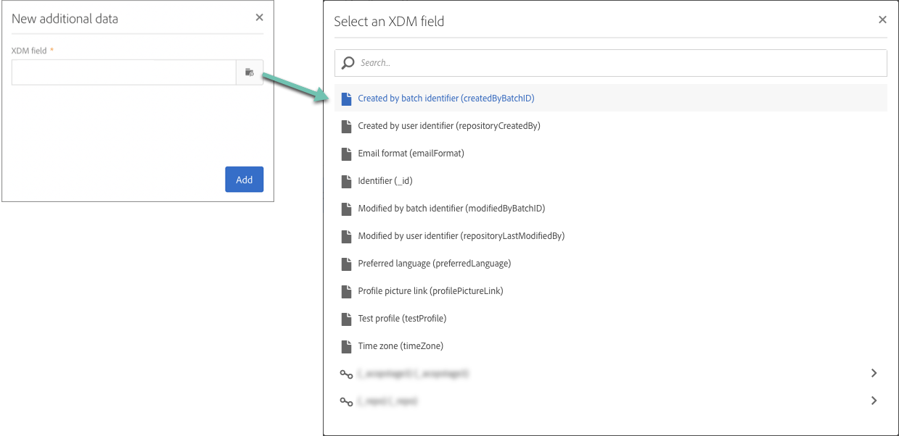

# Personalizing campaigns using Adobe Experience Platform attributes {#personalizing-campaigns-using-aep-attributes}

>[!IMPORTANT]
>
>Adobe Experience Platform features are currently in beta, and subject to frequent updates and modifications without notice.
>
>**Push** and **in-app** channels are not available yet for personalization using contextual data from Adobe Experience Platform.

Once your workflow is configured with an [Adobe Experience Platform audience](../../audiences/using/aep-about-audience-destinations-service.md), you can personalize messages with profile attributes that exist exclusively in the Experience Data Model (XDM).

To do this, you must add these attributes into the **[!UICONTROL Read audience]** activity:

1. Open the **[!UICONTROL Read audience]** activity. In the **[!UICONTROL Additional data]** tab, click the **[!UICONTROL Create element]** button.

    >[!NOTE]
    >
    >The **[!UICONTROL Additional data]** tab is only available after an Adobe Experience Platform audience has been selected.

    

1. Select the desired XDM field from the list, then click **[!UICONTROL Confirm]**.

    

1. Click the **[!UICONTROL Add]** button to add it to the list of additional data.

    

1. Repeat these steps for every XDM field that you want to add into your workflow.

    >[!NOTE]
    >
    >You can add a maximum of 20 XDM fields in a **[!UICONTROL Read audience]** activity.

1. Once all the fields have been added, click the **[!UICONTROL Confirm]** button to save your changes. They will now be available to personalize your deliveries.

For more information on how to create and personalize deliveries, refer to the Campaign Standard documentation:

* [Discovering communication channels](../../channels/using/discovering-communication-channels.md)
* [About channel activities](../../automating/using/about-channel-activities.md)
* [Personalizing deliveries](../../designing/using/personalization.md)
