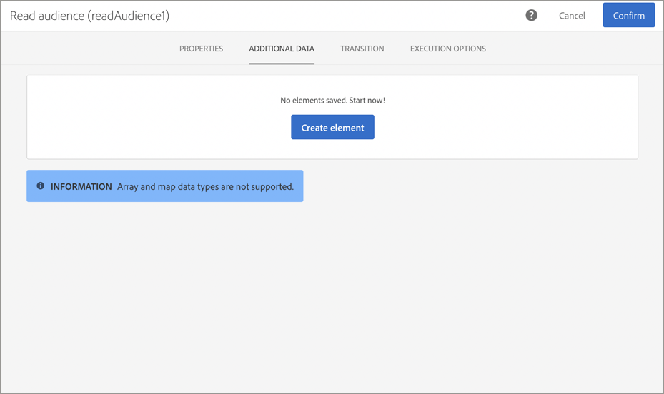

# Personalizing campaigns using Adobe Experience Platform attributes {#personalizing-campaigns-using-aep-attributes}

Once your workflow is configured with an Adobe Experience Platform audience, you can personalize messages with profile attributes that exist exclusively in the Experience Data Model (XDM).

To do this, you must add these attributes into the Read audience activity:

1. Open the Read audience activity. In the Additional data tab, click the Create element button.

    >[!NOTE]
    >
    >The Additional data tab is only available after an Adobe Experience Platform audience has been selected.

    

1. Click the xxxx button to display the list of available XDM fields. Select the desired field, then click Confirm.

    

1. Click the Add button to add the selected field to the list of additional data.

    

1. Repeat these steps for every XDM field that you want to add into your workflow.

>[!NOTE]
>
>You can add a maximum of 20 XDM fields in a Read audience activity.

1. Once all the fields have been added, click the Confirm button to save your changes. They will now be available to personalize your deliveries.

For more information on how to create and personalize deliveries, refer to the Campaign Standard documentation:

* Discovering communication channels
* About channel activities
* Personalizing deliveries

More like this

* Working with Adobe Experience Platform and Adobe Campaign
* Working with Adobe Experience Platform Offer service
* Using Adobe Experience Platform assets in Adobe Campaign
* Mapping Adobe Campaign and Adobe Experience Platform data
