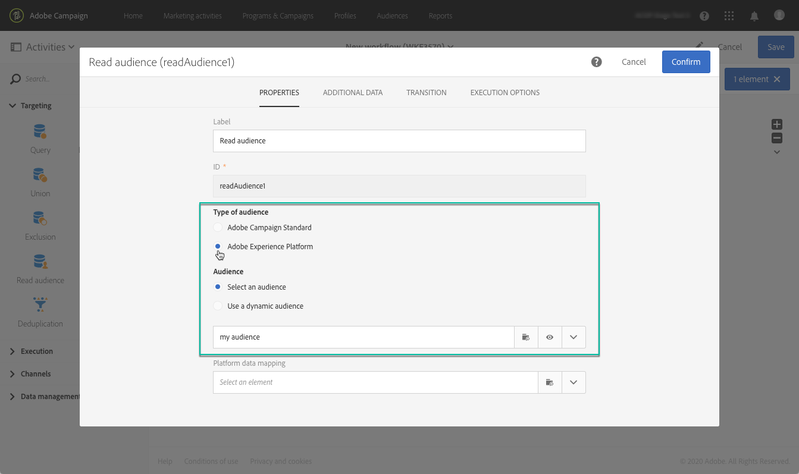
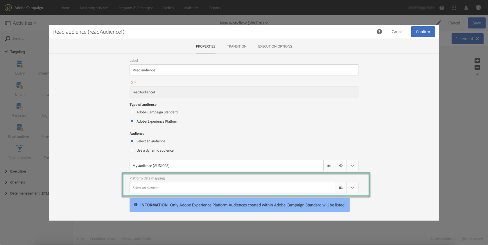
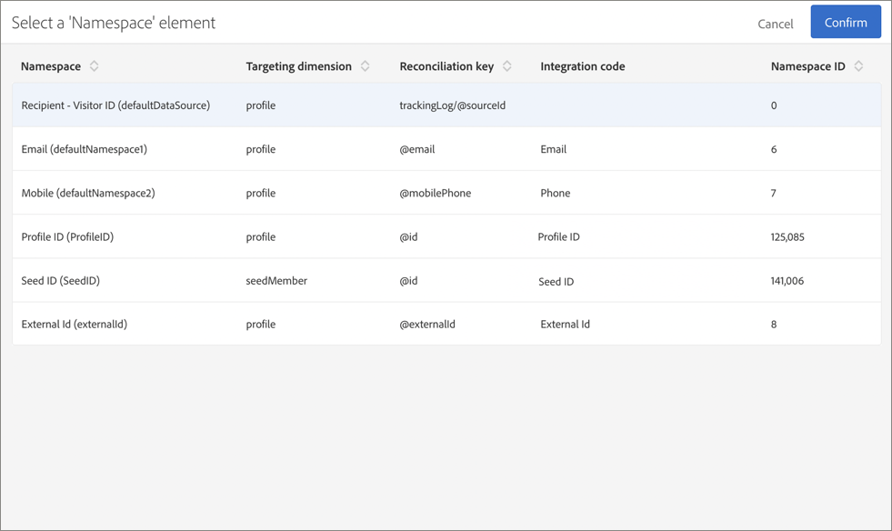
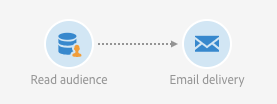

# Targeting Adobe Experience Platform audiences {#targeting-aep-audiences}

>[!IMPORTANT]
>
>Audience Destinations service is currently in beta, which may be subject to frequent updates without notice. Customers are required to be hosted on Azure (currently in beta for North America only) to access these capabilities. Please reach out to Adobe Customer Care if you would like access.

Once you have created an [Adobe Experience Platform audience](../../audiences/using/aep-about-audience-destinations-service.md) using the Unified Profile segment builder, you can use it in the same way as you would for a Campaign audience within workflows to personalize and send messages.

To activate an Adobe Experience Platform audience into your workflows, follow these steps:

1. Add a **[!UICONTROL Read audience]** activity into the workflow, then open it.

1. Select the **[!UICONTROL Adobe Experience Platform]** option under **[!UICONTROL Type of audience]**, then add the desired audience.

    

1. (Optional) Once the audience is selected, you can click the eye button to review and/or edit the segment definition (make sure to save your changes again).

    Clicking the eye button will simply direct you to the Unified Segment Builder (in another tab) associated with the selected audience within Campaign.

1. Select a **[!UICONTROL Platform data mapping]** element to specify the desired targeting dimension for the selected Adobe Experience Platform audience.

    By default, the primary key (e.g., iRecipientID for Profile table, iAppSubscriptionID for AppSubscription table) used for reconciliation will automatically be available from the dropdown list. To target outside of the primary key, you must create a custom **Namespace**.

    >[!NOTE]
    >
    >For targets outside of the primary key, you must also create a custom Target Mapping that corresponds to the custom Namespace. For more information on Target Mapping, refer to [this section](../../administration/using/target-mappings-in-campaign.md).

    

    This list contains all the Experience Data Model (XDM) mappings that have been configured on your instance. For more on Adobe Experience Platform Data Connector, refer to [this dedicated document](../../administration/using/aep-about-data-connector.md).

    

1. Once the audience and targeting dimensions are configured properly, click the **[!UICONTROL Confirm]** button to save your changes.

You can now configure your workflow with other activities. You can, for example, link an **[!UICONTROL Email delivery]** activity to send an email to the audience that has been selected.

>[!NOTE]
>
>Campaign Standard lets you target Adobe Experience Platform audiences within all delivery channels: Emails, SMS messages, Direct mail messages, Push notifications, and In-app messages.

For more on how to use workflows and deliveries, refer to these sections:

* [Discovering workflows](../../automating/using/discovering-workflows.md)
* [Building a workflow](../../automating/using/building-a-workflow.md)
* [Discovering communication channels](../../channels/using/discovering-communication-channels.md)
* [About channel activities](../../automating/using/about-channel-activities.md)
