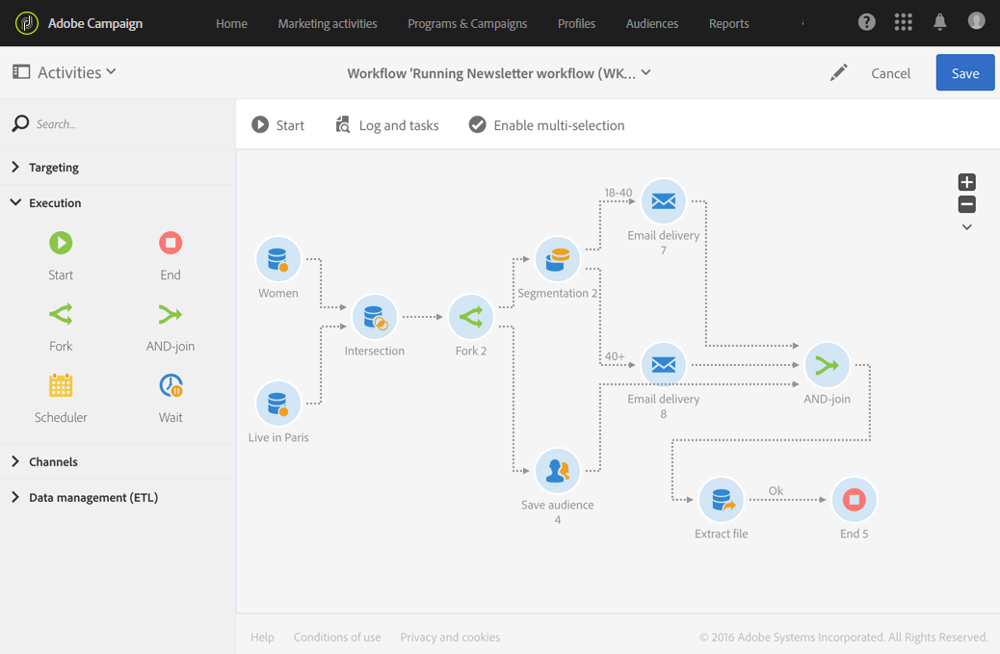

# AND-join{#and-join}

AND-join

## Description {#description}

The **[!UICONTROL AND-join]** activity allows you to synchronize multiple execution branches of a workflow.

## Context of use {#context-of-use}

The **[!UICONTROL AND-join]** activity only triggers its outbound transition once all the inbound transitions are activated, in other words, once all of the preceding activities have finished.

## Configuration {#configuration}

1. Drop multiple activities such as queries into your workflow to form at least two different execution branches.
1. Drag and drop an **[!UICONTROL AND-join]** activity into your workflow.
1. Connect it after the two different branches that you would like to synchronize.
1. Select the activity, then open it using the  

   button from the quick actions that appear.
1. Select the main set to be kept in the outbound transition. If you do not select any set, a random population will be sent from the activity.
1. Confirm the configuration of your activity and save your workflow.

## Example {#example}

The following example shows two workflow branches before they are joined with the **[!UICONTROL AND-join]** activity. File extraction can only take place when the three inbound transitions of the **[!UICONTROL AND-join]** activity are enabled.

