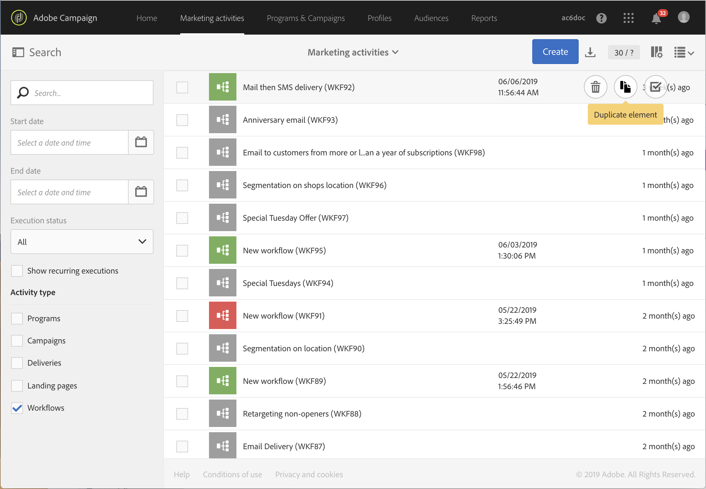
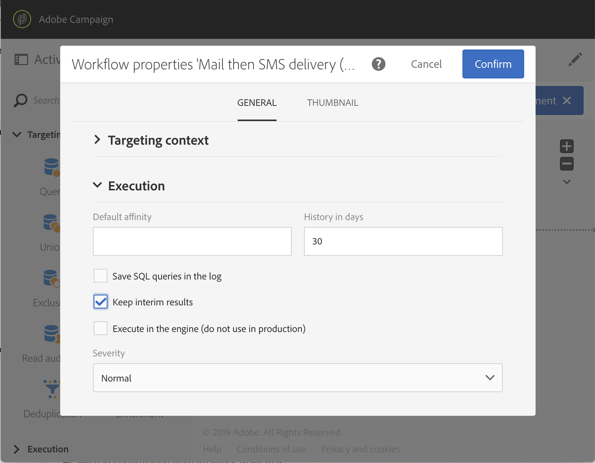
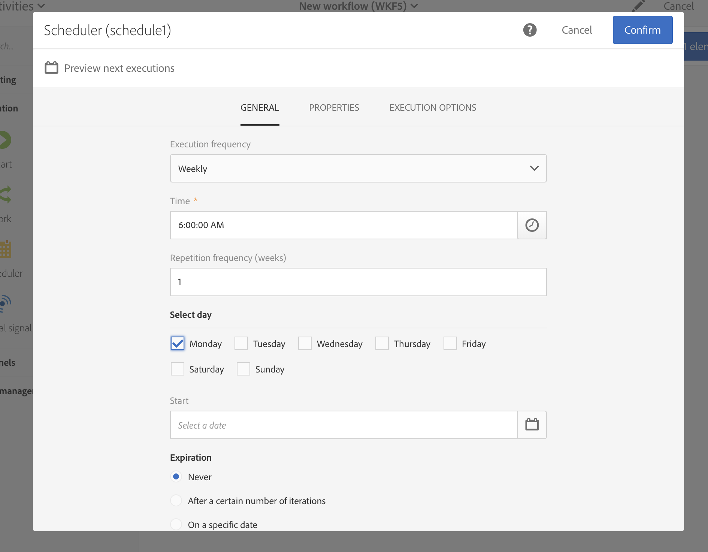

# Workflow best practices{#workflow-best-practices}

With Adobe Campaign, you can set up all types of workflow to perform a large scope of tasks. However, when designing and executing your workflows, you need to be very cautious as a bad implementation can lead to bad performances, errors,and platform issues. You can find below a list of best practices and troubleshooting tips.

>[!NOTE]
>
>Workflow design and execution must be performed by an Adobe Campaign advanced user.

## Naming{#naming}

To ease workflow troubleshooting, Adobe recommends to name and label your workflows explicitly. Fill in the workflow's description field to summarize the process to be performed so that the operator can easily understand it.
If the workflow is part of a process involving multiple workflows, you can use numbers when entering a label to order them clearly.

For example:

* 001 – Import - Import recipients
* 002 – Import – Import sales
* 003 – Import – Import sales details
* 010 – Export – Export delivery logs
* 011 – Export – Export tracking logs

## Duplicating workflows{#duplicating-workflows}

You can duplicate workflows. In the **[!UICONTROL Marketing Activities]**, hover over the workflow and click **[!UICONTROL Duplicate element]**. Once duplicated, modifications of the workflow are not carried over to the copy of the workflow. The copy of the workflow can be edited.

## Execution{#execution}

### Number of workflows

By default, we recommend not to run more than 20 active workflows executions simultaneously. After hitting that limit, workflows will be queued in order not to affect performances. Similarly, Adobe recommends you to spread out your workflow exection over time.
In specific contexts, you may need to run more than 20 workflows. It does not apply to workflows waiting for a scheduled execution.  If so, you need to check the use cases with a Campaign expert and contact Adobe Customer Care to increase the limit.

### Frequency

A workflow cannot be automatically executed more often than once every ten minutes.
The Repetition frequency of the activity cannot be less than 10 minutes. If the repetition frequency is set at 0 (also the default value), this option is not taken into account and the workflow will run according to the execution frequency.

### Paused workflows

Workflows that have been in pause or fail status for more than 7 days are stopped in order to consume less disk space. The cleaning task is displayed in the workflow logs.

### Transitions

A workflow containing unterminated transitions can still be executed: it will generate a warning message and the workflow will pause once it reaches the transition but will not generate an error. You can also start a workflow without a finished design and complete it as you go along.

For more information, refer to [Executing workflows](../../automating/using//executing-a-workflow.md).

## Activity{#activity}

### Workflow design

To ensure that the workflow ends properly, use an **[!UICONTROL End activity]**. Avoid leaving the last transition of a workflow on its own.

To access the detail view of the transitions, check the **[!UICONTROL Keep interim results]** option in the Execution section of the workflow properties.

>[!CAUTION]
>
>This option consumes a lot of disk space and is designed to help you build a workflow and ensure proper configuration and behavior. Leave it unchecked on production instances.

### Labelling activities{#activity-labeling}

While developing your workflow, a name is generated for every activity, as for all Adobe Campaign objects. While the name of an activity is generated by the tool and cannot be edited, we recommend to label it with an explicit name when configuring it.

### Duplicating activities{#activity-duplicating}

To duplicate existing activities, you can use copy-paste. This way, you keep the settings that were originally defined. For more information, refer to [Duplicating workflow activities](../../automating/using/workflow-interface.md).

### Scheduler activity{#acheduler-activity}

When building your workflow, only use one **[!UICONTROL Scheduler activity]** per branch. If the same branch of a workflow has several schedulers (linked to each other), the number of tasks to be executed will be multiplied exponentially, which would considerably overload the database.

You can preview the next ten executions of your workflows by clicking **[!UICONTROL Preview next executions]**.

For more information, refer to [Scheduler activity](../../automating/using/scheduler.md).

## Calling workflow with parameters{#workflow-with-parameters}

Make sure that the name and number of parameters are identical to what is defined when calling the workflow (see [Defining the parameters when calling the workflow](../../automating/using/calling-a-workflow-with-external-parameters.md#defining-the-parameters-when-calling-the-workflow)). The parameters' types must also be consistent with the values that are expected.

Make sure that all the parameters have been declared in the **[!UICONTROL External signal activity]**. Otherwise, an error will occur when running the activity.

For more information, see [Calling a workflow with external parameters](../../automating/using/calling-a-workflow-with-external-parameters.md).

## Exporting packages{#exporting-packages}

To export packages, the resources exported must not contain default IDs. Therefore, the IDs of exportable resources must be changed by using a different name from the templates provided as standard by Adobe Campaign Standard.
For more information, see [Managing packages](../../automating/using/managing-packages.md).

## Exporting lists{#exporting-lists}

The export list option allows you to export a maximum of 100,000 lines by default and defined by the **Nms_ExportListLimit option**. This option can be managed by the functional administrator, under **Administration** > **Application settings** > **Options**.
For more information, see [Exporting lists](../../automating/using/exporting-lists.md).

## Troubleshooting{#workflow-troubleshooting}

Adobe Campaign offers various logs to better understand your workflow issues.

### Using workflow logs{#using-workflow-logs}

You can access workflow logs to monitor the execution of your activities. It indexes the operations carried out and execution errors by chronological order. The Logs tab consists in the history of the execution of all or some selected activities.
The Tasks tab details the execution sequencing of the activities. To get more information on an activity, click a task.
For more information, refer to [Monitoring workflow execution](../../automating/using/executing-a-workflow.md#monitoring).

#### Troubleshooting Query activities{#troubleshooting-query-activities}

You can analyze SQL queries in the Log tab.

1. In the workflow workspace, click **Edit properties**.
1. In **General** > **Execution**, check the **Save SQL queries in the log** and **Execute in the engine** options and click **Confirm**.

**To see SQL queries in Log:**
1. Click **Log and Tasks**.
1. In the **Log** tab, open the **Search** panel. 
1. Check **Display SQL logs only**.

The query is displayed in the **Message** column of the logs.

### Using delivery logs{#using-delivery-logs}

Delivery logs allow to monitor the success of your deliveries. Exclusion logs return excluded messages during preparation of the sending. Sending logs provide the status of the delivery for each profile.
For more information, refer to [Understanding delivery failures](../../sending/using/understanding-delivery-failures.md).

### Using delivery alerting{#delivery-alerting}

The Delivery alerting feature is an alert management system that enables a group of users to automatically receive notifications containing information on the execution of their deliveries.
For more information, refer to [Delivery alerting](../../sending/using/receiving-alerts-when-failures-happen.md).

**Related topics:**

* [Error Management](../../automating/using/executing-a-workflow.md#error-management)
