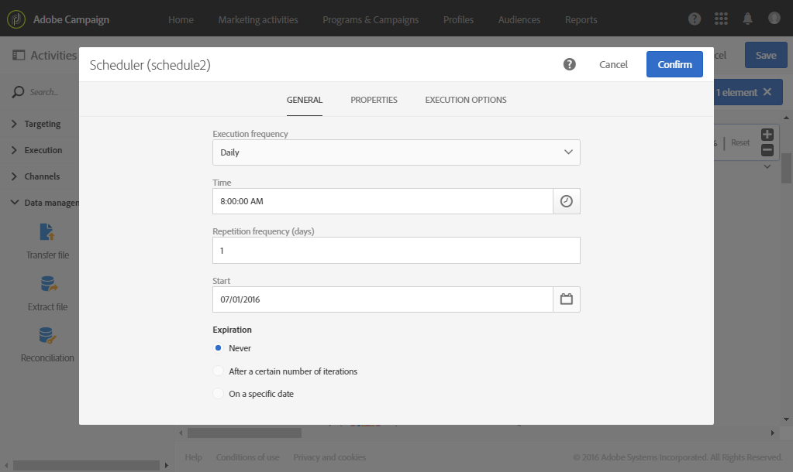
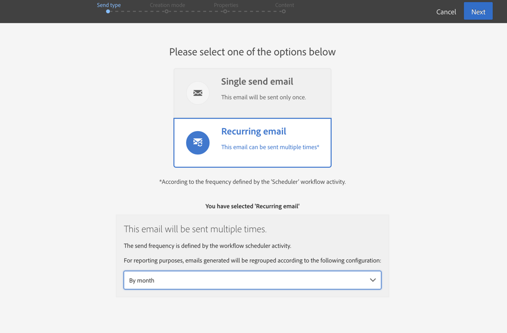

# Birthday delivery {#birthday-delivery}

This example is a birthday workflow. Every day an email is sent to profiles whose birthday it is on that day.

To build the workflow, follow these steps:

* The [Scheduler](../../automating/using/scheduler.md) allows you to start the workflow every day at 8am.

  

* The [Query](../../automating/using/query.md) activity allows you to calculate the profiles who have provided an email and whose birthday it is on the current day, every time the workflow is executed. The birthday calculation is carried out using a predefined filter available in the palette in the query editing tool.

  

* The [Email delivery](../../automating/using/email-delivery.md) is recurring. The sends are aggregated by month. So, all emails sent in a month are aggregated into a single view. In one year, 365 deliveries are therefore executed but they are regrouped into 12 views (also called **recurring executions**) in the Adobe Campaign interface. History and report details are displayed every month and not for every send.

  
