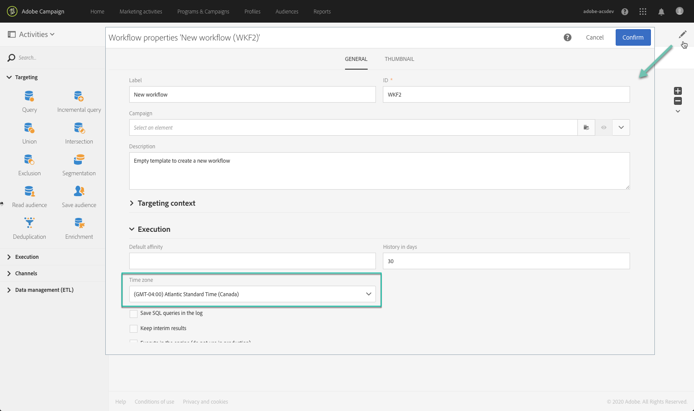

# Building a workflow{#building-a-workflow}

This section details the main principles and best practices for creating a new workflow.

## Workflow operating principles{#workflow-operating-principles}

A workflow is a **sequence of configurable activities**. Each activity has a specific role in the process. The result of each activity is forwarded to the following activity by a **transition**, represented by an arrow.

The type of data exchanged between one activity and another can affect the way the following activities are configured. For example, if a population is established before email delivery activity, it can serve as the target for the email in question.

You can open activities to check or edit parameters before or after executing the workflow.

You can open transitions to check that the data sent is correct during or after executing the workflow. To access the detail view of the transitions, you have to check the **[!UICONTROL Keep interim results]** option in the **[!UICONTROL Execution]** section of the workflow properties.

>[!CAUTION]
>
>This option consumes a lot of disk space and is designed to help you build a workflow and ensure proper configuration and behavior. Leave it unchecked on production instances.

## Creating a workflow {#creating-a-workflow}

You can create a workflow from a program, a campaign, or the marketing activity list.

 [Discover how to build a workflow in video](#video)

Creating a marketing activity is detailed in the [Creating marketing activities](../../start/using/marketing-activities.md#creating-a-marketing-activity) section.

1. Once you have started creating a workflow type marketing activity, select the template you want to use.

   

   >[!NOTE]
   >
   >Each marketing activity offers several types by default. These allow you to preconfigure certain parameters according to your needs. For more information, refer to the [Managing templates](../../start/using/marketing-activity-templates.md) section.

1. Enter the general properties of the workflow.

   

   You can enter a name in the **Label** field and modify the ID. The activity name and its ID appear in the interface, but these are not visible by the message recipients.

   >[!NOTE]
   >
   >You can create your workflow within a parent campaign from the list of marketing activities. You can link this workflow to a campaign by selecting one that has already been created.

   You can add a description that the user can see in the campaign content.

   Because it makes them easier to find and troubleshoot if they are not performing in the expected ways, Adobe recommends to give your workflows proper names and labels: fill in the workflow's description field to summarize the process to be performed so that the operator can easily understand it.

1. Confirm creating the activity and the dashboard for that activity will then be displayed. For more on this, refer to the [Workflow interface](../../automating/using/workflow-interface.md) section.

1. Once the workflow is ready to be configured, you can access additional options by clicking the **[!UICONTROL Edit properties]** button.

   You can, for example, define a specific time zone to use by default in all the workflow's activities. By default, the workflow's time zone is the one defined for the current Campaign operator.

   For more on workflows' properties, refer to [this page](../../automating/using/managing-execution-options.md).

    

## Adding and linking activities {#adding-and-linking-activities}

You must now define the various activities and link them together in the diagram.

>[!NOTE]
>
>If the palette is not shown, click the first button of the toolbar to display it.

Activities are grouped by category inside the different sections of the palette.

* The first section contains [targeting activities](../../automating/using/about-targeting-activities.md) 
* The second section contains the [execution activities](../../automating/using/about-execution-activities.md), which are mainly used for coordinating other activities.
* The third section contains activities that can be used to send messages on different [channels](../../automating/using/about-channel-activities.md). Activities in this section can vary depending on the channels that are enabled on your instance.
* The fourth section contains [file manipulation and data management activities](../../automating/using/about-data-management-activities.md).

To create the diagram:

1. Add an activity by dragging it from the palette and dropping it in the diagram.

   For example, add a **[Start](../../automating/using/start-and-end.md)** activity and then an **[Email delivery](../../automating/using/email-delivery.md)** activity on the diagram.

1. Link the activities together by dragging the **Start** activity transition and dropping it on to the **Email delivery** activity.

   >[!NOTE]
   >
   >You can automatically link an activity to the previous one by placing the new activity at the end of the transition of the previous.

1. Add the activities you need and link them together to complete your workflow.

   >[!NOTE]
   >
   >You can also duplicate existing activities by copy-pasting them. This way, you keep the settings that were originally defined. For more on this, refer to [Duplicating workflow activities](../../automating/using/workflow-interface.md#duplicating-workflow-activities).

Once your workflow activities are linked together, you can personalize the transitions between them with the **label** of your choice. To do this, double-click the transition to access its properties.

Moreover, **[!UICONTROL Targeting]** and **[!UICONTROL Data management (ETL)]** activities allows you to define **segment codes** for their outbound transitions. You can then create reports based on these segment codes in order to measure the efficiency of your maketing campaigns. For more on this, refer to [this section](../../reporting/using/creating-a-report-workflow-segment.md).

**Workflow use cases:**

* [Use case: Create a once-a-week email delivery](../../automating/using/workflow-weekly-offer.md)
* [Use case: Creating a delivery segmented on location](../../automating/using/workflow-segmentation-location.md)
* [Use case: Creating deliveries with a complement](../../automating/using/workflow-created-query-with-complement.md)
* [Use case: Retargeting workflow sending a new delivery to non-openers](../../automating/using/workflow-cross-channel-retargeting.md)

## Configuring activities {#configuring-activities}

By default, activities are not set and won't process the data correctly if they are not configured. Each activity contains several tabs to manage specific configurations and activity generic options such as outbound transitions, labels, etc.

1. Make sure all activities are correctly connected. Some activities require to detect the structure or nature of the incoming data to offer the correct configuration options.
1. Double-click an activity or select it and click the **[!UICONTROL Edit]** contextual action to open its configuration window.
1. Edit the label of the activity.
1. Define all different options that you need to process the data. Refer to the activity's specific section of this documentation to learn the possible options for each activity.
1. Save the activity and repeat these operations for each activity of the workflow.
1. Save the workflow.

## Tutorial video {#video}

This video shows how to create a workflow.

>[!VIDEO](https://video.tv.adobe.com/v/23937?quality=12)

Additional Campaign Standard how-to videos are available [here](https://experienceleague.adobe.com/docs/campaign-standard-learn/tutorials/overview.html).
