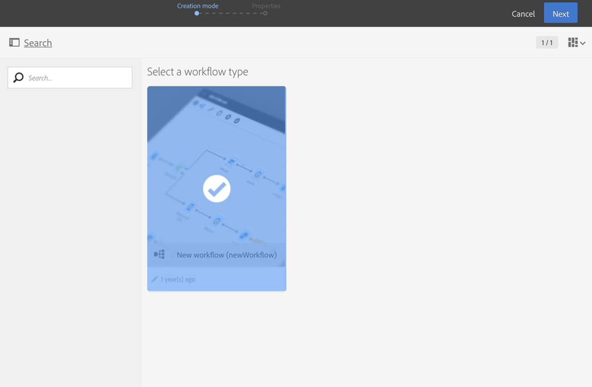
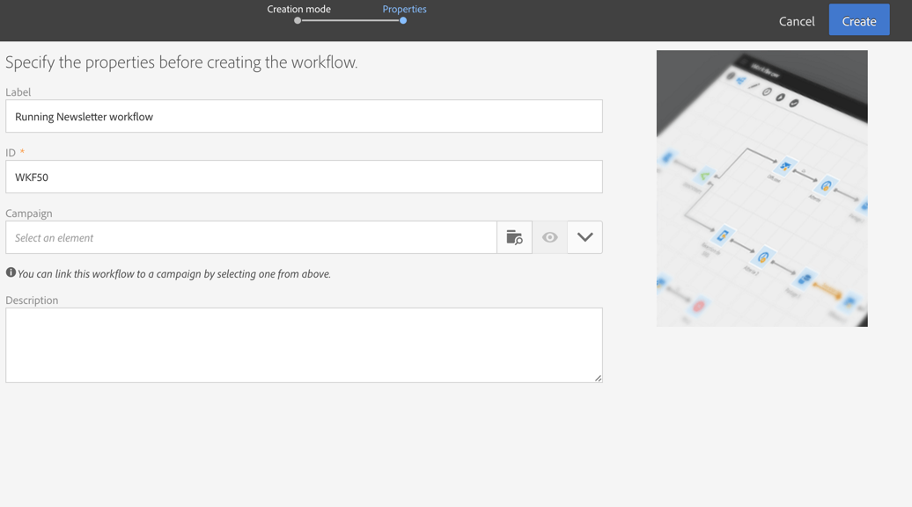

# Building a workflow

Building a workflow

This section details the main principles and best practices for creating a new workflow:

* Creating a workflow.
* Adding and linking activities.
* Configuring activities.

## Creating a workflow

You can create a workflow from a program, a campaign, or the marketing activity list.

Creating a marketing activity is detailed in the [Creating marketing activities](../../start/using/marketing-activities.md#creating-a-marketing-activity) section.

1. Once you have started creating a workflow type marketing activity, select the template you want to use.

   

   >[!NOTE]
   >
   >Each marketing activity offers several types by default. These allow you to preconfigure certain parameters according to your needs. For more information, refer to the [Managing templates](../../start/using/about-templates.md) section.

1. Enter the general properties of the workflow.

   

   You can enter a name in the **Label** field and modify the ID. The activity name and its ID appear in the interface, but these are not visible by the message recipients.

   >[!NOTE]
   >
   >You can create your workflow within a parent campaign from the list of marketing activities. You can link this workflow to a campaign by selecting one that has already been created.

   You can add a description that the user can see in the campaign content.

   Because it makes them easier to find and troubleshoot if they are not performing in the expected ways, Adobe recommends to give your workflows proper names and labels: fill in the workflow's description field to summarize the process to be performed so that the operator can easily understand it.

1. Confirm creating the activity and the dashboard for that activity will then be displayed. For more on this, refer to the [Workflow interface](../../automating/using/workflow-interface.md) section.

**Related topic:**

[Creating a workflow](https://docs.campaign.adobe.com/doc/standard/en/Videos/workflow_creation.mp4) video

## Adding and linking activities

You must now define the various activities and link them together in the diagram.

>[!NOTE]
>
>If the palette is not shown, click the first button of the toolbar to display it.

Activities are grouped by category inside the different sections of the palette.

* The first section contains targeting activities.
* The second section contains the execution activities, which are mainly used for coordinating other activities.
* The third section contains activities that can be used to send messages on different channels. Activities in this section can vary depending on the channels that are enabled on your instance.
* The fourth section contains file manipulation and data management activities.

To create the diagram:

1. Add an activity by dragging it from the palette and dropping it in the diagram.

   For example, add a **Start** activity and then an **Email delivery** activity on the diagram.

1. Link the activities together by dragging the **Start** activity transition and dropping it on to the **Email delivery** activity.

   >[!NOTE]
   >
   >You can automatically link an activity to the previous one by placing the new activity at the end of the transition of the previous.

1. Add the activities you need and link them together to complete your workflow.

## Configuring activities

By default, activities are not set and won't process the data correctly if they are not configured. Each activity contains several tabs to manage specific configurations and activity generic options such as outbound transitions, labels, etc.

1. Make sure all activities are correctly connected. Some activities require to detect the structure or nature of the incoming data to offer the correct configuration options.
1. Double-click an activity or select it and click the **Edit** contextual action to open its configuration window.
1. Edit the label of the activity.
1. Define all different options that you need to process the data. Refer to the activity's specific section of this documentation to learn the possible options for each activity.
1. Save the activity and repeat these operations for each activity of the workflow.
1. Save the workflow.

