# Calling a workflow with external parameters{#calling-a-workflow-with-external-parameters}

Campaign Standard lets you call a workflow with parameters (an audience name to target, a file name to import, a part of message content, etc.). This way, you can easily integrate your Campaign automations with your external system.

Let's take the following example, where we want to send emails directly from a CMS. In that case, you can configure your system to select the audience and email content into the CMS. Clicking on Send will then call a Campaign workflow with these parameters, enabling you to use them into the workflow to define the audience and URL content to use in the delivery.

The process to call a workflow with parameters is the following:

1. Declare the parameters in the **[!UICONTROL External signal]** activity. See [Declaring the parameters in the External signal activity](../../automating/using/calling-a-workflow-with-external-parameters.md#declaring-the-parameters-in-the-external-signal-activity).
1. Configure the **[!UICONTROL End]** activity or the API call to define the parameters and trigger the workflow **[!UICONTROL External signal]** activity.

Once the workflow triggered, the parameters are ingested into the workflow's events variables and can be used within the workflow. See [Customizing a workflow with external parameters](../../automating/using/calling-a-workflow-with-external-parameters.md#customizing-a-workflow-with-external-parameters).

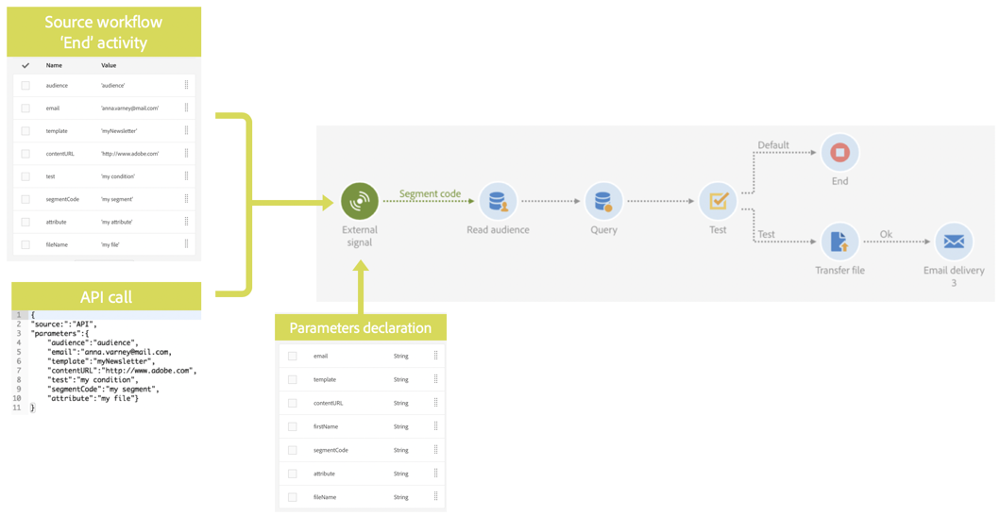

## Declaring the parameters in the External signal activity {#declaring-the-parameters-in-the-external-signal-activity}

The first step to call a workflow with parameters is to declare them in an **[!UICONTROL External signal]** activity.

1. Open the **[!UICONTROL External signal]** activity, then select the **[!UICONTROL Parameters]** tab.
1. Click the **[!UICONTROL Create element]** button, then specify the name and type of each parameter.

   >[!CAUTION]
   >
   >Make sure that the name and number of parameters are identical to what is defined when calling the workflow (see [Defining the parameters when calling the workflow](../../automating/using/calling-a-workflow-with-external-parameters.md#defining-the-parameters-when-calling-the-workflow)). Moreover, the parameters' types must be consistent with the values that are expected.

   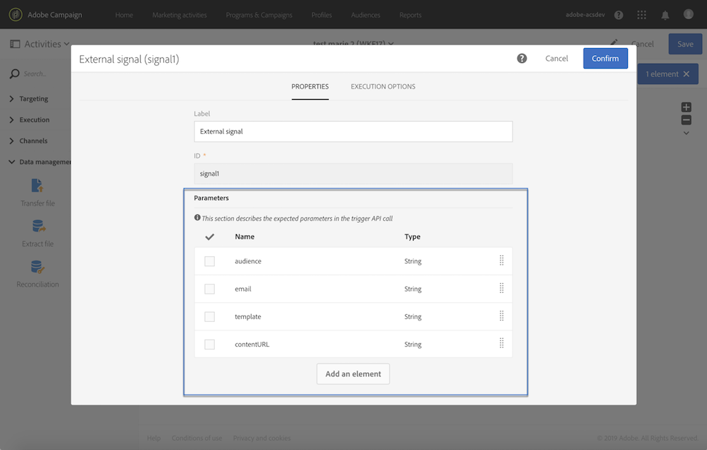

1. Once the parameters declared, finish the workflow configuration, then run it.

## Defining the parameters when calling the workflow {#defining-the-parameters-when-calling-the-workflow}

This section details how to define parameters when calling a workflow. For more on how to perform this operation from an API call, refer to the [REST APIs documentation](../../api/using/triggering-a-signal-activity.md).

Before defining the parameters, make sure that:

* The parameters have been declared in the **[!UICONTROL External Signal]** activity. See [Declaring the parameters in the External signal activity](../../automating/using/calling-a-workflow-with-external-parameters.md#declaring-the-parameters-in-the-external-signal-activity).
* The workflow containing the signal activity is running.

To configure the **[!UICONTROL End]** activity, follow the steps below:

1. Open the **[!UICONTROL End]** activity, then select the **[!UICONTROL External signal]** tab.
1. Select the workflow and the external signal activity that you want to call.
1. Click the **[!UICONTROL Create element]** button to add a parameter, then fill in its name and value.

    * **[!UICONTROL Name]**: the name that has been declared in the **[!UICONTROL External signal]** activity (see [Declaring the parameters in the External signal activity](../../automating/using/calling-a-workflow-with-external-parameters.md#declaring-the-parameters-in-the-external-signal-activity)).
    * **[!UICONTROL Value]**: the value that you want to assign to the parameter. The value should follow the **Standard syntax**, described in [this section](../../automating/using/advanced-expression-editing.md#standard-syntax).

   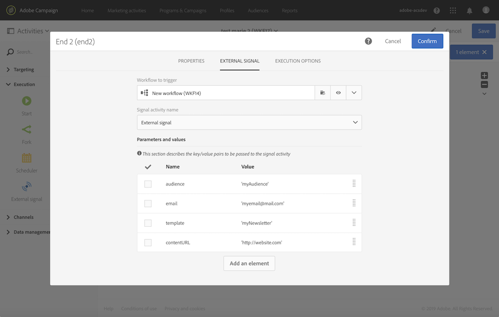

   >[!CAUTION]
   >
   >Make sure that all the parameters have been declared in the **[!UICONTROL External signal]** activity. Otherwise, an error will occur when running the activity.

1. Once the parameters defined, confirm the activity, then save your workflow.

## Monitoring the events variables {#monitoring-the-events-variables}

It is possible to monitor the events variables that are available in the workflow, including the declared external parameters. To do this, follow the steps below:

1. Select the activity that follows the **[!UICONTROL External signal]** activity, then click the **[!UICONTROL Log and tasks]** button.
1. In the **[!UICONTROL Tasks]** tab, click  button.

   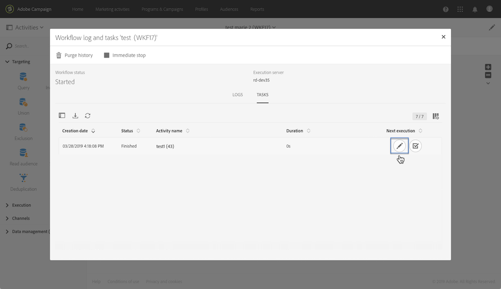

1. The execution context of the task displays (ID, status, duration, etc.), including all events variables that are now available for use in the workflow.

   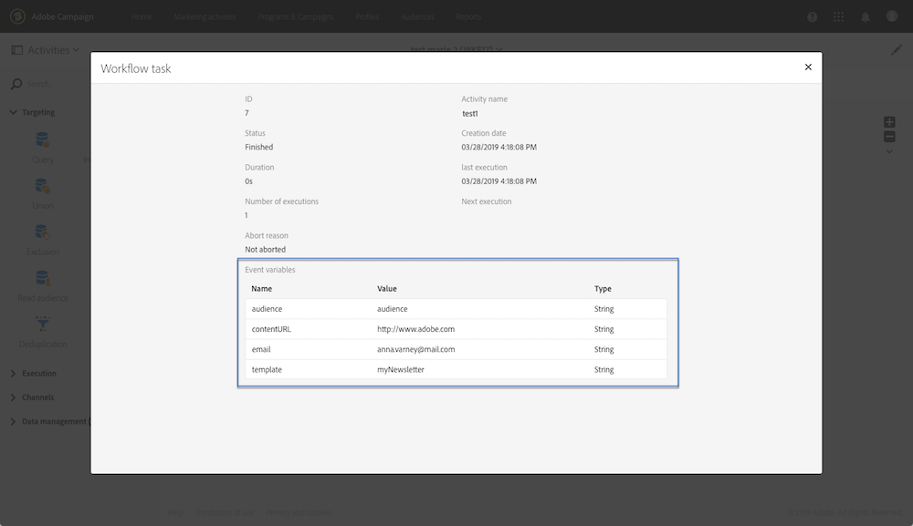

## Customizing a workflow with external parameters {#customizing-a-workflow-with-external-parameters}

Once the workflow triggered, the parameters are ingested into the events variables and can be used to customize the workflow's activities.

They can, for example, be used to define which audience to read in the **[!UICONTROL Read audience]** activity, the name of the file to transfer in the **[!UICONTROL Transfer file]** activity, etc.

Activities that can be customized with events variables are detailed in [this section](../../automating/using/calling-a-workflow-with-external-parameters.md#customizing-activities-with-events-variables).

### Using events variables {#using-events-variables}

Events variables are used within an expression that must respect the **[Standard syntax](../../automating/using/advanced-expression-editing.md#standard-syntax)**.

The syntax to use events variables must follow the format below, and use the parameter's name that has been defined in the **[!UICONTROL External signal]** activity (see [Declaring the parameters in the External signal activity](../../automating/using/calling-a-workflow-with-external-parameters.md#declaring-the-parameters-in-the-external-signal-activity)):

```
$(vars/@parameterName)
```

In this syntax, the **$** function returns **string** data type. If you want to specify another type of data, use the following functions:

* **$long**: integer number.
* **$float**: decimal number.
* **$boolean**: true/false.
* **$datetime**: timestamp.

When using a variable in an activity, the interface provides help to call it.

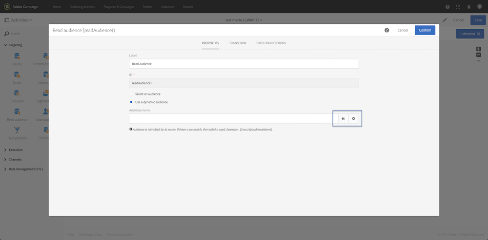

* : select the events variable among all variables that are available in the workflow.

  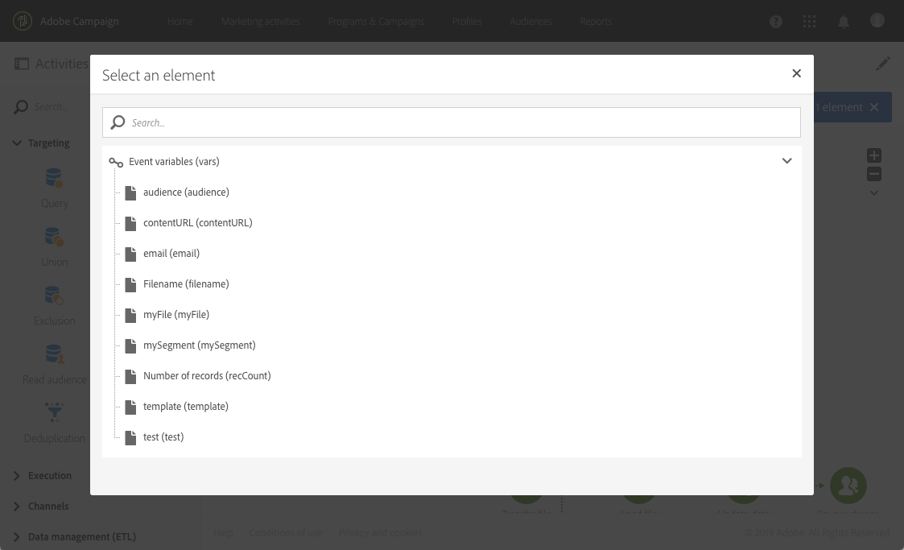

* : edit expressions combining variables and functions. For more on the Expression editor, refer to [this section](../../automating/using/advanced-expression-editing.md).

  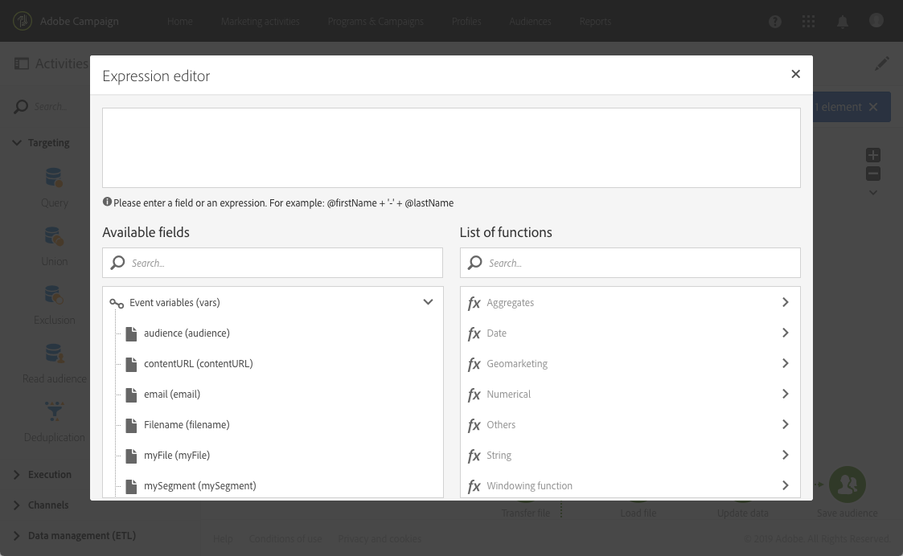

**Related topics:**

* [Edit an expression](../../automating/using/advanced-expression-editing.md#edit-an-expression)
* [Standard syntax](../../automating/using/advanced-expression-editing.md#standard-syntax)
* [List of functions](../../automating/using/list-of-functions.md)

### Customizing activities with events variables {#customizing-activities-with-events-variables}

Events variables can be used to customize several activities, listed in the section below. For more on how to call a variable from an activity, refer to [this section](../../automating/using/calling-a-workflow-with-external-parameters.md#using-events-variables).

**[!UICONTROL Read audience]** activity: define the audience to target based on events variables.

For more on how to use the activity, refer to the [dedicated section](../../automating/using/read-audience.md).

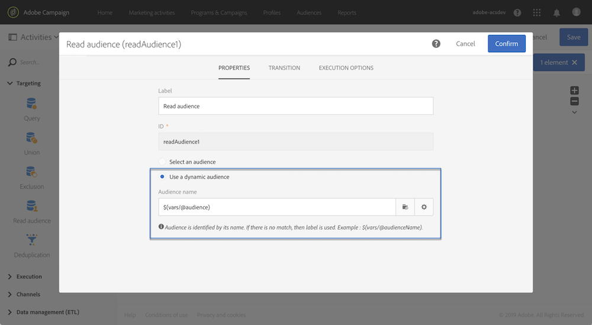

**[!UICONTROL Test]** activity: build conditions based on events variables.

For more on how to use the activity, refer to the [dedicated section](../../automating/using/test.md).

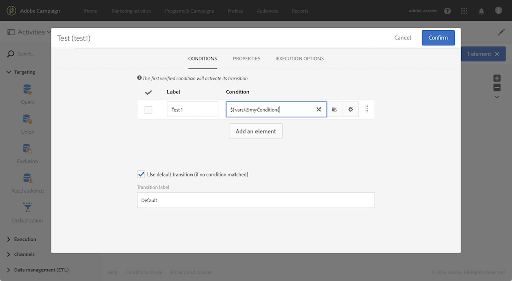

**[!UICONTROL Transfer file]** activity: customize the file to transfer based on events variables.

For more on how to use the activity, refer to the [dedicated section](../../automating/using/transfer-file.md).

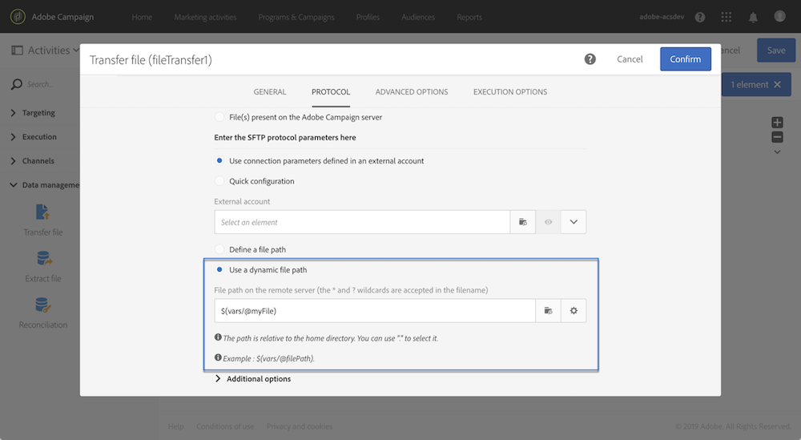

**[!UICONTROL Query]** activity: parameters can be referenced in a query, by using expressions combining events variables and functions. To do this, add a rule then click the **[!UICONTROL Advanced mode]** link to access the expression editing window (see [Advanced expression editing](../../automating/using/advanced-expression-editing.md)).

For more on how to use the activity, refer to the [dedicated section](../../automating/using/query.md).

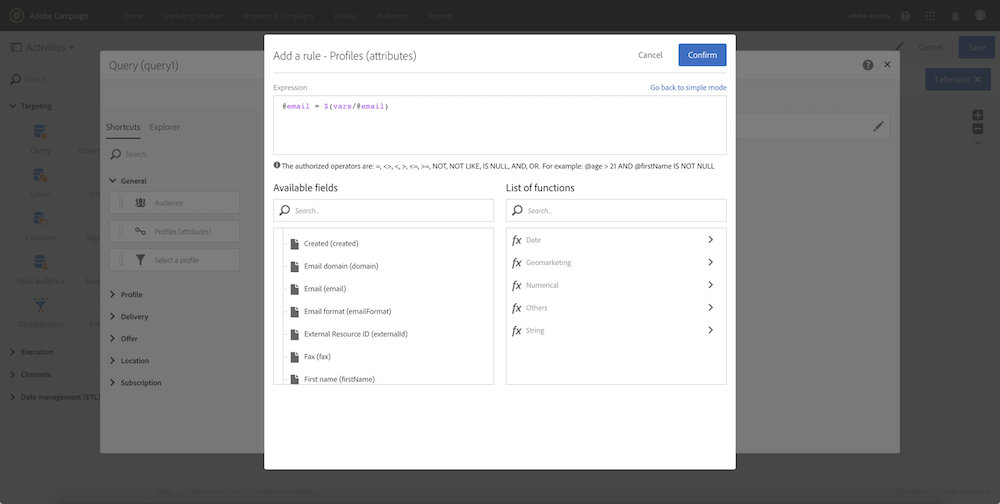

**[!UICONTROL Channels]** activities: personalize deliveries based on events variables.

  >[!NOTE]
  >
  >The delivery parameters' values are retrieved each time the delivery is prepared.
  >
  >Recurring deliveries preparation is based on the delivery **aggregation period**. For example, if the aggregation period is "by day", then the delivery will be re-prepared only once a day. If a delivery parameter's value is modified during the day, then it will not be updated in the delivery, as it has already been prepared once.
  >
  >If you plan on calling the workflow multiple times a day, use the [!UICONTROL No aggregation] option, so that the delivery parameters are updated each time. For more on recurring deliveries configuration, refer to [this section](/help/automating/using/email-delivery.md#configuration).

To personalize a delivery based on events variables, you must first declare into the delivery activity the variables that you want to use:

1. Select the activity, then click the  button to access the settings.
1. Select the **[!UICONTROL General]** tab, then add the events variables that will be available as personalization fields in the delivery.

   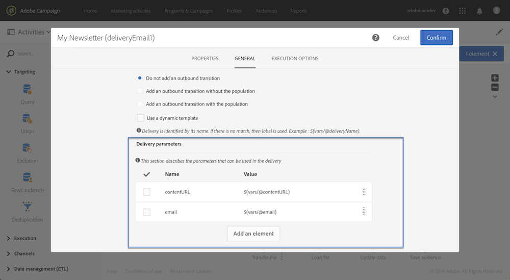

1. Click the **[!UICONTROL Confirm]** button.

Declared events variables are now available from the list of personalization fields. You can use them in the delivery to perform the actions below:

* Define the name of the template to use for the delivery.

  >[!NOTE]
  >
  >This action is available for **recurring** deliveries only.

  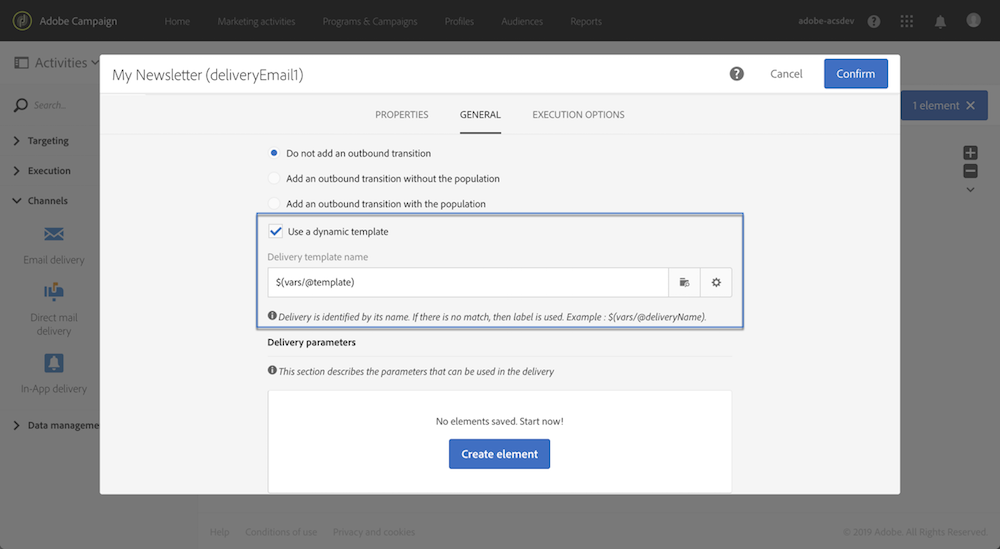

* Personalize the delivery: when selecting a personalization field to configure a delivery, events variables are available in the **[!UICONTROL Workflow parameters]** element. You can use them as any personalization field, for example to define the delivery subject, the sender etc.

  Delivery personalization is detailed in [this section](../../designing/using/personalization.md).

  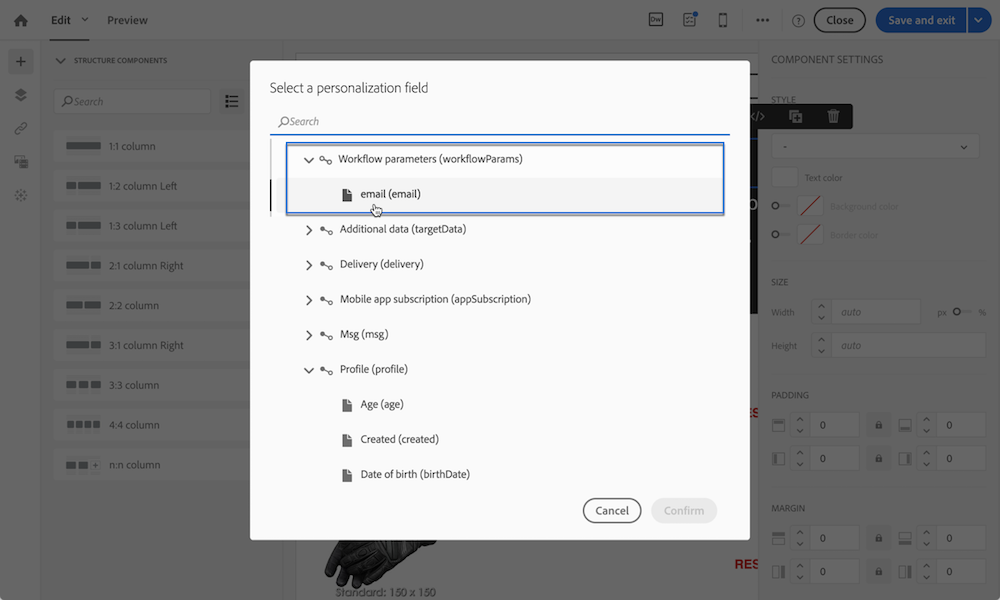

**Segment codes**: define the segment code based on events variables.

>[!NOTE]
>
>This action can be performed from any activity that lets you define a segment code like, for example, **[!UICONTROL Query]** or **[!UICONTROL Segmentation]** activities.

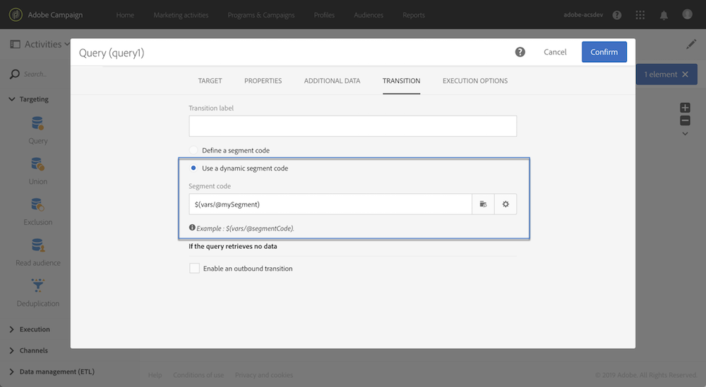

**Delivery label**: define the delivery label based on events variables.

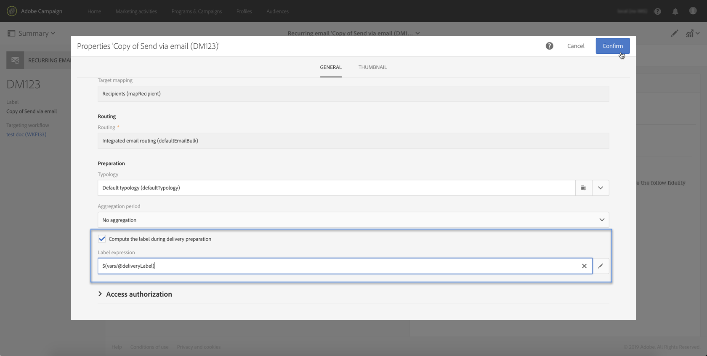

## Use case {#use-case}

The use case below shows how to call workflow with parameters within your workflows.

The objective is to trigger a workflow from an API call with external parameters. This workflow will load data into your database from a file and create an associated audience. Once the audience has been created, a second workflow will be triggered to send a message personnalized with the external parameters defined in the API call.

To perform this use case, you need to perform the actions below:

1. **Make an API call** to trigger Workflow 1 with external parameters. See [Step 1: Configuring the API call](../../automating/using/calling-a-workflow-with-external-parameters.md#step-1--configuring-the-api-call).
1. **Build Workflow 1**: the workflow will transfer a file and load it into the database. It will then test if the data is empty or not, and eventually save the profiles into an audience. Finally, it will trigger Workflow 2. See [Step 2: Configuring Workflow 1](../../automating/using/calling-a-workflow-with-external-parameters.md#step-2--configuring-workflow-1).
1. **Build Workflow 2**: the workflow will read the audience that has been created in Workflow 1, then send a personalized message to the profiles, with a segment code customized with the parameters. See [Step 3: Configuring Workflow 2](../../automating/using/calling-a-workflow-with-external-parameters.md#step-3--configuring-workflow-2).

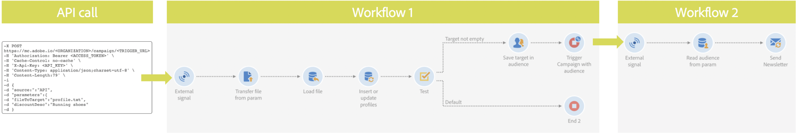

### Prerequisites {#prerequisites}

Before configuring the workflows, you need to create Workflow 1 and 2 with an **[!UICONTROL External signal]** activity in each of them. This way, you will be able to target these signal activities when calling the workflows.

### Step 1: Configuring the API call {#step-1--configuring-the-api-call}

Make an API call to trigger Workflow 1 with parameters. For more on the API call syntax, refer to the [Campaign Standard REST APIs documentation](../../api/using/triggering-a-signal-activity.md).

In our case, we want to call the workflow with the parameters below:

* **fileToTarget**: the name of the file that we want to import into the database.
* **discountDesc**: the description that we want to display into the delivery for the discount.

```
-X POST https://mc.adobe.io/<ORGANIZATION>/campaign/<TRIGGER_URL>
-H 'Authorization: Bearer <ACCESS_TOKEN>' 
-H 'Cache-Control: no-cache' 
-H 'X-Api-Key: <API_KEY>' 
-H 'Content-Type: application/json;charset=utf-8' 
-H 'Content-Length:79' 
-i
-d {
-d "source:":"API",
-d "parameters":{
-d "fileToTarget":"profile.txt",
-d "discountDesc":"Running shoes"
-d } 
```

### Step 2: Configuring Workflow 1 {#step-2--configuring-workflow-1}

Workflow 1 will be built as below:

* **[!UICONTROL External signal]** activity: where the external parameters must be declared in order to be used within the workflow.
* **[!UICONTROL Transfer file]** activity: imports the file with the name defined in the parameters.
* **[!UICONTROL Load file]** activity: loads data from the imported file into the database.
* **[!UICONTROL Update data]** activity: insert or update the database with data from the imported file.
* **[!UICONTROL Test]** activity: checks if there is data imported.
* **[!UICONTROL Save audience]** activity: if the file contains data, saves the profiles into an audience.
* **[!UICONTROL End activity]** activity: calls Workflow 2 with the parameters that you want to use within it.

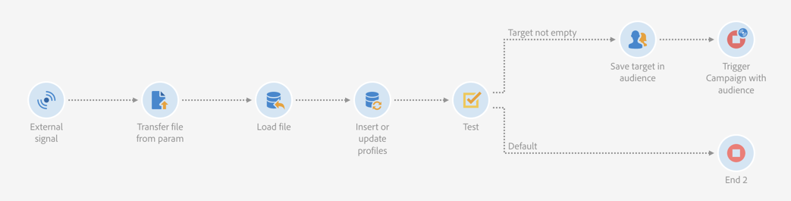

Follow the steps below to configure the workflow:

1. Declare the parameters that have been defined in the API call. To do this, open the **[!UICONTROL External signal]** activity, then add the parameters' names and types.

   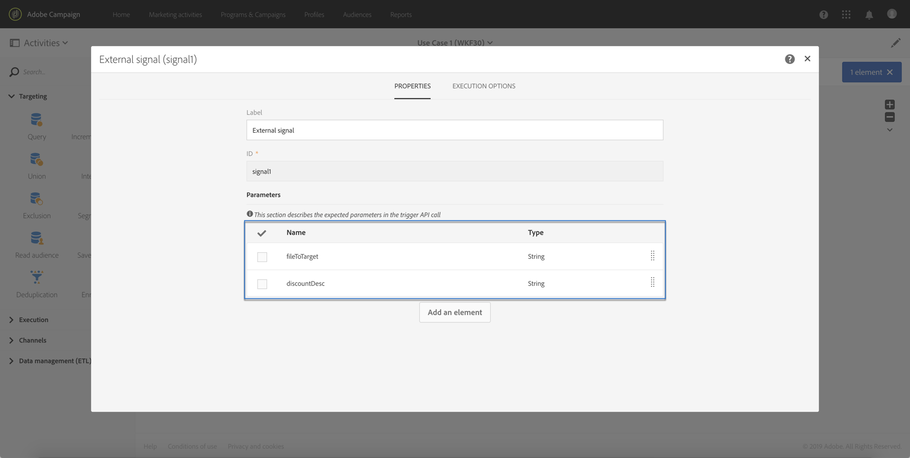

1. Add a **[!UICONTROL Transfer file]** activity to import data into the database.To do this, drag and drop the activity, open it, then select the **[!UICONTROL Protocol]** tab.
1. Select the **[!UICONTROL Use a dynamic file path]** option, then use the **fileToTarget** parameter as the file to transfer:

   ```
   $(vars/@fileToTarget)
   ```

   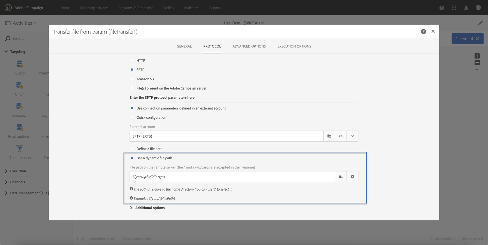

1. Load the data from the file into the database.

   To do this, drag and drop a **[!UICONTROL Load file]** activity into the workflow, then configure it according to your needs.

1. Insert and update the database with data from the imported file.

   To do this, drag and drop an **[!UICONTROL Update data]** activity, then select the **[!UICONTROL Identification]** tab to add a reconciliation criteria (in our case the **email** field).

   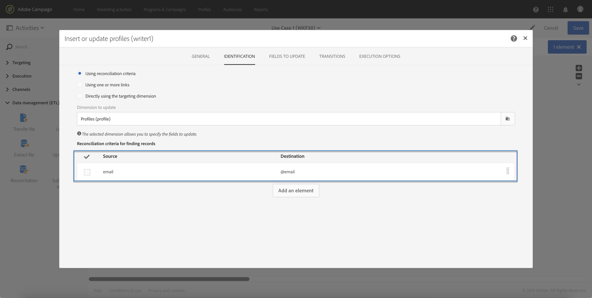

1. Select the **[!UICONTROL Fields to update]** tab, then specify the fields to update in the database (in our case the **firstname** and **email** fields).

   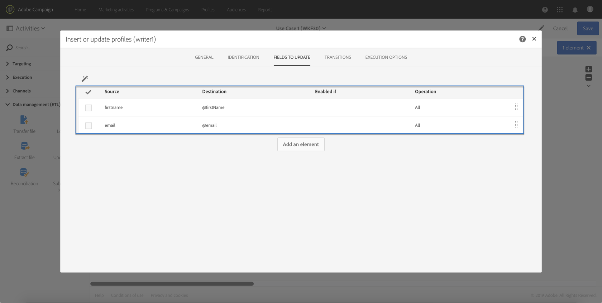

1. Check if data is retrieved from the file. To do this, drag and drop a **[!UICONTROL Test]** activity into the workflow, then click the **[!UICONTROL Add an element]** button to add a condition.
1. Name and define the condition. In our case, we want to test if the outbound transition contains data with the syntax below:

   ```
   $long(vars/@recCount)>0
   ```

   

1. If data is retrieved save it into an audience. To do this, add a **[!UICONTROL Save audience]** activity to the **Target not empty** transition, then open it.
1. Select the **[!UICONTROL Use a dynamic label]** option, then use the **fileToTarget** parameter as the label of the audience:

   ```
   $(vars/@fileToTarget)
   ```

   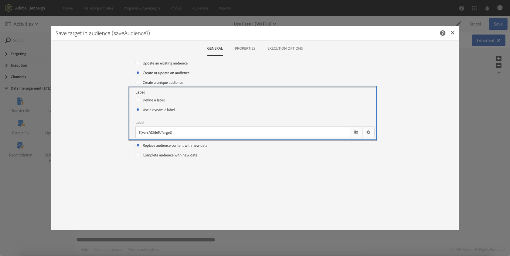

1. Drag and drop an **[!UICONTROL End]** activity that will call Workflow 2 with parameters, then open it.
1. Select the **[!UICONTROL External signal]** tab, then specify the workflow to trigger and its associated signal activity.
1. Define the parameters that you want use within Workflow 2 and their associated values.

   In our case, we want to pass the parameters originally defined in the API call (**fileToTarget** and **discountDesc**), and an additional **segmentCode** parameter with a constant value ("20% discount").

   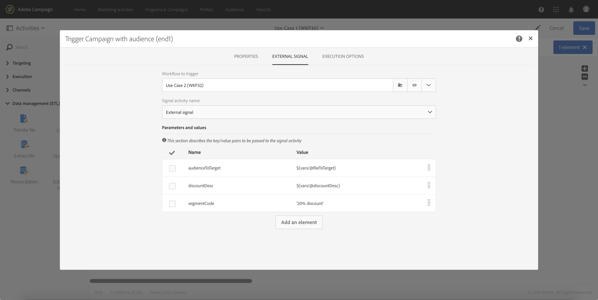

Workflow 1 is configured, you can now build Workflow 2. For more on this, refer to [this section](../../automating/using/calling-a-workflow-with-external-parameters.md#step-3--configuring-workflow-2).

### Step 3: Configuring Workflow 2 {#step-3--configuring-workflow-2}

Workflow 2 will be built as below:

* **[!UICONTROL External signal]** activity: where the parameters must be declared in order to be used within the workflow.
* **[!UICONTROL Read audience]** activity: reads the audience saved in Workflow 1.
* **[!UICONTROL Email delivery]** activity: sends a recurring message to the targeted audience, personalized with parameters.

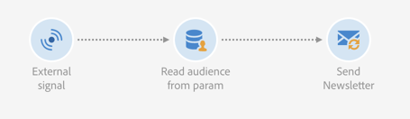

Follow the steps below to configure the workflow:

1. Declare the parameters that have been defined in Workflow 1.

   To do this, open the **[!UICONTROL External signal]** activity, then add the name and type of each parameter defined in the **[!UICONTROL End]** activity of Workflow 1.

   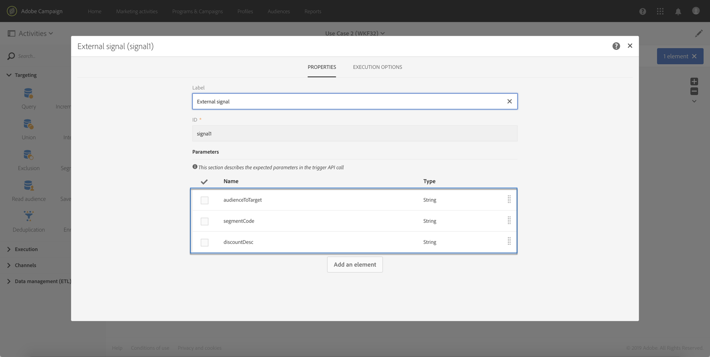

1. Use the audience that has been saved in Workflow 1. To do this, drag and drop a **[!UICONTROL Read audience]** activity into the workflow, then open it.
1. Select the **[!UICONTROL Use a dynamic audience]** option, then use the **fileToTarget** parameter as the name of the audience to read:

   ```
   $(vars/@fileToTarget)
   ```

   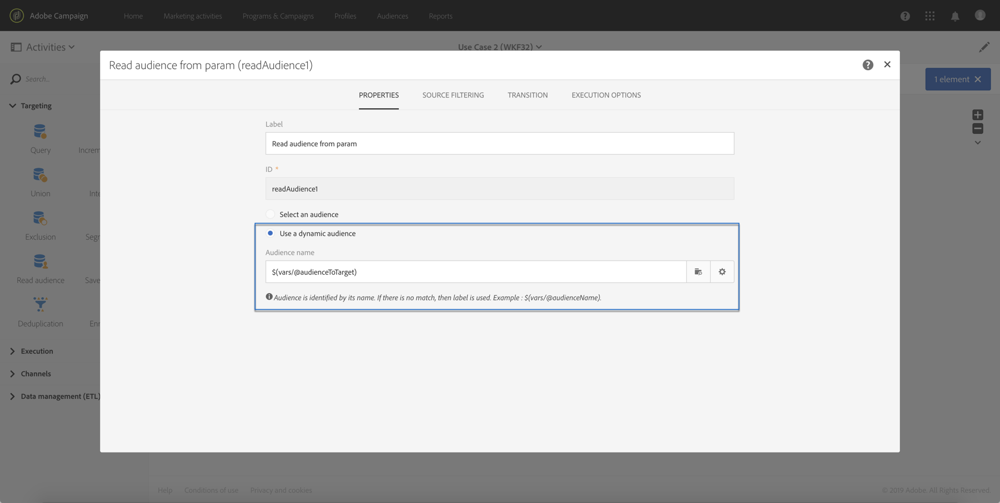

1. Name the outbound transition according to the **segmentCode** parameter.

   To do this, select the **[!UICONTROL Transition]** tab, then the **[!UICONTROL Use a dynamic segment code]** option.

1. Use the **segmentCode** parameter as the name of the outbound transition:

   ```
   $(vars/@segmentCode)
   ```

   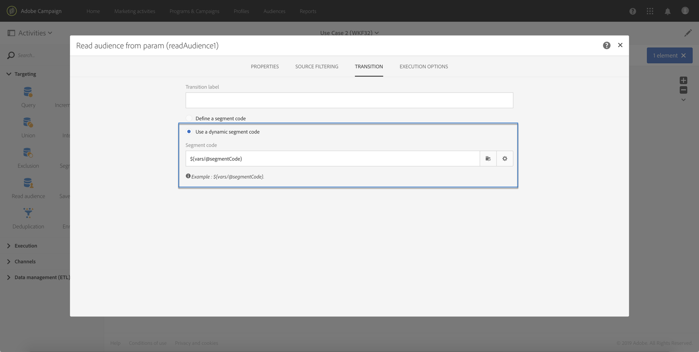

1. Drag and drop an **[!UICONTROL Email delivery]** activity to send a message to the audience.
1. Identify the parameters to use in the message to personalize it with the **discountDesc** parameter. To do this, open the activity's advanced options, then add the parameter name and value.

   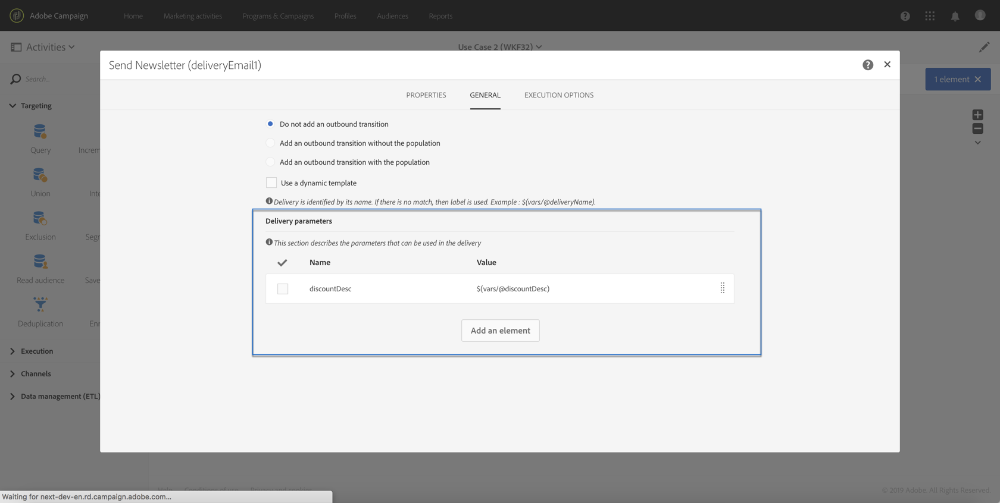

1. You can now configure the message. Open the activity, then select **[!UICONTROL Recurring email]**.

   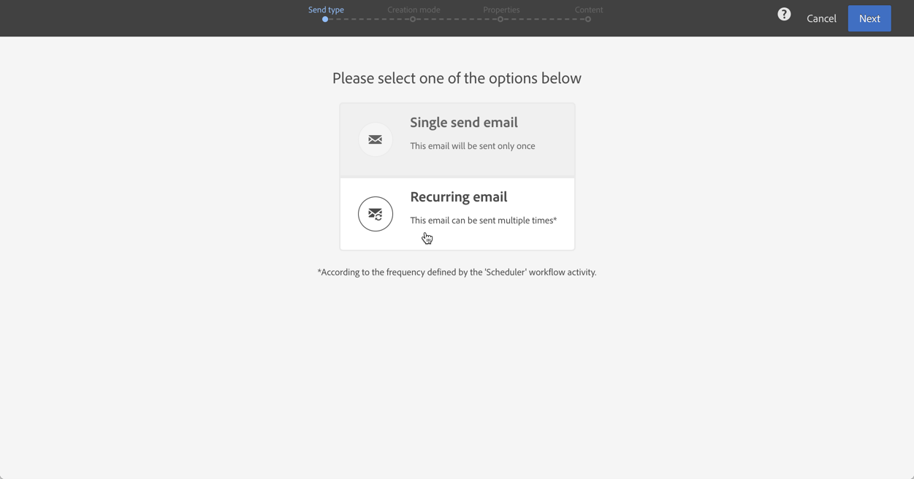

1. Select the template to use, then define the email properties according to your needs.
1. Use the **discountDesc** parameter as a personalization field. To do this, select it from the personalization fields list. 

   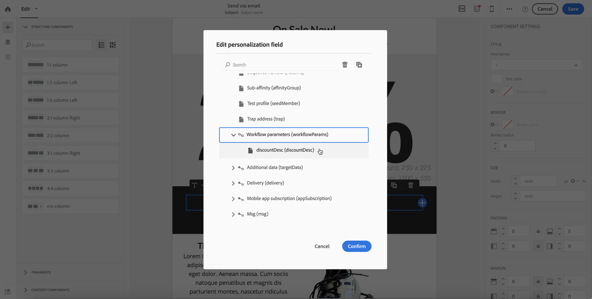

1. You can now finish configuring the message, then send it as usual.

   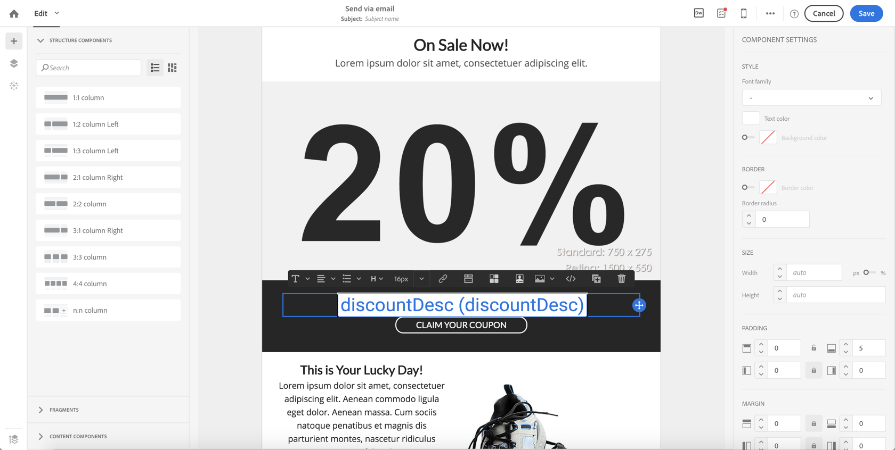

### Executing the workflows {#executing-the-workflows}

Once the workflows built, you can execute them. Make sure the two workflows are started before performing the API call.
