# Deduplication{#deduplication}

## Description {#description}


The **[!UICONTROL Deduplication]** activity allows you to delete duplicates in the result(s) of the inbound activities.

## Context of use {#context-of-use}

The **[!UICONTROL Deduplication]** activity is generally used following targeting activities or after importing a file and before activities that allow the use of targeted data.

During deduplication, inbound transitions are processed separately. For example, if profile 'A' is present in the result of query 1, and also in the result of query 2, it will not be deduplicated.

It is therefore advised that a deduplication only has one inbound transition. To do this, you can combine your different queries by using activities that correspond to your targeting needs such as a union activity, an intersection activity, etc. For example:


## Configuration {#configuration}

To configure a deduplication activity, you must enter a label, the method and the deduplication criteria, as well as the options relating to the result.

1. Drag and drop a **[!UICONTROL Deduplication]** activity into your workflow.
1. Select the activity, then open it using the  button from the quick actions that appear.

   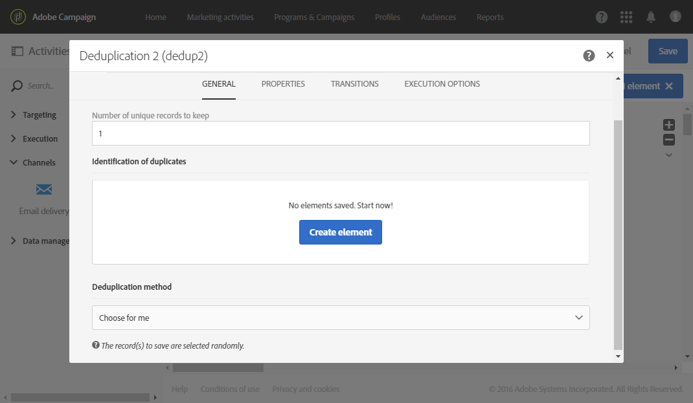

1. Select the **[!UICONTROL Resource type]** on which the deduplication has to be carried out:

    * **[!UICONTROL Database resource]** if the deduplication is carried out on data that already exists in the database. Select the **[!UICONTROL Filtering dimension]** and the **[!UICONTROL Targeting dimension]** , depending on the data that you want to deduplicate. By default, deduplication is carried out on the **profiles**.
    * **[!UICONTROL Temporary resource]** if the deduplication is carried out on the workflow's temporary data: select the **[!UICONTROL Targeted set]** containing the data to deduplicate. This use case can be encountered after importing a file or if the data in the database was enriched (with a segment code, for example).

1. Select the **[!UICONTROL Number of unique records to keep]** . The default value for this field is 1. The value 0 allows you to keep all the duplicates.

   For example, if records A and B are considered duplicates of record Y, and a record C is considered as a duplicate of record Z:

    * If the value of the field is 1: only the Y and Z records are kept.
    * If the value of the field is 0: all the records are kept.
    * If the value of the field is 2: records C and Z are kept and two records from A, B, and Y are kept, by chance or depending on the deduplication method selected thereafter.

1. Define the **[!UICONTROL Duplicate identification]** criteria by adding conditions in the list provided. Specify the fields and/or expressions for which the identical values allow the duplicates to be identified: email address, first name, last name, etc. The order of the conditions allows you to specify those to process first.
1. In the drop-down list, select the **[!UICONTROL Deduplication method]** to use:

    * **[!UICONTROL Choose for me]** : randomly selects the record to be kept out of the duplicates.
    * **[!UICONTROL Following a list of values]** : lets you define a value priority for one or more fields. To define the values, select a field or create an expression, then add the value(s) into the appropriate table. To define a new field, click the **[!UICONTROL Add]** button located above the list of values.
    
      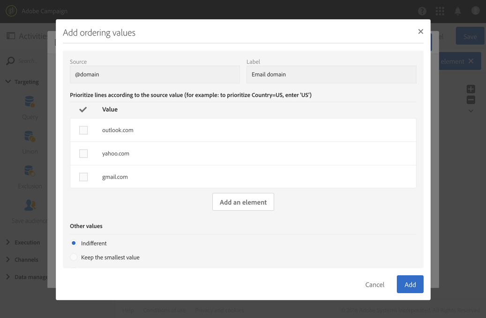

    * **[!UICONTROL Non-empty value]** : this lets you keep records for which the value of the selected expression is not empty as a priority.
    
      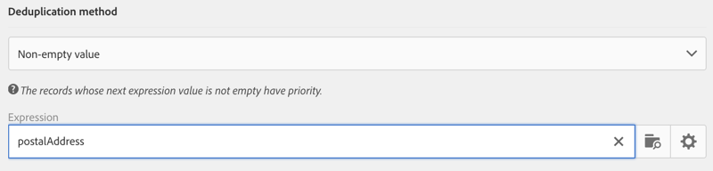

    * **[!UICONTROL Using an expression]** : this lets you keep the records in which the value of the expression entered is the smallest or the biggest. 
    
      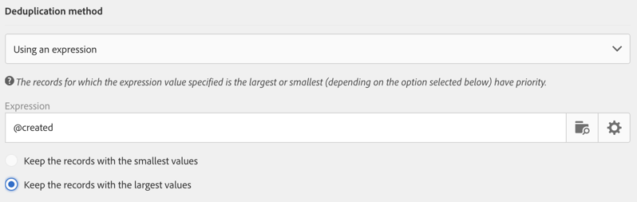

1. If needed, manage the activity's [Transitions](../../automating/using/executing-a-workflow.md#managing-an-activity-s-outbound-transitions) to access the advanced options for the outbound population.
1. Confirm the configuration of your activity and save your workflow.

## Example 1: Identifying duplicates before a delivery {#example-1--identifying-duplicates-before-a-delivery}

The following example illustrates a deduplication that lets you exclude the duplicates of a target before sending an email. This means you avoid sending a communication several times to the same profile.

The workflow is made up of:

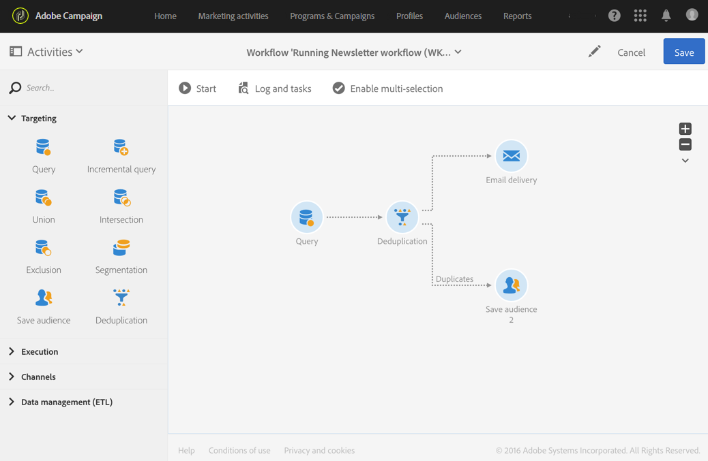

* A **[!UICONTROL Query]** which allows you to define the target of the email. Here, the workflow targets all profiles aged between 18 and 25 that have been in the client database for more than a year.

  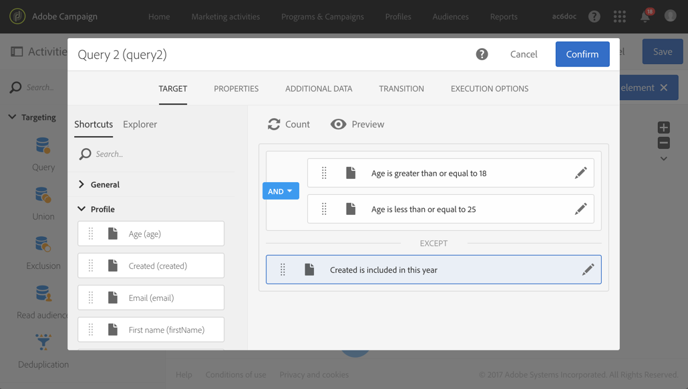

* A **[!UICONTROL Deduplication]** activity, which allows you to identify the duplicates that come from the preceding query. In this example, only one record is saved for each duplicate. The duplicates are identified using the email address. This means that the email delivery can only be sent once for each email address to be present in the targeting.

  The deduplication method selected is **[!UICONTROL Non-empty value]** . This allows you to ensure that amongst the records kept in case of duplicates, priority is given to those in which the **First name** has been provided. This will make it more coherent if the first name is used in the personalization fields of the email content.

  In addition, an extra transition is added to keep the duplicates and to be able to list them.

  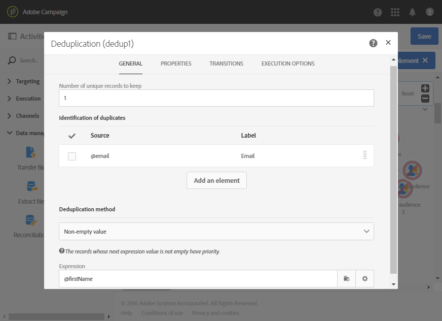

* An **[!UICONTROL Email delivery]** placed after the main outbound transition of the deduplication. The configuration for email deliveries is detailed in the [Email delivery](../../automating/using/email-delivery.md) section.
* A **[!UICONTROL Save audience]** activity placed after the additional transition of the deduplication to save the duplicates in a **Duplicates** audience. This audience can be reused to directly exclude its members from every email delivery.

## Example 2: Deduplicating the data from an imported file {#example-2--deduplicating-the-data-from-an-imported-file}

This example shows how to deduplicate data from a file imported before loading the data into the database. This procedure improves the quality of the data loaded in the database.

The workflow is made up of:

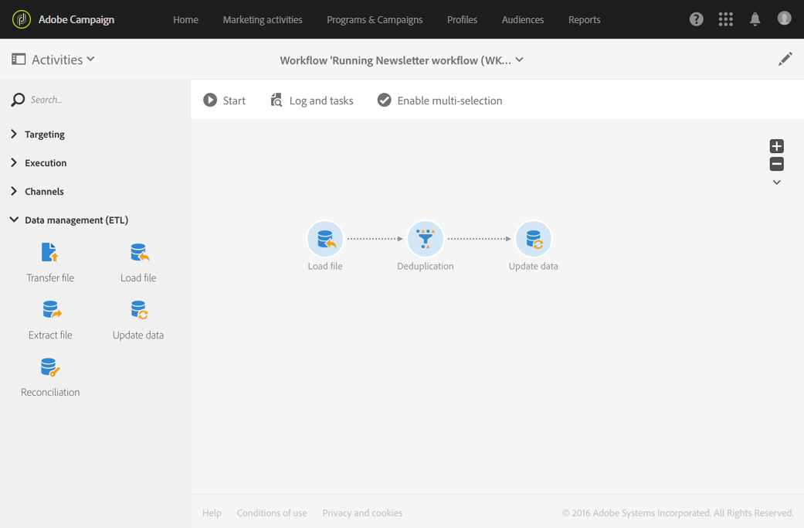

* A file that contains a list of profiles is imported using a **[!UICONTROL Load file]** activity. In this example, the file imported is in .csv format and contains 10 profiles:

  ```
  lastname;firstname;dateofbirth;email
  Smith;Hayden;23/05/1989;hayden.smith@example.com
  Mars;Daniel;17/11/1987;dannymars@example.com
  Smith;Clara;08/02/1989;hayden.smith@example.com
  Durance;Allison;15/12/1978;allison.durance@example.com
  Lucassen;Jody;28/03/1988;jody.lucassen@example.com
  Binder;Tom;19/01/1982;tombinder@example.com
  Binder;Tommy;19/01/1915;tombinder@example.com
  Connor;Jade;10/10/1979;connor.jade@example.com
  Mack;Clarke;02/03/1985;clarke.mack@example.com
  Ross;Timothy;04/07/1986;timross@example.com
  ```

  This file can also be used as a sample file to detect and define the format of the columns. From the **[!UICONTROL Column definition]** tab, make sure that each column of the imported file is configured correctly.

  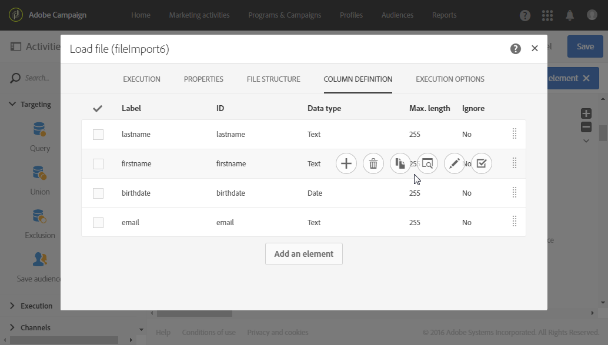

* A **[!UICONTROL Deduplication]** activity. Deduplication is carried out directly after importing the file and before inserting the data into the database. It should therefore be based on the **[!UICONTROL Temporary resource]** from the **[!UICONTROL Load file]** activity.

  For this example, we want to keep a single entry per unique email address contained in the file. Duplicate identification is therefore carried out on the **email** column of the temporary resource. Yet, two email addresses appear twice in the file. Two lines will therefore be considered as duplicates.

  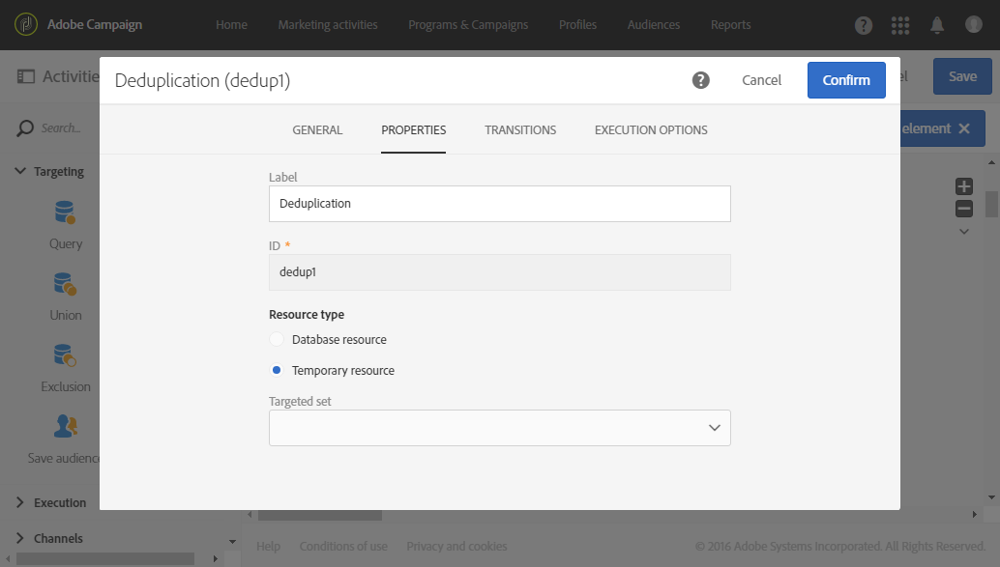

* An **[!UICONTROL Update data]** activity allows you to insert the data kept from the deduplication process into the database. It is only when the data is updated that the imported data is identified as belonging to the profile dimension.

  Here, we would like to **[!UICONTROL Insert only]** the profiles that do not already exist in the database. We are going to do this by using the file's email column and the email field from the **Profile** dimension as the reconciliation key.

  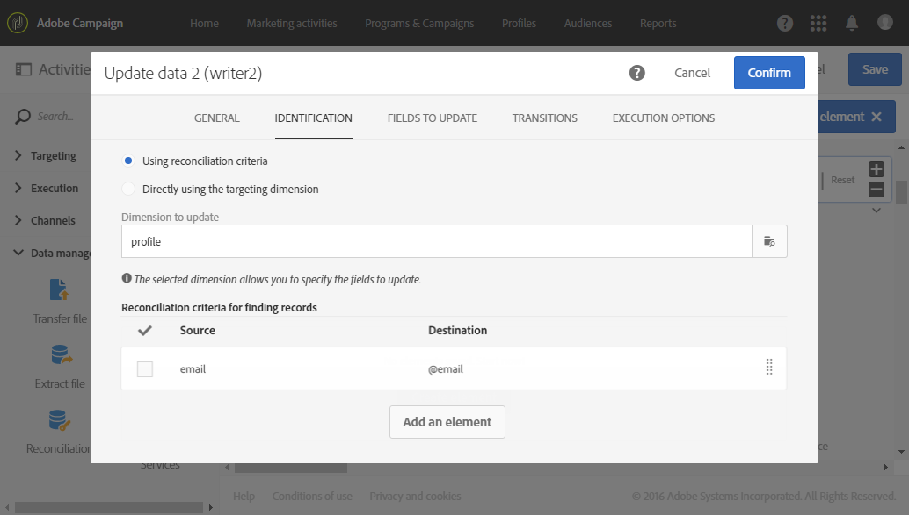

  Specify the mappings between the file's columns from which you want to insert the data and the database fields from the **[!UICONTROL Fields to update]** tab.

  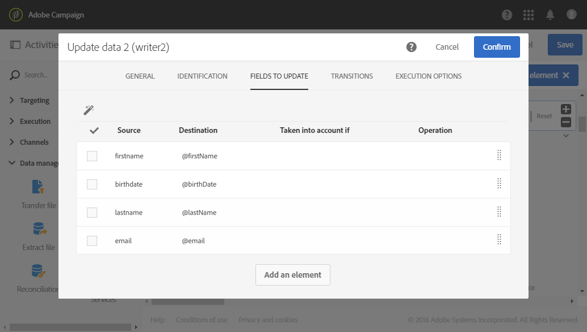

Then start the workflow. The records saved from the deduplication process are then added to the profiles in your database.
