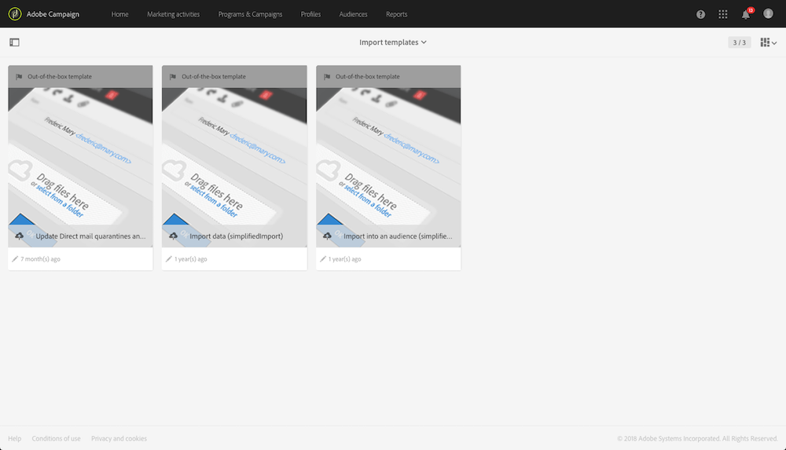
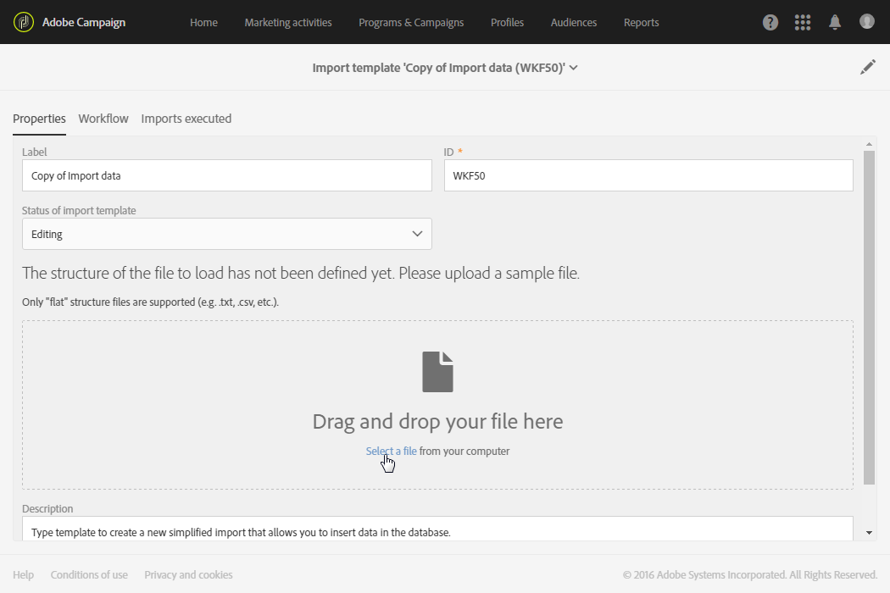
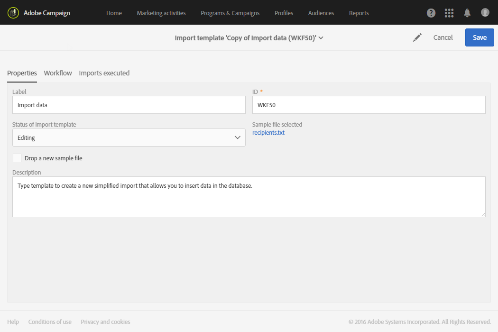
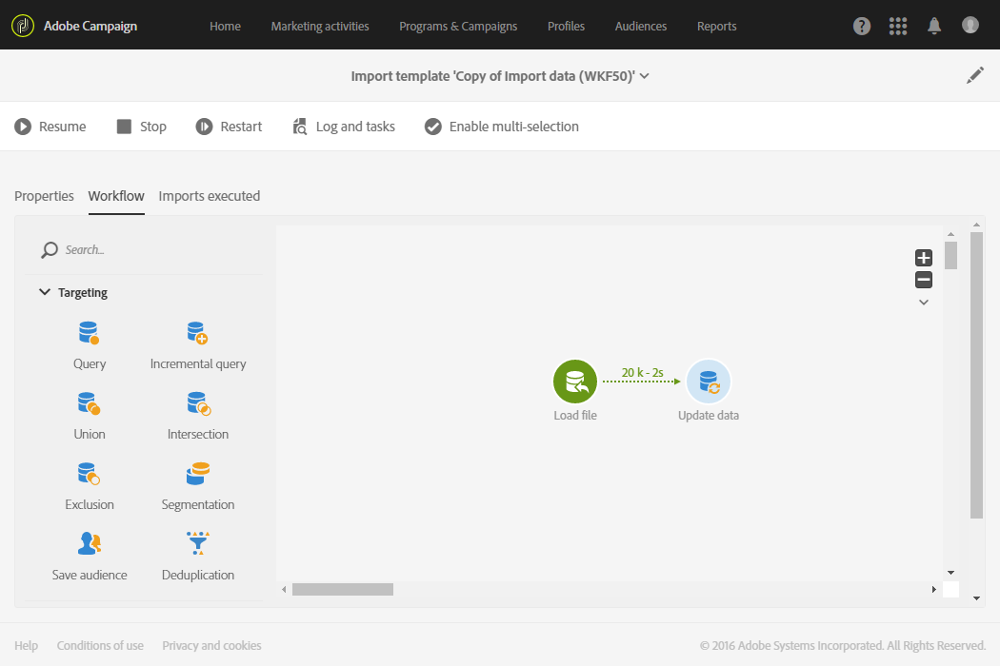

# Defining import templates{#defining-import-templates}

Import templates allow the administrator to pre-define a certain number of technical import configurations. These templates can then be made available to standard users to carry out and upload files.

An import template is defined by the functional administrator and can be managed under the **[!UICONTROL Resources]** > **[!UICONTROL Templates]** > **[!UICONTROL Import templates]** menu.

Three default read-only templates are available:

* **[!UICONTROL Update Direct mail quarantines and delivery logs]** : this template can serve as a basis for new imports to update quarantines and delivery logs for Direct mail. The template's workflow contains the following activities: 
* **[!UICONTROL Import data]** : this template can serve as a basis for new imports to insert data from a file into the database. This template's workflow contains the following activities:

    * **[!UICONTROL Load file]** : this activity allows you to upload a file on the Adobe Campaign server.
    * **[!UICONTROL Update data]** : this activity allows you to insert data from the file in the database.

* **[!UICONTROL Import list]** : this template can serve as a basis for new imports to create a **List** type audience from data in a file. This template's workflow contains the following activities:

    * **[!UICONTROL Load file]** : this activity allows you to upload a file on the Adobe Campaign server.
    * **[!UICONTROL Reconciliation]** : this activity allows you to link a targeting dimension to imported data. This then allows you to create a **List** type audience. If the targeting dimension of the imported data is not known, the audience is **File** type. See [Targeting dimensions and resources](../../automating/using/query.md#targeting-dimensions-and-resources).
    * **[!UICONTROL Save audience]** : this activity allows you to save data imported in the form of a **List** type audience. The name of the saved audience corresponds to the name of the file imported by the user, and a suffix specifying the date and time of the import will be added. For example: 'profiles_20150406_151448'.

These default templates are read-only and are not visible to standard users. To create a template that will be available to users, follow these steps:

1. Duplicate a default template. The duplicated template contains three tabs:

    * **[!UICONTROL Properties]** : the import template's general parameters. This tab allows you to enable the template and to upload a sample file.
    * **[!UICONTROL Workflow]** : import workflow. This tab allows you to define the workflow activities. These activities are not visible during simplified imports carried out by users.
    * **[!UICONTROL Executed imports]** : list of imports carried out using this template. You can view the status, details and results of each import that has been carried out using this template. You can directly access the workflow (carried out in a transparent manner for the user) from this list.

1. From the **[!UICONTROL Properties]** tab, rename the template and add a description. Users will be able to view the description when the template is available.

   

1. Go to the **[!UICONTROL Workflow]** tab. From here you can enrich the workflow offered by default by adding new activities according to your needs.

   For more on how to configure the workflow activities, refer to the use case describe in this section: [Example: Import workflow template](../../automating/using/importing-data.md#example--import-workflow-template). This use case will help you setting up a workflow that can be reused for importing profiles coming from a CRM in the Adobe Campaign database.

1. Save your template so that the workflow's configuration is correctly taken into account.
1. Upload a sample file from the **[!UICONTROL Properties]** tab. The file uploaded can only have columns necessary for future imports or sample data. Data in the sample file allows you to test the simplified import once the workflow has been defined.

   

   This sample file will then be available for users using the template to carry out an import. They will be able to download it to their computer, for example to fill it with data to import. Make sure to take this into account when adding a sample file.

1. Save your template. The sample file is now taken into account. At any moment you can download it to your computer to check the content, or modify it by checking the **[!UICONTROL Drop a new sample file]** option.

   

1. Go back to the **[!UICONTROL Workflow]** tab and open the **[!UICONTROL Load file]** activity to check and adjust the column configuration of the sample file that was uploaded at the previous step.
1. Test the import by starting the workflow. The sample file uploaded at step **5** has to contain data.

   The data from the sample file is then genuinely imported. Please make sure the data used is small and fictitious to ensure that your database is not compromised.

1. Go to the workflow execution log, available in the action bar. If you encounter an error, check that the activities are configured correctly.

   

1. In the **[!UICONTROL Properties]** tab, set the **[!UICONTROL Import template status]** to **[!UICONTROL Available]** , then save the template. To stop using this template, you can set the **[!UICONTROL Import template status]** to **[!UICONTROL Archived]** .

The template workflow can be modified by re-uploading the sample file and checking the **[!UICONTROL Load file]** configuration.

The import template is now available for the users and can be used to upload files.

**Related topics:**

* [Workflows](../../automating/using/discovering-workflows.md)
* [Importing data](../../automating/using/importing-data.md)
* [Example: Import workflow template](../../automating/using/importing-data.md#example--import-workflow-template)

