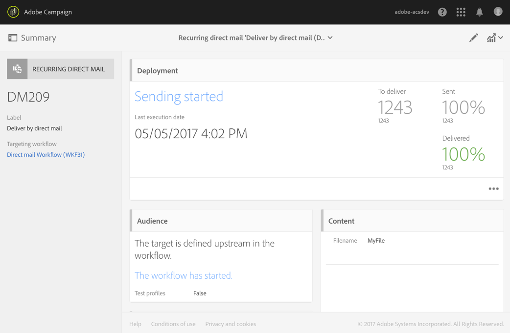
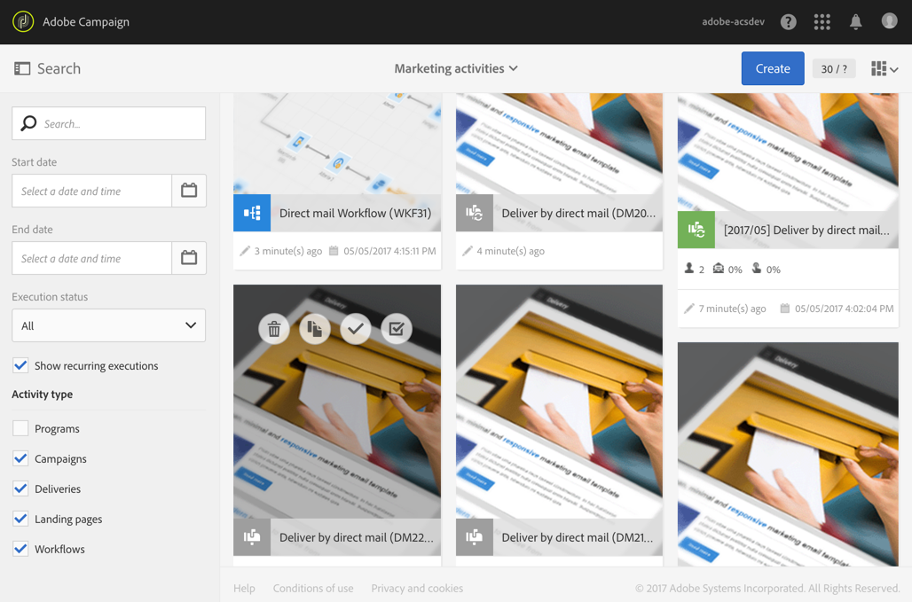
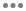
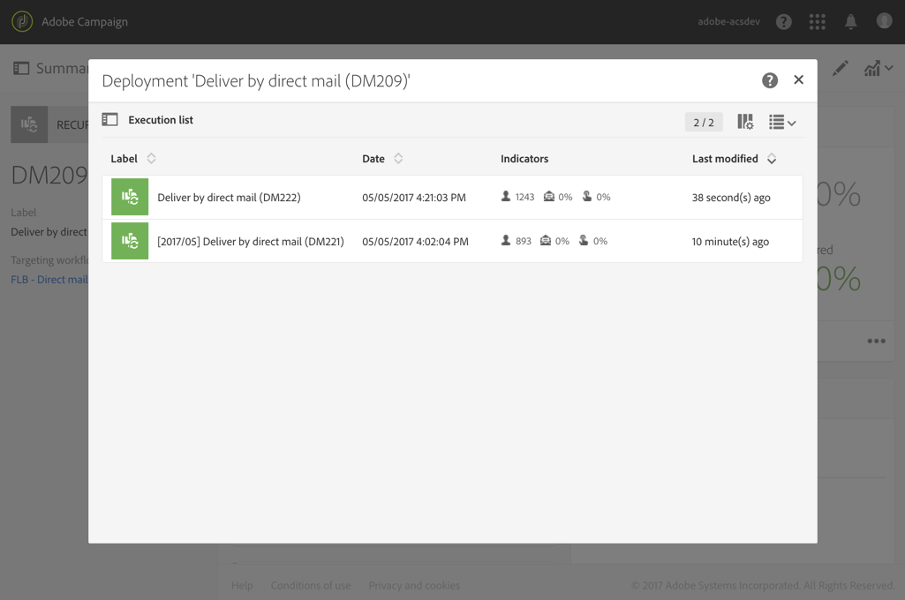

# Direct mail delivery{#direct-mail-delivery}

Direct mail delivery

## Description {#description}

  

The **Direct mail delivery** activity allows you to configure and prepare a file containing profile data that you want to use for a direct mail campaign. This can be a direct mail that is used just once, or it can be a **recurring** direct mail.

Standard direct mails are sent once.

Recurring mails allow you to send the same direct mail multiple times to different targets over a defined period. You can aggregate the deliveries per period in order to get reports that correspond to your needs.

## Context of use {#context-of-use}

The **Direct mail delivery** activity is generally used to automate preparing a file that contains profile data. This file can then be sent to a partner/provider in charge of the mailing.

When linked to a scheduler, you can define recurring direct mails.

Direct mail recipients are defined upstream of the activity in the same workflow, via targeting activities such as queries, intersections, etc. Profiles whose mailing address is not specified are automatically excluded when the direct mail is prepared.

The message preparation is triggered according to the workflow execution parameters. From the message dashboard, you can select whether to request or not a manual confirmation to send the message (required by default). You can start the workflow manually or place a scheduler activity in the workflow to automate execution.

## Configuration {#configuration}

1. Drag and drop a **Direct mail delivery** activity into your workflow.
1. Select the activity, then open it using the  

   button from the quick actions that appear.

   >[!NOTE]
   >
   >You can access the general properties and advanced options of the activity (and not of the delivery itself) via the     >
   >
   >button from the activity's quick actions. This button is specific to the channel activities. The direct mail's properties can be accessed via the action bar in the direct mail dashboard.

1. Select the direct mail send mode:

    * **Direct mail**: the direct mail is sent a single time. You can specify here whether or not you would like to add an outbound transition to the activity. The different transition types are detailed in step 7 of this procedure.
    * **Recurring direct mail**: the direct mail is sent several times, according to the frequency defined in a **Scheduler** activity. Select the aggregation period of the sends. This allows you to regroup all the sends that occur during the defined period in one single direct mail that is also called **Recurring execution** and can be accessed from the application's marketing activity list.

      For example, for a recurring birthday mail, that is processed daily, you can choose to aggregate the sends per month. This allows you to receive reports on your delivery on a monthly basis although the mail is processed every day.

      >[!NOTE]
      >
      >For recurring direct mails, a new file is generated at each execution of the workflow. The selected aggregation period has no impact on this behavior.

1. Select a direct mail type. The direct mail types come from templates defined in the **Resources** &gt; **Templates** &gt; **Delivery templates** menu.
1. Enter the general properties for the direct mail. You can also attach it to an existing campaign. The label of the workflow's delivery activity is updated with the direct mail label.
1. Define the direct mail content. Refer to the section concerning [content editing](../../designing/using/about-personalization.md).
1. By default, the **Direct mail delivery** activity does not include any outbound transitions. If you would like to add an outbound transition to your **Direct mail delivery** activity, go to the **General** tab of the advanced activity options (  

   button in the activity's quick actions) then check one of the following options:

    * **Add outbound transition without the population**: this lets you generate an outbound transition that contains the exact same population as the inbound transition. This transition contains the file generated by the direct mail activity and the raw population that was received by the direct mail activity.
    * **Add outbound transition with the population**: this lets you generate an outbound transition containing the population to whom the direct mail will be sent. The members of the target excluded during the direct mail preparation (quarantine, invalid address, etc.) are excluded from this transition. The transition also contains the file generated by the direct mail.

1. Confirm the configuration of your activity and save your workflow.

When you reopen the activity, you are taken directly to the direct mail dashboard. Only its content can be edited.

By default, starting a delivery workflow only triggers the message preparation. The sending of messages created from a workflow still needs to be confirmed after the workflow has been started. But from the message dashboard, and only if the message was created from a workflow, you can disable the **Request confirmation before sending messages** option. By unchecking this option, messages are sent without further notice once the preparation is done.

## Remarks {#remarks}

The deliveries created within a workflow can be accessed in the application's marketing activity list. You can view the workflow's execution status using the dashboard. Links in the direct mail summary pane allow you to directly access linked elements (workflow, campaign, parent delivery in case of a recurring direct mail).

The executions of recurring deliveries are masked by default. To view them, check the **Show recurring executions** option in the marketing activities' search panel.

In the parent deliveries, which can be accessed from the marketing activity list or directly via the associated recurring executions, you can view the total number of mails that have been processed (according to the aggregation period specified when the **Direct mail delivery** activity was configured). To do this, open the detail view of the parent delivery's **Deployment** block by selecting  

.

 

## Example {#example}

An example of **Direct mail delivery** is available in the [Direct Mail](../../channels/using/example-of-direct-mail-in-a-workflow.md) chapter.
