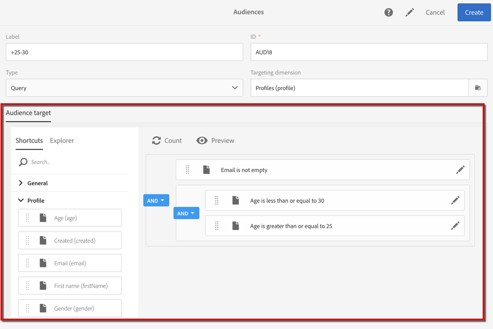
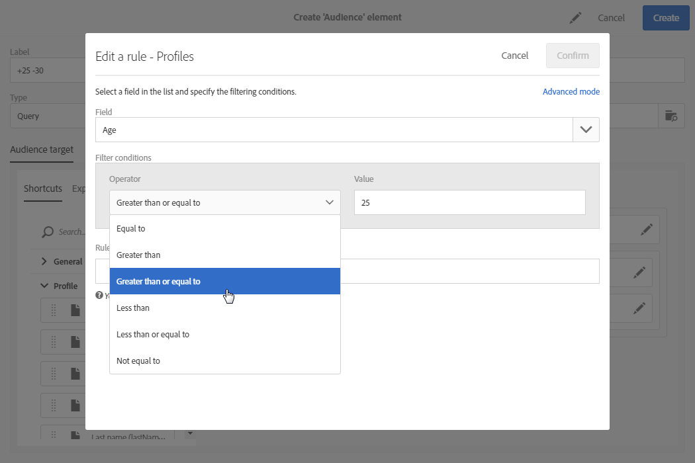
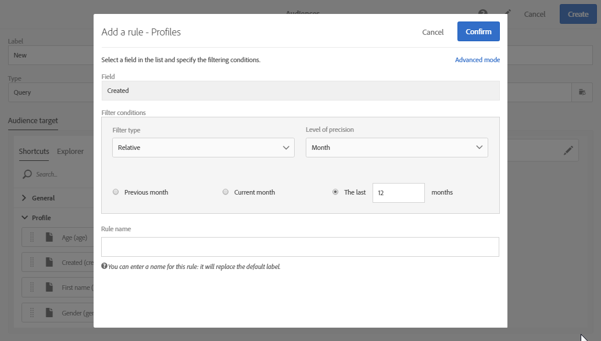
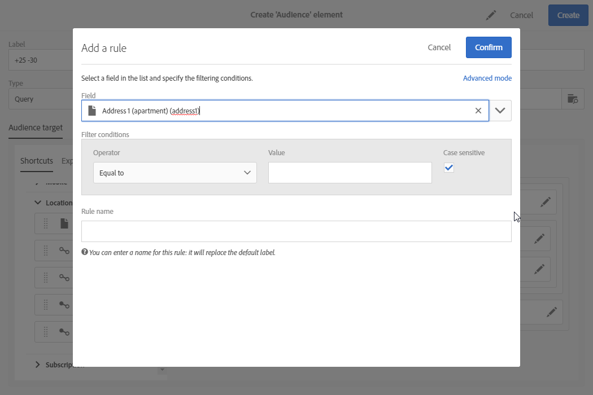
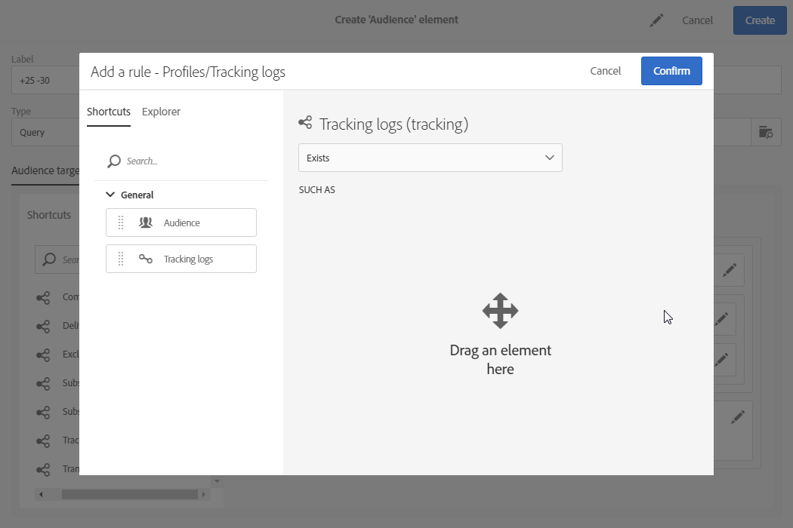
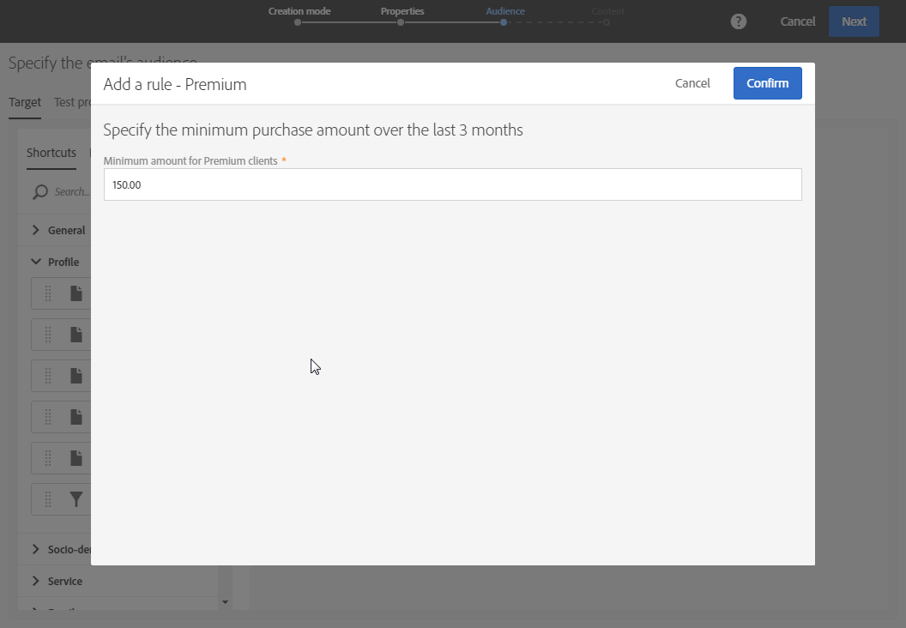
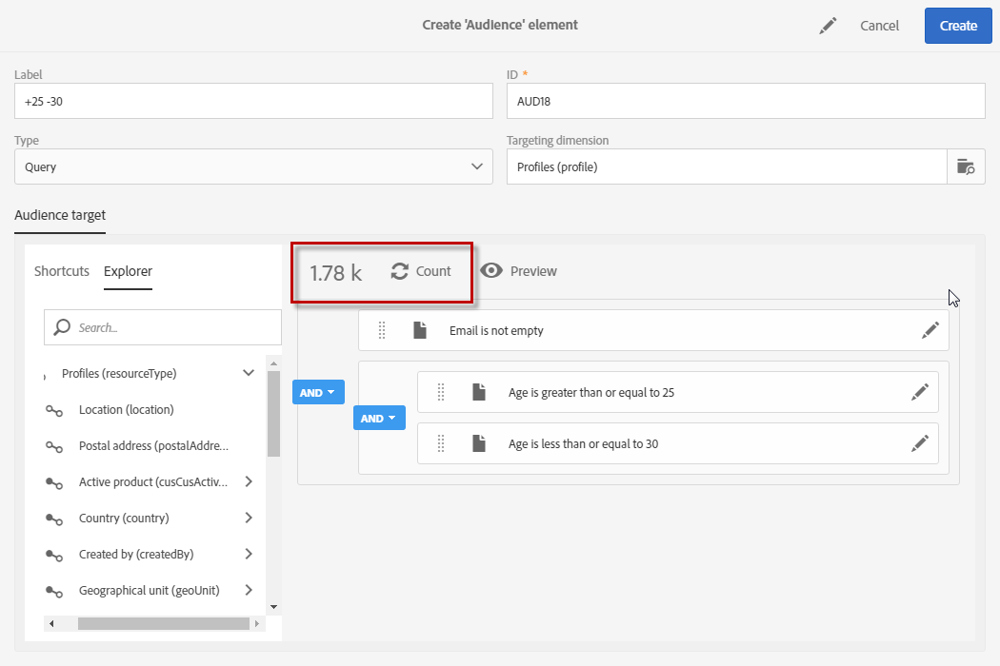

# Editing queries{#editing-queries}

## About query editor {#about-query-editor}

The query editor is a wizard that allows you to filter data contained in the Adobe Campaign database.

This feature lets you build a population to better target your recipients thanks to the predefined filters and rules.

Several application functionalities use it in order to:

* Create **Query** type **audiences**
* Define **email** targets
* Define populations in **workflow** activities

## Query editor interface {#query-editor-interface}

The query editor is made up of a **Palette** and a **Workspace**.

### Palette {#palette}

The palette, located on the left-hand side of the editor, is divided into two tabs, which contain elements divided into thematic blocks. These tabs are:

* The **Shortcuts**, available by default, or created by the instance administrator. Here you will find fields, nodes, groupings, 1-1 links, 1-N links and other predefined filters.
* The **Explorer** which allows you to access all available fields in the target resource: nodes, grouping elements, links (1-1 and 1-N).

The elements contained in the tabs must be moved into the workspace in order to be configured and taken into account for the query. Depending on the targeting dimension selected (see [Targeting dimensions and resources](../../automating/using/query.md#targeting-dimensions-and-resources)), you can:

* Select audiences or profiles one by one
* Use predefined filters
* Define simple rules for fields of your choice
* Define advanced rules that allow you to apply functions to certain fields

### Workspace {#workspace}

The workspace is the central zone in which you can configure and combine rules, audiences, and predefined filters added from the palette.

When you move an element from the palette into the workspace, a new window opens and you can start [Creating queries](../../automating/using/editing-queries.md#creating-queries).

## Creating queries {#creating-queries}

The query editor can be used to define an audience or test profile in a message, a population in a workflow and to create a query type audience.

Queries can be defined in the **[!UICONTROL Audience]** window while creating a delivery or in a **Query** activity while creating a workflow.

1. Move an element from the palette into the workspace. The window for editing the rule opens.

    * For a string or numerical **field**, specify the comparison operator and the value. 
    
      

    * For a date or date and time **field**, you can choose to define a specific date, a range between two dates, or a period relative to the query's execution date.
    
      

    * For a Boolean **field**, check the boxes linked to the possible values for the field.
    * For a **grouping** field, select the grouping field on which you want to create the rule, then define the condition in the same way as for the other fields.
    
      

    * For a **1-1** link with another database resource, select a value directly from the table targeted.
    
      

    * For a **1-N** link with another database resource, you can define a sub-query on the fields of this second resource.

      You do not need to specify a sub-condition.

      For example, you can only select the **[!UICONTROL Exists]** operator on the profile tracking logs and approve the rule. The rule will return all of the profiles for which tracking logs exist.
    
      

    * For a **predefined filter**, enter or select the elements you like according to the criteria offered.

      Administrators can create filters to facilitate complex and repetitive queries. These will appear in the query editor in the form of pre-configured rules and they limit the number of steps needed to be carried out by the user.
    
      

1. You can specify a name for your rule. This is then displayed as the rule name in the workspace. If the rule is not given a name, an automatic description of the conditions is displayed.
1. To combine the workspace elements, interlock them into one another to create different groups and/or group levels. You can then select a logical operator to combine elements on the same level:

    * **[!UICONTROL AND]** : an intersection of two criteria. Only the elements matching each criterion are taken into account.
    * **[!UICONTROL OR]** : a union of two criteria. Elements matching at least one of the two criteria are taken into account.
    * **[!UICONTROL EXCEPT]** : exclusion criteria. Elements matching the first criterion are taken into account unless they also match the second criterion.

1. You can now calculate and preview the number of elements targeted by your query using the  and  buttons from the action bar.

   

If you would like to modify an element of the query, click on the edit icon. The rule is opened as it was previously configured and you can then carry out any necessary adjustments.

Your queries are now created and defined, this allows you to build a population to better personalize your deliveries.

**Related Topics:**

* [Advanced functions](../../automating/using/advanced-expression-editing.md)
* [Defining filters](../../developing/using/configuring-filter-definition.md)

