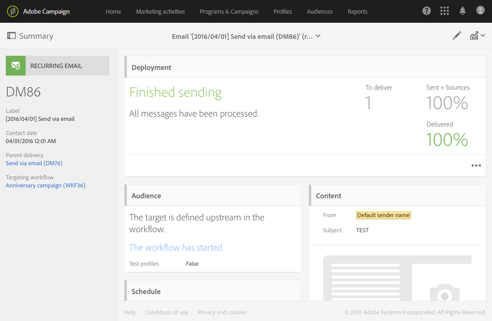
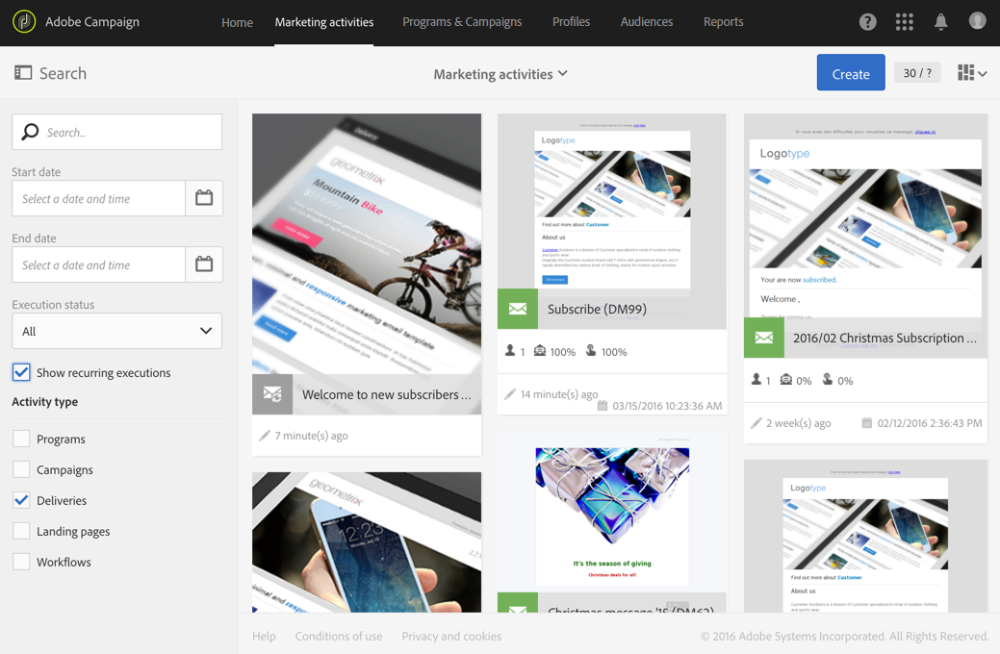
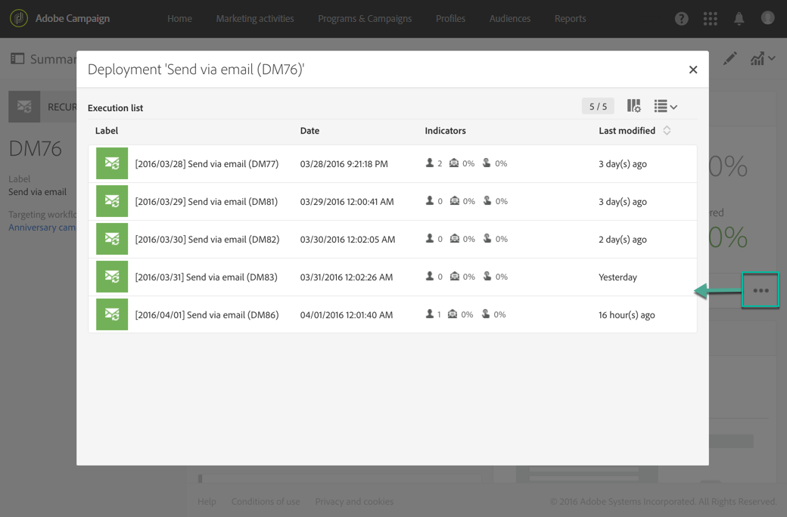
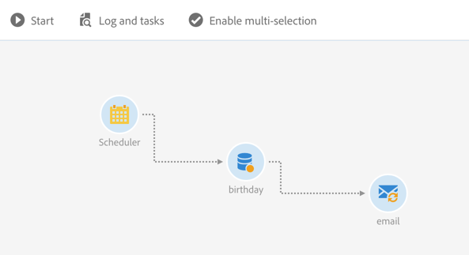
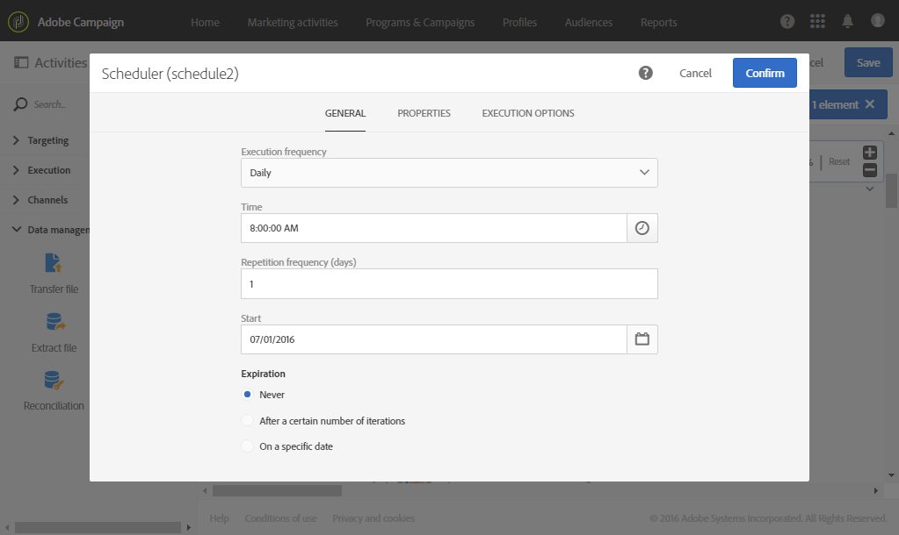
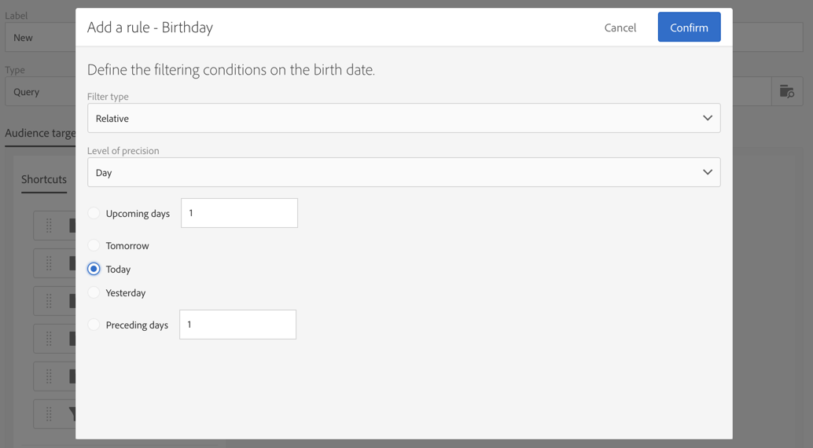
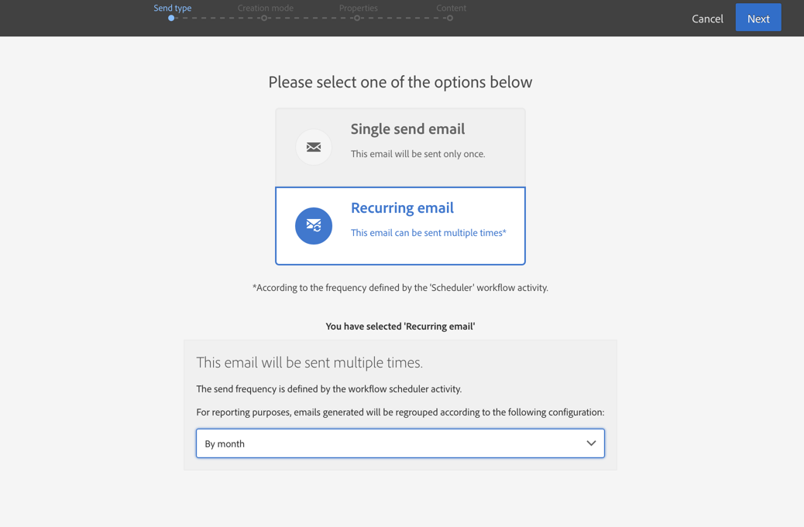

# Email delivery{#email-delivery}

## Description {#description}

The **[!UICONTROL Email delivery]** activity allows you to configure sending an email in a workflow. This can be a **single send** email and sent just once, or it can be a **recurring** email.

Single send emails are standard emails, sent once.

Recurring emails allow you to send the same email multiple times to different targets over a defined period. You can aggregate the deliveries per period in order to get reports that correspond to your needs.

## Context of use {#context-of-use}

The **[!UICONTROL Email delivery]** activity is generally used to automate sending an email to a target calculated in the same workflow.

When linked to a scheduler, you can define recurring emails.

Email recipients are defined upstream of the activity in the same workflow, via targeting activities such as queries, intersections, etc.

The message preparation is triggered according to the workflow execution parameters. From the message dashboard, you can select whether to request or not a manual confirmation to send the message (required by default). You can start the workflow manually or place a scheduler activity in the workflow to automate execution.

## Configuration {#configuration}

1. Drag and drop an **[!UICONTROL Email delivery]** activity into your workflow.
1. Select the activity, then open it using the  button from the quick actions that appear.

   >[!NOTE]
   >
   >You can access the general properties and advanced options of the activity (and not of the delivery itself) via the  button from the activity's quick actions. This button is specific to the **[!UICONTROL Email delivery]** activity. The email's properties can be accessed via the action bar in the email dashboard.

1. Select the email send mode:

    * **[!UICONTROL Email]**: the email is sent a single time. You can specify here whether or not you would like to add an outbound transition to the activity. The different transition types are detailed in step 7 of this procedure.
    * **[!UICONTROL Recurring email]**: the email is sent several times, according to the frequency defined in a **[!UICONTROL Scheduler]** activity. Select the aggregation period of the sends. This allows you to regroup all the sends that occur during the defined period in one single email that is also called **Recurring execution** and can be accessed from the application's marketing activity list.

      For example, for a recurring birthday email, that is sent daily, you can choose to aggregate the sends per month. This allows you to receive reports on your delivery on a monthly basis although the email is sent every day.

1. Select an email type. The email types come from email templates defined in the **[!UICONTROL Resources]** > **[!UICONTROL Templates]** > **[!UICONTROL Delivery templates]** menu.
1. Enter the general properties for the email. You can also attach it to an existing campaign. The label of the workflow's delivery activity is updated with the email label.
1. Define the email content. Refer to the section concerning [content editing](../../designing/using/overview.md).
1. By default, the **[!UICONTROL Email delivery]** activity does not include any outbound transitions. If you would like to add an outbound transition to your **[!UICONTROL Email delivery]** activity, go to the **[!UICONTROL General]** tab of the advanced activity options (  button in the activity's quick actions) then check one of the following options:

    * **[!UICONTROL Add outbound transition without the population]**: this lets you generate an outbound transition that contains the exact same population as the inbound transition.
    * **[!UICONTROL Add outbound transition with the population]**: this lets you generate an outbound transition containing the population to whom the email was sent. The members of the target excluded during the delivery preparation (quarantine, invalid email, etc.) are excluded from this transition.

1. Confirm the configuration of your activity and save your workflow.

When you reopen the activity, you are taken directly to the email dashboard. Only its content can be edited.

By default, starting a delivery workflow only triggers the message preparation. The sending of messages created from a workflow still needs to be confirmed after the workflow has been started. But from the message dashboard, and only if the message was created from a workflow, you can disable the **[!UICONTROL Request confirmation before sending messages]** option. By unchecking this option, messages are sent without further notice once the preparation is done.

## Remarks {#remarks}

The deliveries created within a workflow can be accessed in the application's marketing activity list. You can view the workflow's execution status using the dashboard. Links in the email summary pane allow you to directly access linked elements (workflow, campaign, parent delivery in case of a recurring email).

The executions of recurring deliveries are masked by default, though. To view them, check the **[!UICONTROL Show recurring executions]** option in the marketing activities' search panel.

In the parent deliveries, which can be accessed from the marketing activity list or directly via the associated recurring executions, you can view the total number of sends that have been processed (according to the aggregation period specified when the **[!UICONTROL Email delivery]** activity was configured). To do this, open the detail view of the parent delivery's **[!UICONTROL Deployment]** block by selecting .

## Example {#example}

This example is a birthday workflow. Every day an email is sent to profiles whose birthday it is on that day. To do this:

* The **[!UICONTROL Scheduler]** allows you to start the workflow every day at 8am.

  

* The **[!UICONTROL Query]** activity allows you to calculate the profiles who have provided an email and whose birthday it is on the current day, every time the workflow is executed. The birthday calculation is carried out using a predefined filter available in the palette in the query editing tool.

  

* The **[!UICONTROL Email]** is recurring. The sends are aggregated by month. So, all emails sent in a month are aggregated into a single view. In one year, 365 deliveries are therefore executed but they are regrouped into 12 views (also called **recurring executions**) in the Adobe Campaign interface. History and report details are displayed every month and not for every send.

  

**Related topics**

* [Use case: Create a once-a-week email delivery](../../automating/using/workflow-weekly-offer.md)
* [Use case: Creating a delivery segmented on location](../../automating/using/workflow-segmentation-location.md)
* [Use case: Creating deliveries with a complement](../../automating/using/workflow-created-query-with-complement.md)
* [Use case: Retargeting workflow sending a new delivery to non-openers](../../automating/using/workflow-cross-channel-retargeting.md)