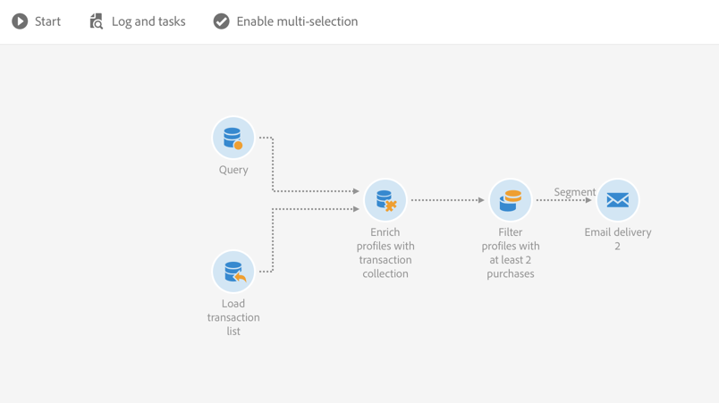
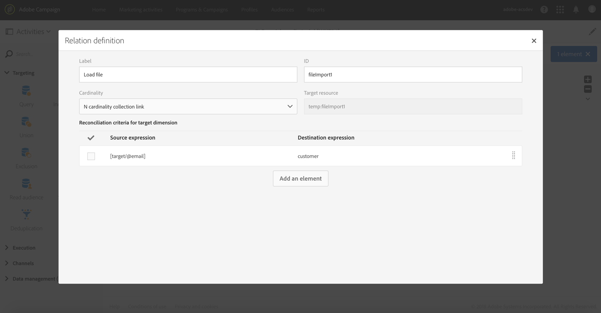
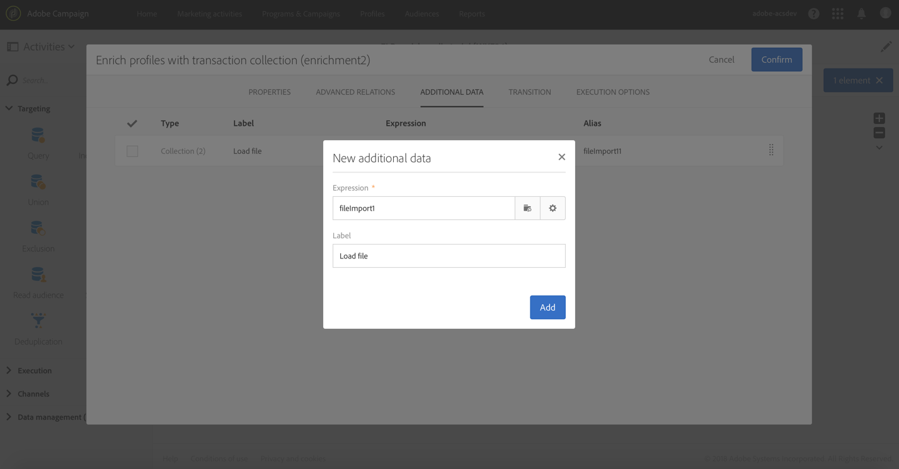
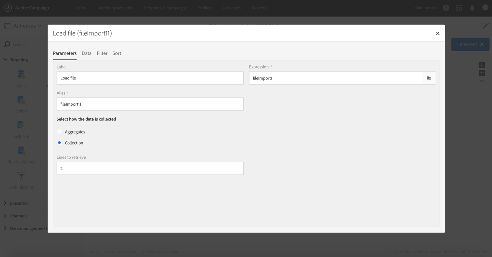
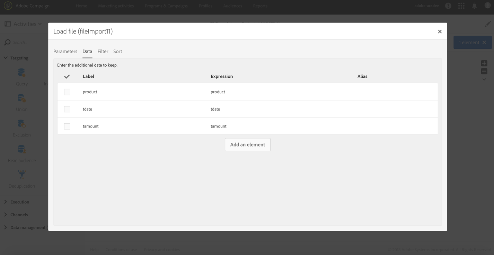
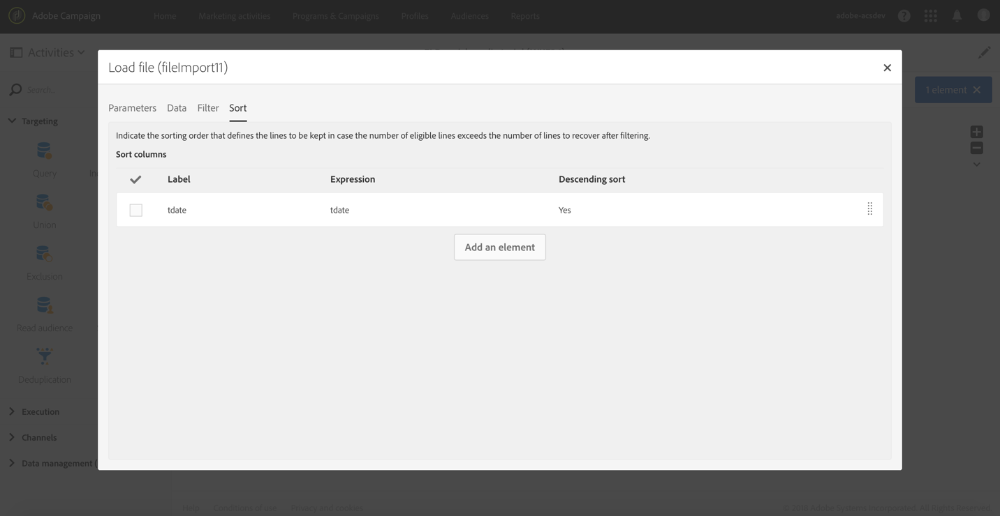
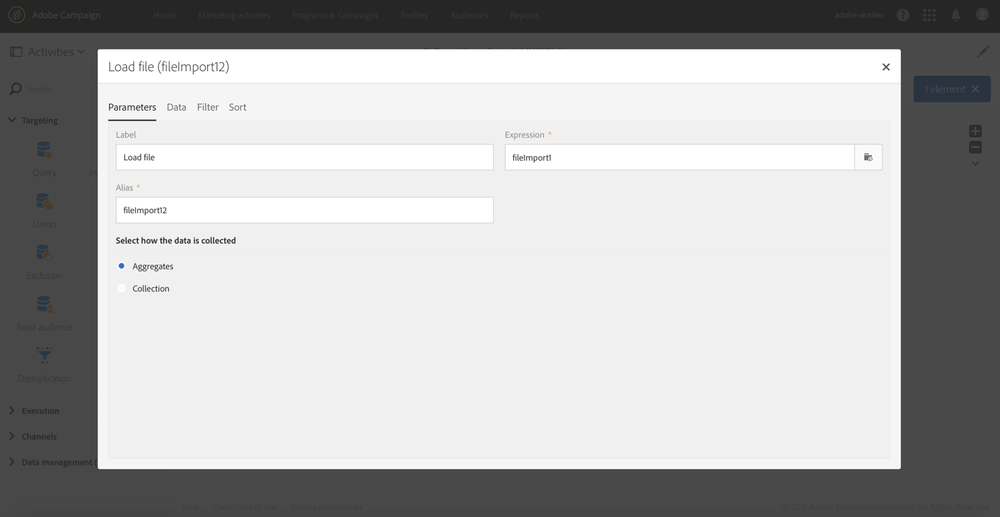
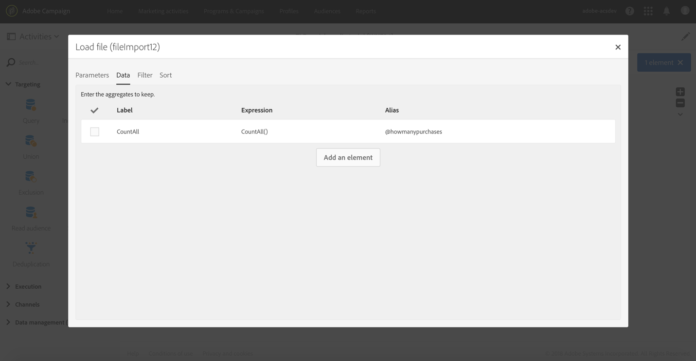
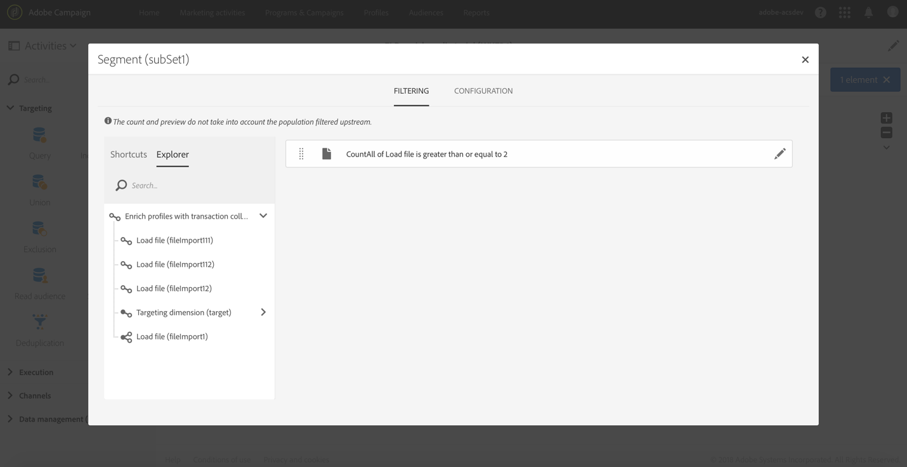

# Enriching profile data with data contained in a file {#enriching-profile-data-with-data-contained-in-a-file}

This example shows how to enrich profile data with purchase data contained in a file.We consider here that the purchase data are stored in a third-party system. Each profile can have several purchases stored in the file. The final goal of the workflow is to send an email to the target profiles who have purchased at least two items to thank them for their loyalty.

The workflow is configured as follows:



* A [Query](../../automating/using/query.md) activity that targets the profiles who will receive the message.
* A [Load file](../../automating/using/load-file.md) activity that loads the purchase data. For example:

  ```
  tcode;tdate;customer;product;tamount
  aze123;21/05/2017;dannymars@example.com;TV;799
  aze124;28/05/2017;dannymars@example.com;Headphones;8
  aze125;31/07/2017;john.smith@example.com;Headphones;8
  aze126;14/12/2017;john.smith@example.com;Plastic Cover;4
  aze127;02/01/2018;dannymars@example.com;Case Cover;79
  aze128;04/03/2017;clara.smith@example.com;Phone;149
  ```

  With this example file, we will use the email address to reconcile the data with the database profiles. You can also enable unique IDs as described in [this document](../../developing/using/configuring-the-resource-s-data-structure.md#generating-a-unique-id-for-profiles-and-custom-resources).

* An [Enrichment](../../automating/using/enrichment.md) activity that creates a link between the transaction data loaded from the file and the profiles selected in the **[!UICONTROL Query]**. The link is defined in the **[!UICONTROL Advanced relations]** tab of the activity. The link is based on the transition coming from the **[!UICONTROL Load file]** activity. It uses the "email" field of the profile resource and the "customer" column of the imported file as reconciliation criteria. 

  

  Once the link is created, two sets of **[!UICONTROL Additional data]** are added:

    * A collection of two lines corresponding to the two last transactions of each profile. For this collection, the product name, the transaction date, and the price of the product are added as additional data. A descending sort is applied on the data. To create the collection, from the **[!UICONTROL Additional data]** tab:

      Select the link previously defined in the **[!UICONTROL Advanced relations]** tab of the activity.
    
      

      Check **[!UICONTROL Collection]** and specify the number of lines to retrieve (2 in this example). In this screen, you can customize the **[!UICONTROL Alias]** and the **[!UICONTROL Label]** of the collection. These values will be visible in the following activities of the workflow when referring to this collection.
    
      

      As **[!UICONTROL Data]** to keep for the collection, select the columns that will be used in the final delivery.
    
      

      Apply a descending sort on the transaction date to make sure to retrieve the latest transactions.
    
      

    * An aggregate counting the total number of transactions for each profile. This aggregate will be used later to filter profiles that have at least two transactions recorded. To create the aggregate, from the **[!UICONTROL Additional data]** tab:

      Select the link previously defined in the **[!UICONTROL Advanced relations]** tab of the activity.
    
      

      Select **[!UICONTROL Aggregate]**.
    
      

      As **[!UICONTROL Data]** to keep, define a **Count All** aggregate. If you need, specify a custom alias to find it faster in the following activities.
    
      

* A [Segmentation](../../automating/using/segmentation.md) activity with only one segment, that retrieves profiles of the initial target that have at least two transactions recorded. Profiles with only one transaction are excluded. To do that, the query of the segmentation is made on the aggregate defined previously.

  

* An [Email delivery](../../automating/using/email-delivery.md) activity that uses the additional data defined in the **[!UICONTROL Enrichment]** to dynamically retrieve the two last purchases made by the profile. The additional data can be found in the **Additional data (TargetData)** node when adding a personalization field.

  

**Related topic:**

* [Enriching customer profiles with external data](https://helpx.adobe.com/campaign/kb/simplify-campaign-management.html#Managedatatofuelengagingexperiences)
