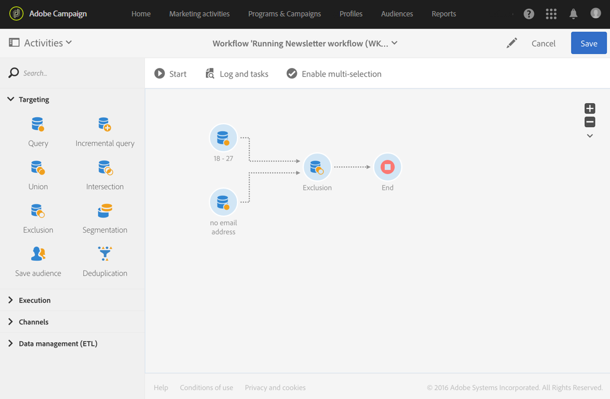

# Exclusion{#exclusion}

## Description {#description}

The **[!UICONTROL Exclusion]** activity allows you to exclude elements from one population according to certain criteria.

## Context of use {#context-of-use}

The **[!UICONTROL Exclusion]** activity is used essentially to carry out additional filtering on inbound transition populations.

A primary set is defined amongst inbound transitions. Members of other inbound transitions are excluded from the primary set. The outbound transition of the exclusion activity only contains the members of the primary set that were not encountered in the other inbound transitions.

## Configuration {#configuration}

1. Drag and drop an **[!UICONTROL Exclusion]** activity into your workflow.
1. Select the activity, then open it using the  button from the quick actions that appear.
1. Select the **[!UICONTROL Primary set]** from the inbound transitions. This is the set from which elements are excluded. The other sets match elements before being excluded from the primary set.

   >[!NOTE]
   >
   >The inbound transitions have to contain the same type of population. For example, if the primary set contains test profiles, the other transitions have to also contain test profiles.

1. If needed, manage the activity's [Transitions](../../automating/using/activity-properties.md) to access the advanced options for the outbound population.
1. Confirm the configuration of your activity and save your workflow.

## Example {#example}

The following example shows two query activities configured to filter profiles from the Adobe Campaign database who are between 18 and 27 years old and have an invalid email address. The profiles with invalid email addresses are then excluded from the first set. This allows you to then send an email for example.

