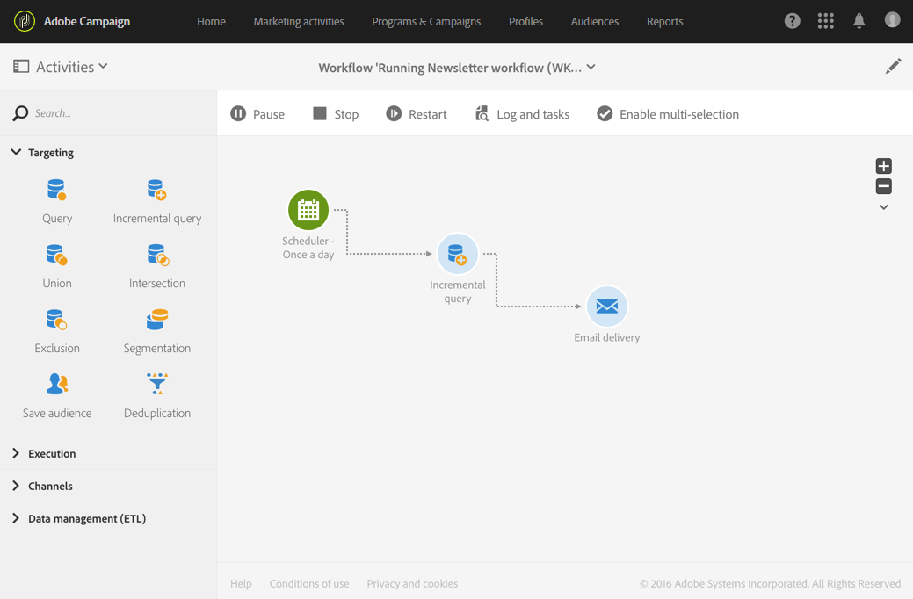

# Execution commands {#execution-commands}

The icons in the action bar allow you to start, track, and modify a workflow's execution. See [Action bar](../../automating/using/workflow-interface.md#action-bar).

The actions available are as follows:

**Start**

The  button starts executing a workflow, which then takes on the **In progress** (blue) status. If the workflow was paused, it is resumed, otherwise it is started and the initial activities are then activated.

>[!NOTE]
>
>Starting is an asynchronous process: the request is saved and will be processed as soon as possible by the workflow execution engine.

**Pause**

The  button pauses the execution. The workflow takes on the **Warning** (yellow) status. No new activities will be activated until it is resumed, but operations in progress are not suspended.

**Stop**

The  button stops a workflow that is being executed, which will then take on the **Finished** (green) status. The operations in progress are interrupted if possible, and imports or SQL queries in progress are immediately canceled. You cannot resume from the workflow from the same place that it was stopped.

**Restart**

The  button involves stopping, then restarting a workflow. In most cases, this allows you to restart quicker. It can also be useful to automate restarting once stopping takes a certain amount of time, because the  button is only available when the stop is effective.

When one or multiple activities in a workflow are selected, there are other actions you can carry out, such as:

**Immediate execution**

The  button starts any pending activities selected as soon as possible.

**Normal execution**

The  button reactivates any paused or deactivated activities.

**Execution suspended**

The  button pauses the workflow at the selected activity: this task as well as all those that follow it (in the same branch) are not executed.

**No execution**

The  button deactivates any selected activities.

>[!NOTE]
>
>Quick actions let you access different actions concerning one particular activity and appear when an activity is selected.
