# Exporting / importing custom resources {#exporting-importing-custom-resources}

This tutorial explains how to export and import a package of custom resources from a development environment to a production environment.

This example is aimed at functional administrators linked to Adobe Campaign.

The prerequisites are:

* **One or multiple custom resources** that are available and published.

    In addition, you must have defined a unique key for these resources because the automatic primary keys are not exported in the packages. The resource can therefore have a primary key and an additional unique key to guarantee the uniqueness of the records.
* **The necessary rights** to create and export a package.

Additional resources:

* [Managing packages](../../automating/using/managing-packages.md)
* [Deploying packages: Operating principle](../../developing/using/data-model-concepts.md)
* [Adding or extending a resource](../../developing/using/key-steps-to-add-a-resource.md)

## Exporting the structure {#exporting-the-structure}

In this section, we are going to carry out a first package export which details the physical structure of the custom resource data.

This example has two custom resources: **Products** and **Orders**.

1. Go to the **[!UICONTROL Administration]** / **[!UICONTROL Deployment]** / **[!UICONTROL Package exports]** menu.

    We are going to create a new package to export the **[!UICONTROL Custom resource (cusResource)]** filtered with the two custom resources, "Products" and "Orders".

1. In the **[!UICONTROL Package exports]** page, click **[!UICONTROL Create]** to create a new package.
1. Complete the label then click **[!UICONTROL Create element]**.

    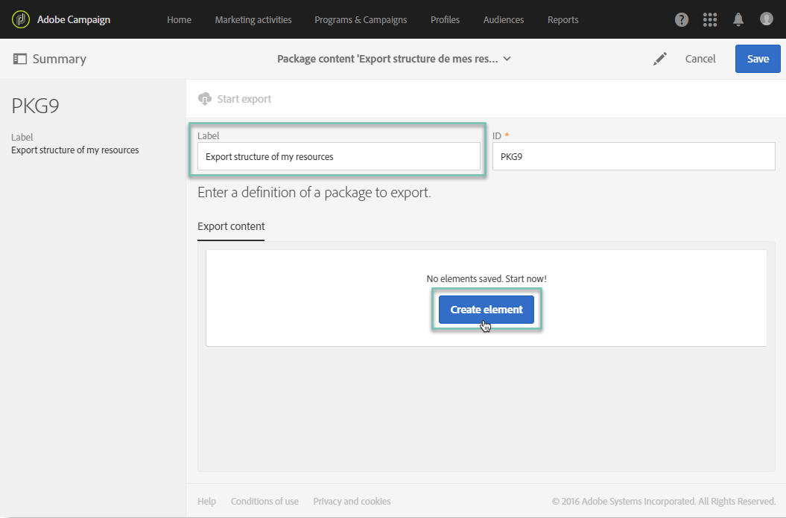

1. Search for and select the **[!UICONTROL Custom resource (cusResource)]**.

    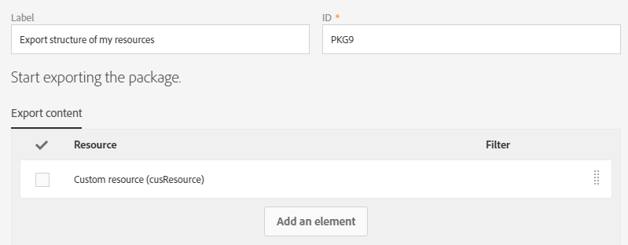

1. Configure the details of the **[!UICONTROL Custom resource]** by selecting the two resources, **Products** and **Orders**, in the filtering conditions.

    Make sure that you don't forget to change the logical operator. The value must be set to **OR** so that the structure of the products resource and the orders resource are integrated into the package.

    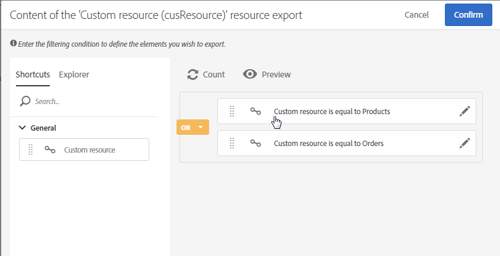

1. Confirm and save the package definition.

You can now click **[!UICONTROL Start export]**.

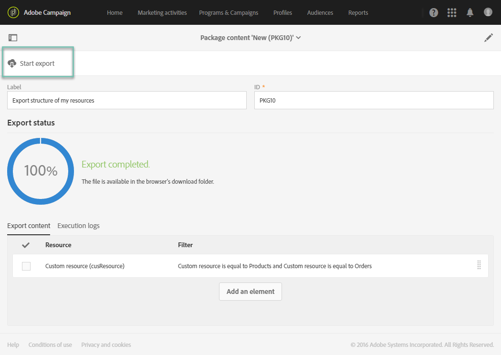

The package generated is available in the Downloads folder. The name of the zip file is randomly generated. You can rename it.

## Exporting the data {#exporting-the-data}

This second export will allow us to export the data from the **Products** and **Orders** custom resources.

Based on the same type of export as the structure export, you are going to create a second package that contains the data.

1. In the **[!UICONTROL Package exports]** page, click **[!UICONTROL Create]** to create a new package.
1. Complete the label with **[!UICONTROL Export data of my resources]** then click **[!UICONTROL Create element]** in the **[!UICONTROL Export content]** tab.
1. Search for and select the **Products** resource.

    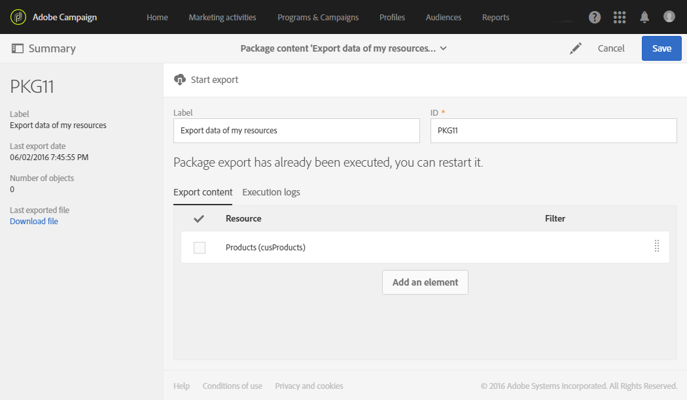

1. Configure an advanced **filtering condition** with **@Label IS NOT NULL**.

    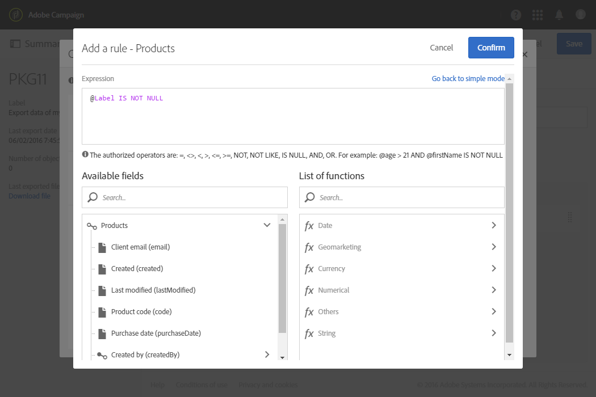

1. Check the count.

    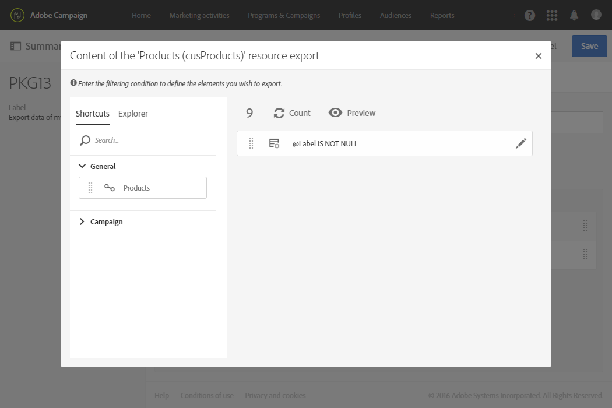

1. Repeat the same operation for the **Orders** custom resource.

    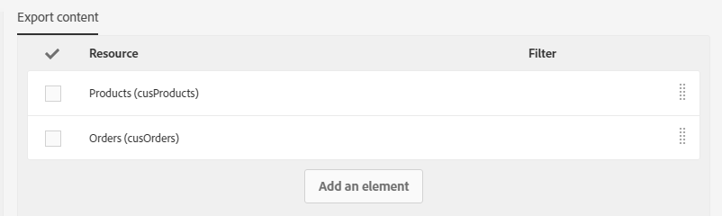

1. Confirm and save the package definition.

You can now click **[!UICONTROL Start export]**.

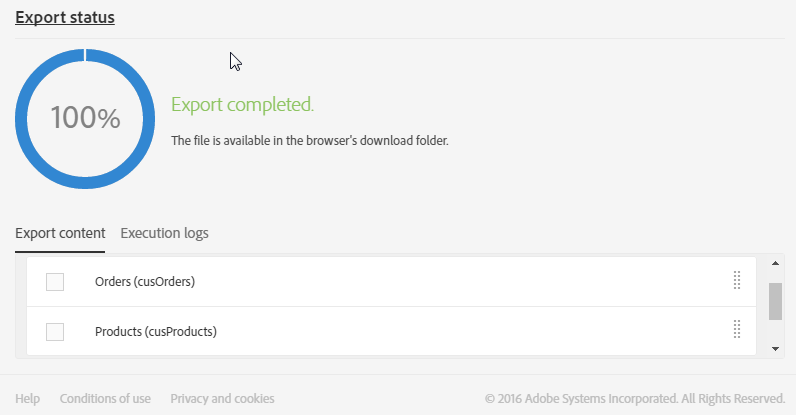

The package generated is available in the Downloads folder. The name of the zip file is randomly generated. You can rename it.

## Importing the structure {#importing-the-structure}

### Importing the package {#importing-the-structure-package}

1. Connect to the **target instance** on which you want to import the newly created packages.
1. Go to the **[!UICONTROL Administration]** / **[!UICONTROL Deployment]** / **[!UICONTROL Package imports]** menu to create a new package to import the file from the first export.
1. Drag and drop the **structure file** into the zone provided for this purpose. The formats accepted are ZIP or XML.

    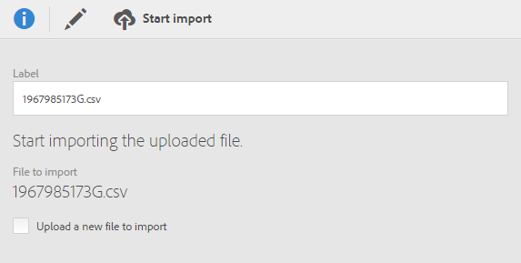

1. Modify the label, for example **Import structure**, then click **[!UICONTROL Save]**.
1. Click **[!UICONTROL Start import]**.

    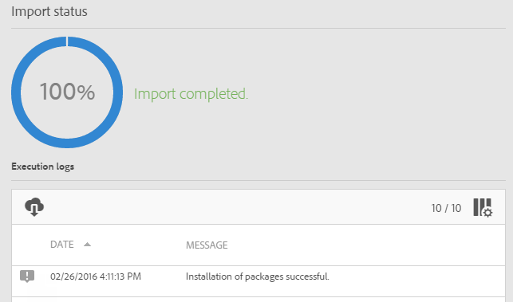

### Publish {#publish-structure}

1. Go to the **[!UICONTROL Administration]** / **[!UICONTROL Development]** / **[!UICONTROL Publication]** menu.
1. Click **[!UICONTROL Prepare publication]** then **[!UICONTROL Publish]** to update the instance with the data from the new custom resources.
1. The menu entries corresponding to the package installed are going to be inserted into the **[!UICONTROL Client data]** menu.

    

## Importing the data {#importing-the-data}

In this section, we are going to **import the data** linked to the package installed on the instance in the previous step.

In the same way as for the previous step, it is split into two parts: importing the package and publishing.

### Importing the package {#importing-the-data-package}

1. Go to the **[!UICONTROL Administration]** / **[!UICONTROL Deployment]** / **[!UICONTROL Package imports]** menu to create a new package to import the file containing the data.
1. Drag and drop the data file into the zone provided for this purpose. The formats accepted are ZIP or XML.
1. Modify the label, for example "Import data", then click **[!UICONTROL Save]**.
1. Click **[!UICONTROL Start import]**.

    

### Publish {#publish-data}

1. Go to the **[!UICONTROL Administration]** / **[!UICONTROL Development]** / **[!UICONTROL Publication]** menu.
1. Click **[!UICONTROL Prepare publication]** then **[!UICONTROL Publish]** to update the instance with the data from the custom resources.
