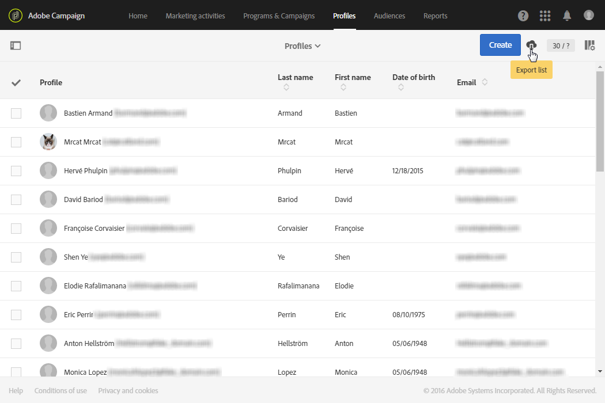

# Exporting lists{#exporting-lists}

Adobe Campaign allows you to export your lists directly in a file for future use. Exporting a list in a file generates a log entry in the **[!UICONTROL Export audits]** menu. For more information on export audits, refer to the [Auditing exports](../../administration/using/auditing-export-logs.md) section.

 [Discover how to configure a list in video](#video)

The export list option allows you to export a maximum of 100,000 lines by default and defined by the **Nms_ExportListLimit** option. This option can be managed by the functional administrator, under the **[!UICONTROL Administration]** > **[!UICONTROL Application settings]** > **[!UICONTROL Options]** menu.

Export list is available in all the screens that have a **List** mode view, for users with the **[!UICONTROL EXPORT (export)]** role.

1. Go to your chosen **List** screen. For example, the test profile overview screen ( **[!UICONTROL Profiles & audiences]** > **[!UICONTROL Test profiles]** ).
1. Check that the screen is in **List** mode.

   

1. Organize the columns in the list in the order that you want to export them using the **[!UICONTROL Configure list]** button, in the top right corner. In addition to configured columns, the primary key of the resource will also be exported.
1. If you like, you can apply a filter. To do this, click the button in the top-left corner to show the search pane.

   If you carry out an export from a list containing different resources, you must apply your filters so that only one type of resource is displayed in the list.

1. If you like, sort your chosen column(s).
1. Select the export button .

   A popup will appear to confirm the export. Once you have confirmed the export, the file is automatically downloaded to your computer.

The file is generated in CSV format with a .TXT extension. It is named according to the resource exported and the export date. For example: the name profileBase_20150426_120253.txt would be applied to a profile export carried out on the 26th of April 2015 at 12:02:53. It is encoded in UTF-8 format.

The numeric values and dates take into account the local time (locale) of the user that carries out the export. For example: DD-MM-YYYY or MM-DD-YYYY.

To carry out an export that is larger than this, you must create a dedicated workflow. Refer to the [Extract file](../../automating/using/extract-file.md) section.

**Example**

The following example is an export carried out from the profile list defined below:

* Columns displayed (in order): Last name, First name, Birth date, Email address.
* Names are sorted in alphabetical order.



The file generated is presented as follows (for the first ten records):

```
Last name;First name;Birth date;Email;Zip code
Abalo;Patrick;11/11/1941 02:00:00;patrick.a@testmail.com;29200
Abasq;Joel;21/08/1977 02:00:00;abasq.joel@testmail.com;92160
Abernot;John;12/07/1963 01:00:00;john.abernot@testmail.com;78510
Abiven;Christian;16/03/1975 01:00:00;chris.a@mailtest.com;35000
Abouvier;Peter;02/07/1975 01:00:00;pabouvier@mailtest.com;94560
Accardi;Mike;22/06/1948 01:00:00;mike.accardi@mail.com;76400
Accremont;Frank;27/04/1947 01:00:00;accr.frank@mailtest.com;13500
Adam;Daniel;17/09/1953 01:00:00;danieladam@mail.com;17000
Adama;Pascal;22/01/1990 01:00:00;adapascal@mailtest.com;75012
Adama;Henry;22/09/1992 02:00:00;henry.adama@mail.com;64120
```

**Related topics:**

* [Roles](../../administration/using/list-of-roles.md)
* [Customizing lists](../../start/using/customizing-lists.md)

## Tutorial video {#video}

This video shows how to configure lists.

>[!VIDEO](https://video.tv.adobe.com/v/25288/?quality=12)
 
Additional Campaign Standard how-to videos are available [here](https://experienceleague.adobe.com/docs/campaign-standard-learn/tutorials/overview.html).
