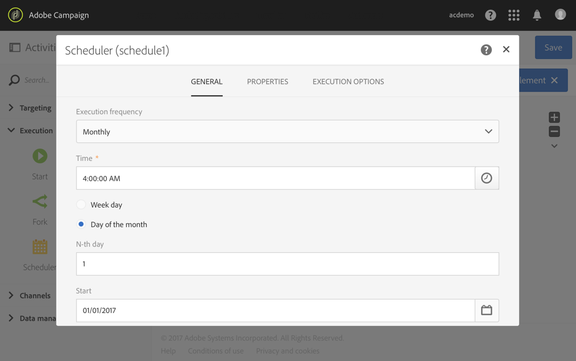
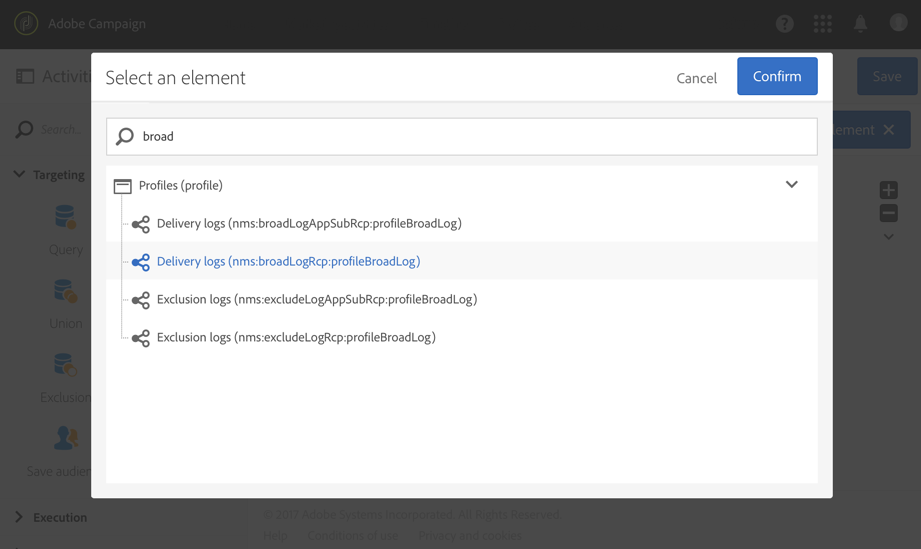
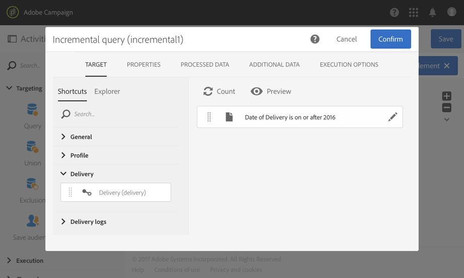
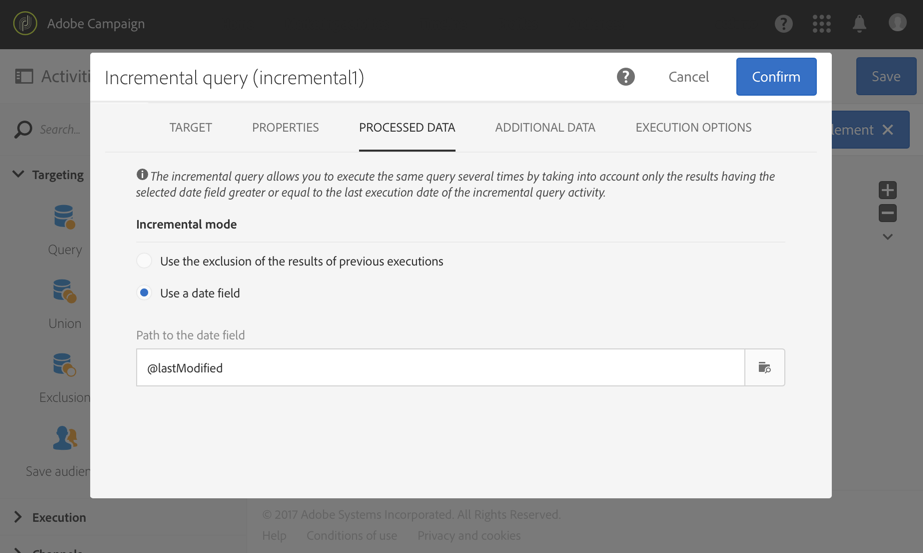
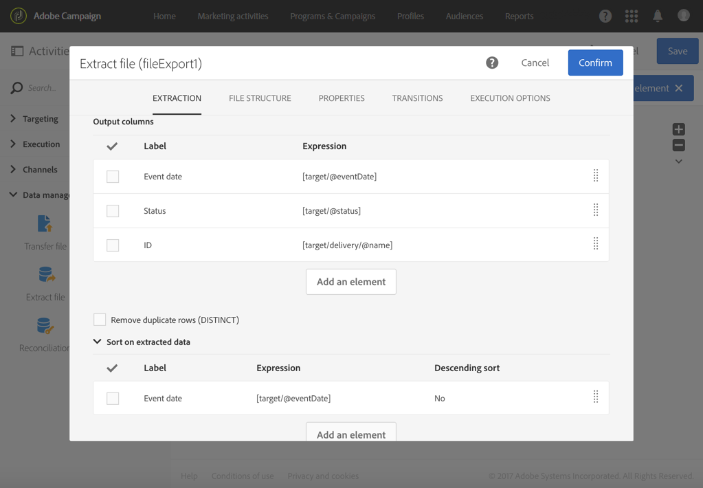
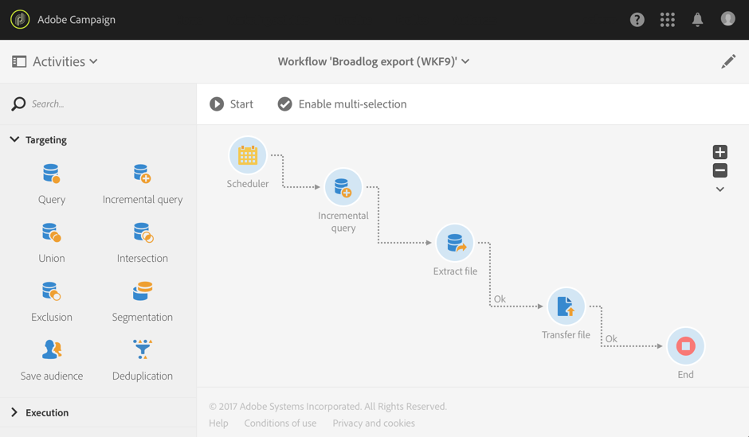

# Exporting logs{#exporting-logs}

Exporting logs

Log data, whether they are related to deliveries or to subscriptions, can be exported through a simple workflow. It enables you to analyze the results of your campaigns in your own reporting or BI tool.

By using an **[!UICONTROL Incremental query]** that only retrieves new logs every time the workflow is executed and a simple **[!UICONTROL Extract file]** activity to define the output columns, you can get a file with the format and all the data you need. Then use a **[!UICONTROL Transfer file]** activity to retrieve the final file. Each workflow execution is planned by a **[!UICONTROL Scheduler]** .

The export logs operation can be carried out by standard users. Private resources such as: broadlogs, tracking logs, exclusion logs subscription logs and subscription history logs on **Profiles** can only be managed by functional administrator.

1. Create a new workflow as detailed in [this section](../../automating/using/building-a-workflow.md#creating-a-workflow).
1. Add a **[!UICONTROL Scheduler]** activity and set it according to your needs. Below is an example of a monthly execution.

   

1. Add an **[!UICONTROL Incremental query]** activity and configure it so that it selects the logs you need. For example, to select all new or updated broadlogs (profile delivery logs):

    * In the **[!UICONTROL Properties]** tab, change the target resource to **Delivery logs** (broadLogRcp).
    
      

    * In the **[!UICONTROL Target]** tab, set a condition to retrieve all delivery logs that correspond to deliveries sent in 2016 or after. For more information, refer to the [Editing queries](../../automating/using/editing-queries.md#creating-queries) section.
    
      

    * In the **[!UICONTROL Processed data]** tab, select **[!UICONTROL Use a date field]** and choose the **lastModified** field. On the next executions of the workflow, only logs that will have been modified or created after the last execution will be retrieved.
    
      

      After the first execution of the workflow, you can see in this tab the last execution date that will be used for the next execution. It is automatically updated every time the workflow is executed. You still have the possibility to override this value by manually entering a new one so that it fits your needs.

1. Add an **[!UICONTROL Extract file]** activity that will export the queried data in a file:

    * In the **[!UICONTROL Extraction]** tab, specify the name of the file. This name will be automatically completed with the date of the export to ensure all extracted files are unique.

      Select the columns that you want to export in your file. You can select here data coming from related resources such as delivery or profile information. To organize the final file, you can apply a sort. For example on the log date, as shown in the example below.
    
      

      >[!NOTE]
      >
      >It is not possible to export unique identifiers (primary keys) of log resources.

    * In the **[!UICONTROL File structure]** tab, define the format of the output file to match your needs.

      Check the **[!UICONTROL Export labels instead of internal values of enumerations]** option in case you export enumeration values. This option allows to retrieve shorter labels that are easy to understand instead of IDs.

1. Add a **[!UICONTROL Transfer file]** activity and configure it to transfer the newly created file from the Adobe Campaign server to another location where you can access it, such as a SFTP server.

    * In the **[!UICONTROL General]** tab, select **[!UICONTROL File upload]** as the purpose is to send the file from Adobe Campaign to another server.
    * In the **[!UICONTROL Protocol]** tab, specify the transfer parameters and select the [external account](../../administration/using/external-accounts.md#creating-an-external-account) to use.

1. Add an **[!UICONTROL End]** activity to make sure it properly ends and save your workflow.

   

You can now execute the workflow and retrieve the output file on your external server.

**Related topic:**

[Workflows](../../automating/using/discovering-workflows.md)
