# External API {#external-api}

## Description {#description}

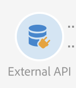

The **[!UICONTROL External API]** activity brings data into the workflow from an **external system** via a **REST API** call.

The REST endpoints can be a customer management system, an [Adobe I/O Runtime](https://www.adobe.io/apis/experienceplatform/runtime.html) instance or an Experience Cloud REST endpoints (Data Platform, Target, Analytics, Campaign, etc).

>[!CAUTION]
>
>This capability is currently in public beta. You need to accept the usage agreement before starting using the External API activity. Please note that since this public beta capability has not yet been commercially released by Adobe, it is not supported by Adobe Client Care, it may contain errors and may not function as well as other released features. 

The main characteristics of this activity are:

* Ability to pass data in a JSON format to a 3rd party REST API endpoint 
* Ability to receive a JSON response back, map it to output tables and pass downstream to other workflow activities.
* Failure management with an outbound specific transition

The following guardrails have been put in place for this activity:

* 5MB http response data size limit
* Request timeout is 60 seconds
* HTTP redirects are not allowed
* Non-HTTPS Urls are rejected
* "Accept: application/json" request header and "Content-Type: application/json" response header are allowed

>[!CAUTION]
>
>Please note that the activity is meant for fetching of campaign wide data (latest set of offers, latest scores etc.) not for retrieving specific information for each profile as that can result in large amounts of data being transferred. If the use case requires this, the recommendation is to use the [Transfer File](../../automating/using/transfer-file.md) activity.

## Configuration {#configuration}

Drag and drop an **[!UICONTROL External API]** activity into your workflow and open the activity to start the configuration.

### Inbound Mapping

Inbound mapping is a temporary table generated by a previous inbound activity that will be displayed and sent as JSON in the UI.
Based on this temporary table, user can make modification to inbound data.

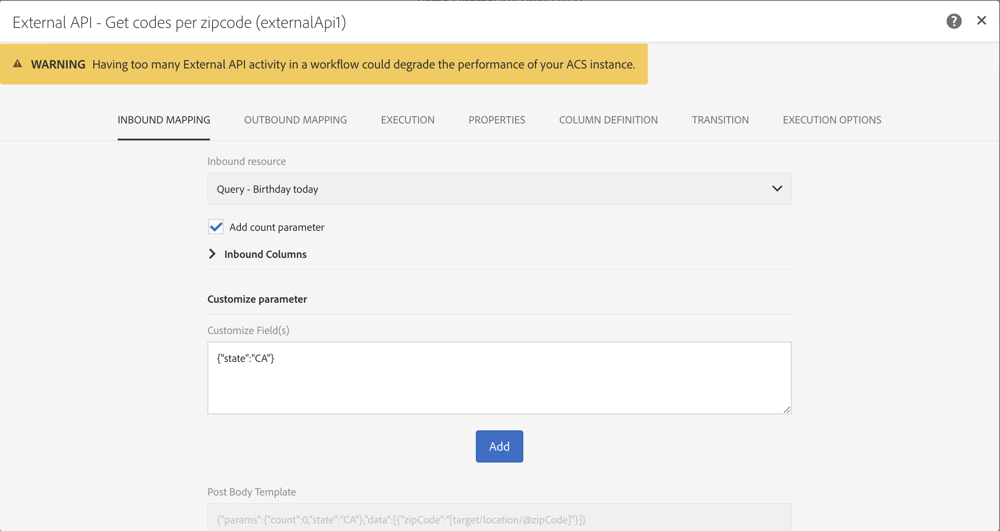

The **Inbound resource** dropdown lets you select the query activity that will create the temporary table.

The **Add count parameter** checkbox will a count value for each row coming from the temporary table. Note that this checkbox is only available if the inbound activity is generating a temporary table.

The **Inbound Columns** section allow the user to add any fields from the inbound transition table. The selected column(s) will be the keys in the data object. The data object in the JSON will be an array list containing data for selected columns from each row of the inbound transition table.

The **customize parameter** text box lets you add a valid JSON with additional data needed by the external API. This additional data will be added to the params object in the generated JSON.

### Outbound Mapping

This tab lets you define the sample **JSON structure** returned by the API Call.

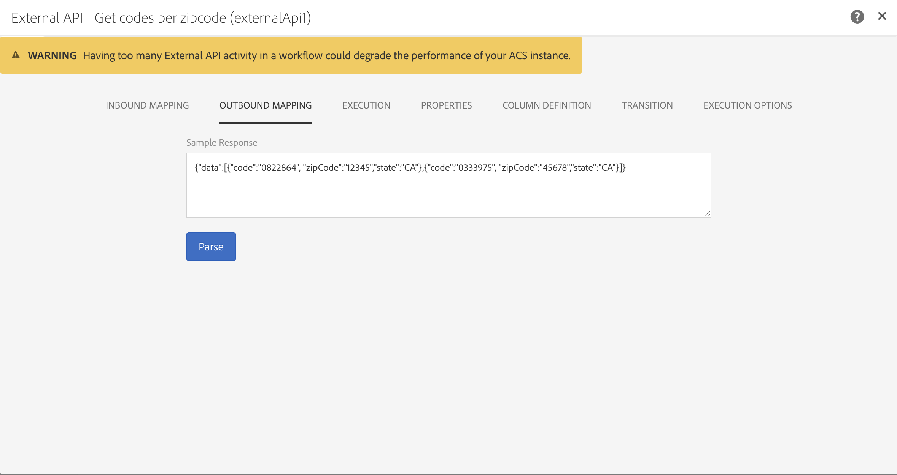

The JSON structure pattern is: `{“data”:[{“key”:“value”}, {“key”:“value”},...]}`

The sample JSON definition must have the **following characteristics**:

* **data** is a mandatory property name in the JSON, the content of "data" is a JSON array.
* **Array elements** must contain first-level properties (deeper levels are not supported).
  **Property names** would end up becoming column names for the output schema of the output temporary table.
* **Column name** definition is based on the first element of the "data" array.
  Columns definition (add/remove) and the type value of the property can be edited in the **Column definition** tab.

If the **parsing is validated** a message appears and invite you to customize the data mapping in the "Column definition" tab. In other cases, an error message is displayed.

### Execution

This tab lets you define the **HTTPS Endpoint** that will send data to ACS. If needed, you can enter authentication information in the fields below.
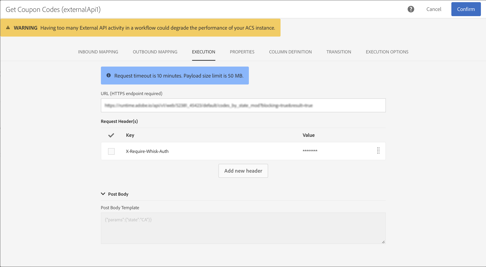

### Properties

This tab lets you control **general properties** on the external API activity like the displayed label in the UI. The internal ID is not customizable.

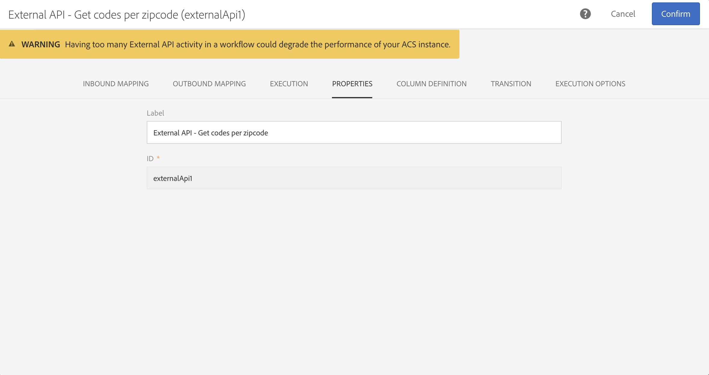

### Column definition

>[!NOTE]
>
>This tab appears when the **response data format** is completed and validated in Outbound Mapping tab.

The **Column definition** tab allows you to precisely specify the data structure of each column in order to import data that does not contain any errors and make it match the types that are already present in the Adobe Campaign database for future operations.

For example, you can change the label of a column, select its type (string, integer, date, etc.) or even specify error processing.

For more information, refer to the [Load File](../../automating/using/load-file.md) section.

### Transition

This tab lets you activate the **outbound transition** and its label. This specific transition is useful in case of **timeout** or if the payload exceed the **data size limit**.

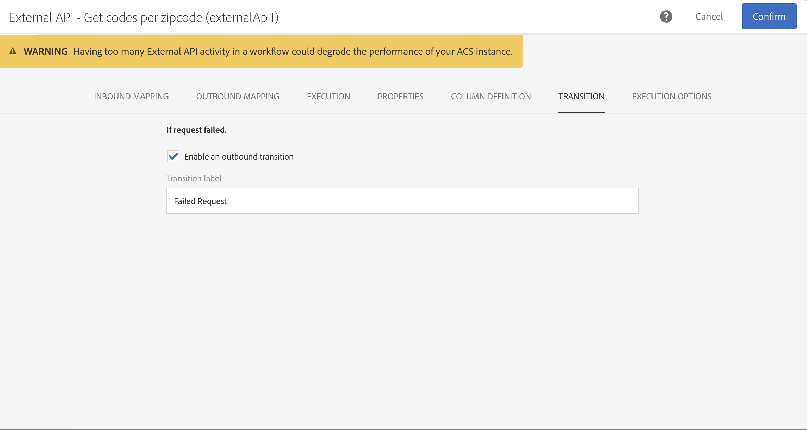

### Execution options

This tab is available in most of the workflow activities. For more information, consult the [Activity properties](../../automating/using/executing-a-workflow.md#activity-properties) section.

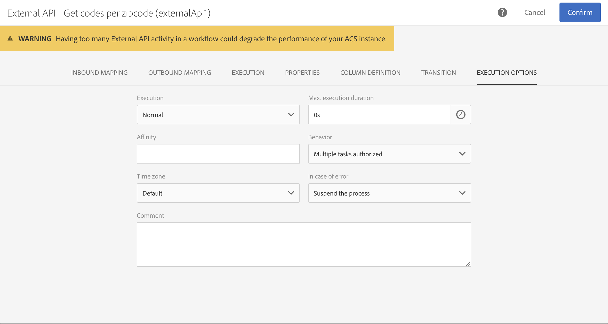

## Troubleshooting

There two types of log messages added to this new workflow activity: information and errors. They can help you troubleshooting potential issues.

### Information

These log messages are used to log information about useful checkpoints during the execution of the workflow activity. Specifically, the following log messages are used to log the first attempt as well a retry attempt (and reason for failure of first attempt) to access the API.

<table> 
 <thead> 
  <tr> 
   <th> Message format  </th> 
   <th> Example  </th> 
  </tr> 
 </thead> 
 <tbody> 
  <tr> 
   <td> Invoking API URL '%s'.</td> 
   <td> 
Invoking API URL 'https://example.com/api/v1/web-coupon?count=2'.
</td> 
  </tr> 
  <tr> 
   <td> Retrying API URL '%s', previous attempt failed ('%s').</td> 
   <td> 
Retrying API URL 'https://example.com/api/v1/web-coupon?count=2', previous attempt failed ('HTTP - 401').
</td>
  </tr> 
  <tr> 
   <td> Transferring content from '%s' (%s / %s).</td> 
   <td> 
Transferring content from 'https://example.com/api/v1/web-coupon?count=2' (1234 / 1234).
</td> 
  </tr>
 </tbody> 
</table>

### Errors

These log messages are used to log information about unexpected error conditions, that can eventually cause the workflow activity to fail.

<table> 
 <thead> 
  <tr> 
   <th> Code - Message format  </th> 
   <th> Example  </th> 
  </tr> 
 </thead> 
 <tbody> 
  <tr> 
   <td> WKF-560250 - API request body exceeded limit (limit: '%d').</td> 
   <td> 
API request body exceeded limit (limit: '5242880').
</td> 
  </tr> 
  <tr> 
   <td> WKF-560239 -  API response exceeded limit (limit: '%d').</td> 
   <td> 
API response exceeded limit (limit: 5242880').
</td> 
  </tr> 
  <tr> 
   <td> WKF-560245 - API URL could not be parsed (error: '%d').</td> 
   <td> 
API URL could not be parsed (error: '-2010').

   
 Note: This error is logged when the API URL fails validation rules.
</td>
  </tr> 
  <tr>
   <td> WKF-560244 - API URL host must not be 'localhost', or IP address literal (URL host: '%s').</td> 
   <td> 
API URL host must not be 'localhost', or IP address literal (URL host: 'localhost').

    
API URL host must not be 'localhost', or IP address literal (URL host: '192.168.0.5').

    
API URL host must not be 'localhost', or IP address literal (URL host: '[2001]').
</td>
  </tr> 
  <tr> 
   <td> WKF-560238 - API URL must be a secure URL (https) (requested URL: '%s').</td> 
   <td> 
API URL must be a secure URL (https) (requested URL: 'https://example.com/api/v1/web-coupon?count=2').
</td> 
  </tr> 
  <tr> 
   <td> WKF-560249 - Failed to create request body JSON. Error when adding '%s'.</td> 
   <td> 
Failed to create request body JSON. Error when adding 'params'.

    
Failed to create request body JSON. Error when adding 'data'.
</td>
  </tr> 
  <tr> 
   <td> WKF-560246 - HTTP header key is bad (header key: '%s').</td> 
   <td> 
HTTP header key is bad (header key: '%s').

   
 Note: This error is logged when the custom header key fails validation according to <a href="https://tools.ietf.org/html/rfc7230#section-3.2.html">RFC</a>
</td> 
  </tr>
 <tr> 
   <td> WKF-560248 - HTTP header key is not allowed (header key: '%s').</td> 
   <td> 
HTTP header key is not allowed (header key: 'Accept').
</td> 
  </tr> 
  <tr> 
   <td> WKF-560247 -  AHTTP header value is bad (header value: '%s').</td> 
   <td> 
HTTP header value is bad (header value: '%s'). 

    
Note: This error is logged when the custom header value fails validation according to <a href="https://tools.ietf.org/html/rfc7230#section-3.2.html">RFC</a>
</td> 
  </tr> 
  <tr> 
   <td> WKF-560240 - JSON payload has bad property '%s'.</td> 
   <td> 
JSON payload has bad property 'blah'.
</td>
  </tr> 
  <tr>
   <td> WKF-560241 - Malformed JSON or unacceptable format.</td> 
   <td> 
Malformed JSON or unacceptable format.

   
Note: This message only applies to parsing response body from the external API, and is logged when trying to validate whether the response body conforms to the JSON format mandated by this activity.
</td>
  </tr>
  <tr> 
   <td> WKF-560246 - Activity failed (reason: '%s').</td> 
   <td> 
When activity fails due to HTTP 401 error response - Activity failed (reason: 'HTTP - 401')

        
When activity fails due to a failed internal call - Activity failed (reason: 'iRc - -Nn').

        
When activity fails due to an invalid Content-Type header. - Activity failed (reason: 'Content-Type - application/html').
</td> 
  </tr>
 </tbody> 
</table>

<!--
## Example: Managing coupons with External API Activity

This example illustrates how to **add coupon value** retrieving by a REST call to profiles and then sending an email containing these coupon values.

The workflow is presented as follows:

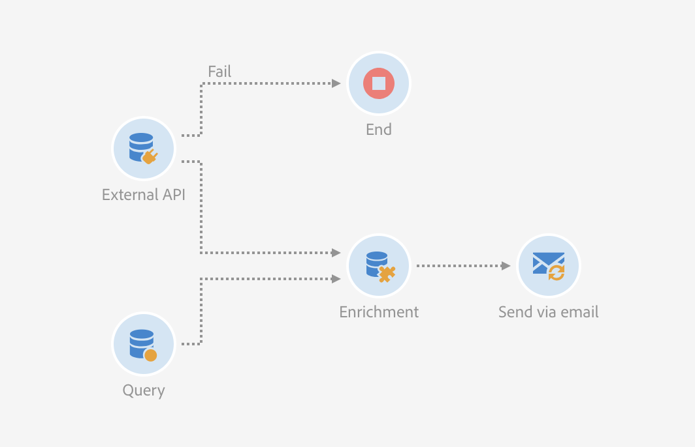

1. Drag and drop an **External API** activity
    1. Parse the JSON sample responsa as {"data":[{"code":"value"}]}.
    1. Add the **Rest endpoint URL** and define authentication setting if needed
    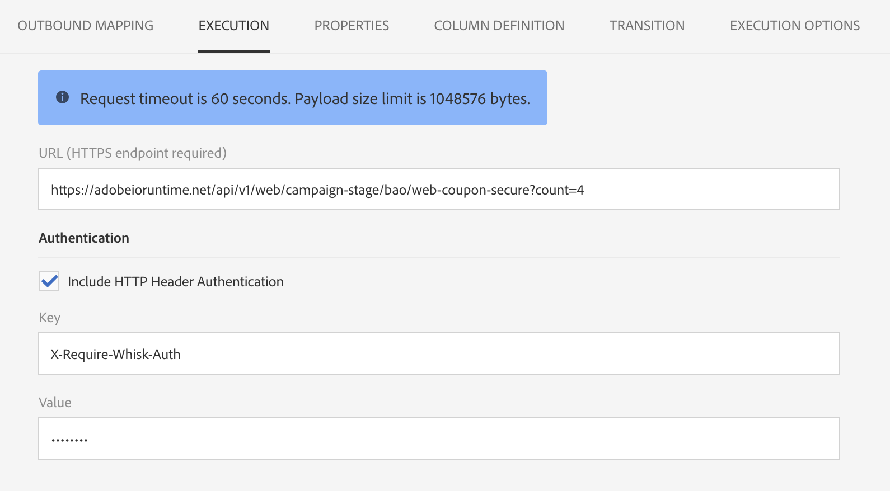
    1. In the **column definition** tab, add a new column called **code** that will store the code value.
        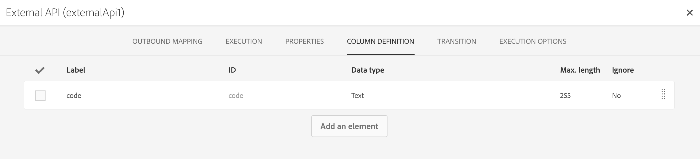
    1. Enabled an **outbound transition** to manage request failures.
1. Drag and drop a **Query** activity
    1. Configure the **Target** tab to query all the **@adobe.com** email. For different Query samples, refer to the [Query](../../automating/using/query.md) section.
    1. In the **additional data** tab, add a new column based on **rowId()** function. This additional column allows you to reconciliate coupon code with the profile ID..
        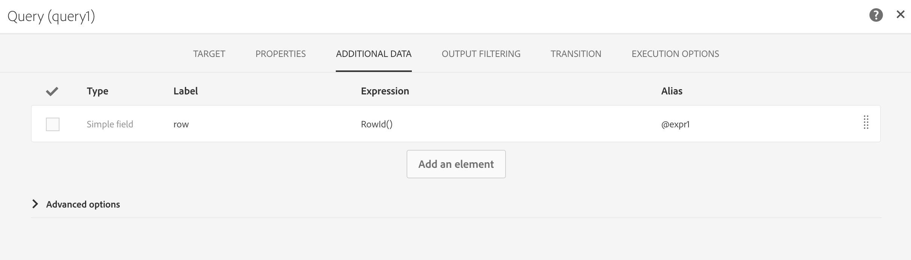

        >[!NOTE]
        >
        >This reconciliation approach means that the profile query number is equal to the number of coupon values returned by the REST call.
1. Once this two activities are configured, drag and drop an **Enrichment** activity to associate coupon values with profiles.
    1. Select the previous Query activity in the **primarySet** field.
        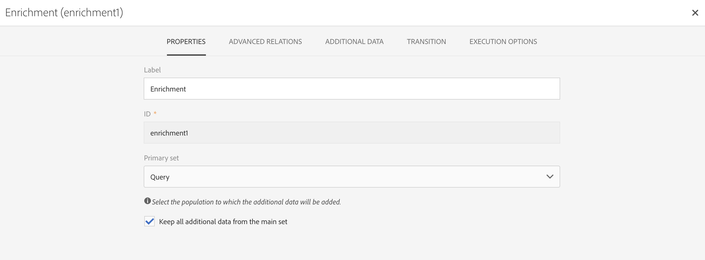
    1. Create a new relation in the **Advanced relations** tab, and add the following reconciliation criteria:
    1. **@expr1** coming grom the Query activity in the source expression field.
    1. **@lineNum** as an expression that returns the line number for each coupon value in the destination field.
        
        More information on the enrichment activity are available [here](../../automating/using/enrichment.md)

    1. The transition **Data Structure** will contain:
        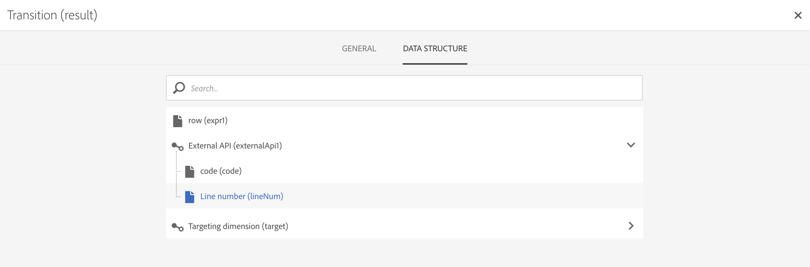
1. Finally drag and drop a **Send via Email** activity.
    You can modify your email template by adding the **code** personnalized field.

-->
