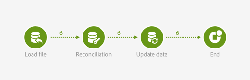
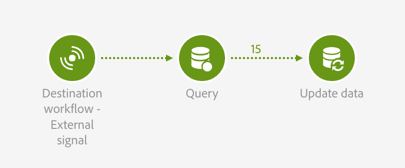

# External signal{#external-signal}

## Description {#description}


The **[!UICONTROL External signal]** activity triggers a workflow when some conditions are successfully met in another workflow or from a REST API call.

## Context of use {#context-of-use}

The **[!UICONTROL External signal]** activity is used to organize and orchestrate different processes that are part of the same customer journey into different workflows. It allows to start one workflow from another, enabling to support more complex customer journeys, while being able to better monitor and react in case of issue.

The **[!UICONTROL External signal]** activity is designed to be placed as the first activity of a workflow. It can be triggered from the **[!UICONTROL End]** activity of another workflow or from a REST API call (for more on this, refer to the [API documentation](../../api/using/managing-workflows.md)).

When triggered, external parameters can be defined and be available in the workflow events variables. The process to call a workflow with external parameters is detailed in [this section](../../automating/using/calling-a-workflow-with-external-parameters.md).

>[!NOTE]
>
>The activity cannot be triggered more often than every 10 minutes.

Note that an **[!UICONTROL External signal]** activity can be triggered from several different events. In that case, the **[!UICONTROL External signal]** is triggered as soon as one of the source workflows or API call is executed. It does not require that all source workflows are finished.

## Configuration {#configuration}

When configuring an external signal, it is important to first configure the **[!UICONTROL External signal]** activity in the destination workflow. Once this configuration is done, the **[!UICONTROL External signal]** activity of this workflow becomes available to configure the **[!UICONTROL End]** activity of the source workflow.

1. Drag and drop an **[!UICONTROL External signal]** activity into your destination workflow.
1. Select the activity, then open it using the  button from the quick actions that appear.
1. Edit the label of the activity. This label is needed when configuring the source workflow that triggers the **[!UICONTROL External signal]**.

   If you want to call the workflow with parameters, use the **[!UICONTROL Parameters]** area to declare them. For more on this, refer to [this section](../../automating/using/calling-a-workflow-with-external-parameters.md#declaring-the-parameters-in-the-external-signal-activity).

   

1. Confirm the configuration of your activity, add any other activity you need and save your workflow.

   >[!NOTE]
   >
   >If you want to trigger the destination workflow from another workflow, proceed with the following steps. If you want to trigger the destination workflow from a REST API call, consult the [API documentation](../../api/using/managing-workflows.md) to get more details.

1. Open the source workflow and select an **[!UICONTROL End]** activity. If there is no **[!UICONTROL End]** activity available, add one after the last activity of a branch of the workflow.

   Some activities do not have any outbound transition by default. From the **[!UICONTROL Properties]** tab of these activities, you can add an outbound transition.

   For example, in an **[!UICONTROL Update data]** activity, go to the **[!UICONTROL Transitions]** tab and check the **[!UICONTROL Add an outbound transition without the population]** option. This option allows to add a transition that does not contain any data and do not consume any unnecessary space on your system. It is just used to connect the extra **[!UICONTROL End]** activity that triggers the destination workflow.

   

1. In the **[!UICONTROL External signal]** tab of the **[!UICONTROL End]** activity, select the destination workflow as well as the **[!UICONTROL External signal]** activity to trigger within that workflow.

   When you set an **[!UICONTROL End]** activity to trigger another workflow, its icon is updated with an additional signal symbol.

   If you want to call the workflow with parameters, use the **[!UICONTROL Parameters and values]** area. For more on this, refer to [this section](../../automating/using/calling-a-workflow-with-external-parameters.md#defining-the-parameters-when-calling-the-workflow).

   

1. Save the source workflow.

Once the **[!UICONTROL End]** activity of the source workflow or the REST API call is executed, the destination workflow is automatically triggered from the **[!UICONTROL External signal]** activity.

>[!NOTE]
>
>The destination workflow must be started manually before it can be triggered. When started, the **[!UICONTROL External activity]** is activated and waits for the signal from the source workflow.

## Example {#example}

The following example illustrates the **[!UICONTROL External signal]** activity in a typical use case. A data import is performed in a source workflow. Once the import is done and the database updated, a second workflow is triggered. This second workflow is used to update an aggregate on the imported data.

The source workflow is presented as follows:

* A [Load file](../../automating/using/load-file.md) activity uploads a file containing new purchase data. Note that the [database has been extended](../../developing/using/data-model-concepts.md) accordingly as purchase data are not present by default in the datamart.

  For example:

  ```
  tcode;tdate;customer;product;tamount
  aze123;21/05/2015;dannymars@example.com;A2;799
  aze124;28/05/2015;dannymars@example.com;A7;8
  aze125;31/07/2015;john.smith@example.com;A7;8
  aze126;14/12/2015;john.smith@example.com;A10;4
  aze127;02/01/2016;dannymars@example.com;A3;79
  aze128;04/03/2016;clara.smith@example.com;A8;149
  ```

* A [Reconciliation](../../automating/using/reconciliation.md) activity creates the links between the imported data and the database so that the transactions data are properly connected to profiles and products.
* An [Update data](../../automating/using/update-data.md) activity inserts and updates the Transactions resource of the database with the incoming data.
* An **[!UICONTROL End]** activity triggers the destination workflow, which is used to update aggregates.



The destination workflow is presented as follows:

* An **[!UICONTROL External signal]** activity waits for the source workflow to be successfully finished.
* A [Query](../../automating/using/query.md#enriching-data) activity targets profiles and enrich them with a collection set to retrieve the last purchase date.
* An [Update data](../../automating/using/update-data.md) activity stores the additional data in a dedicated custom field. Note that the profile resource has been extended to add the **Last purchase date** field.



