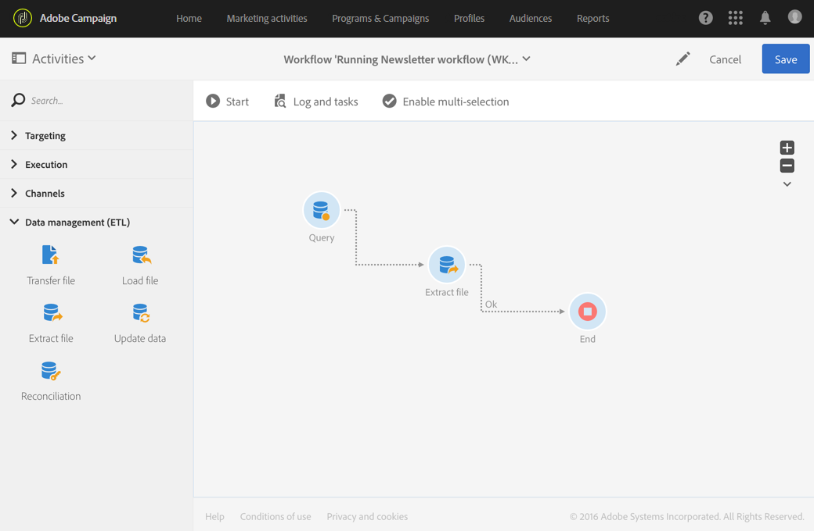
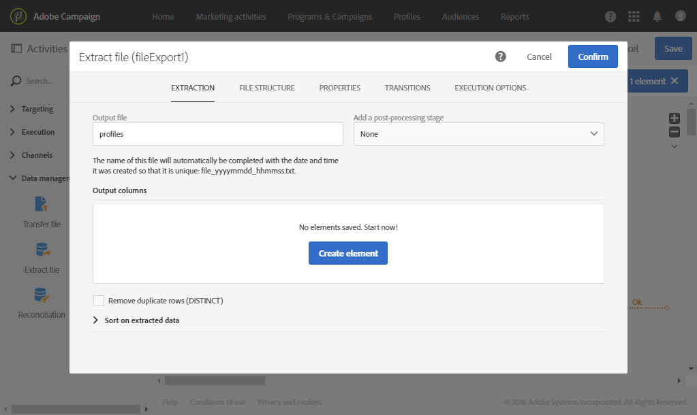
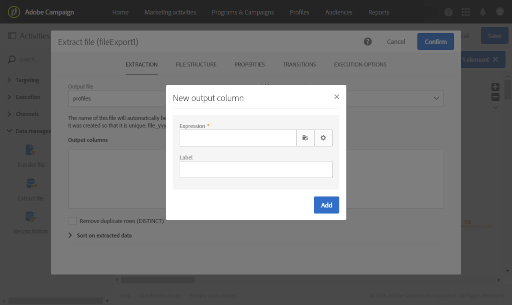
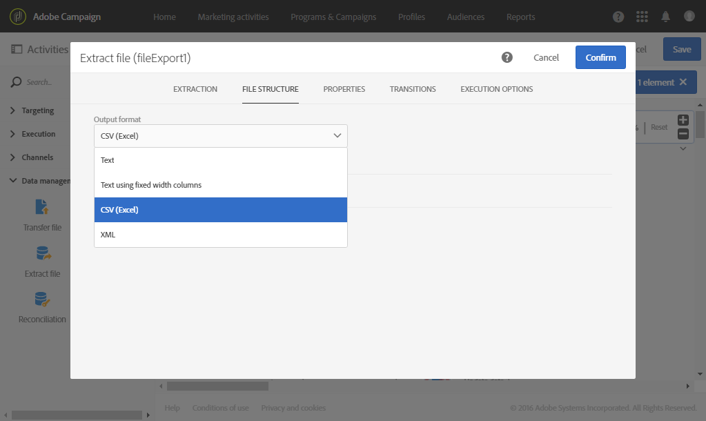
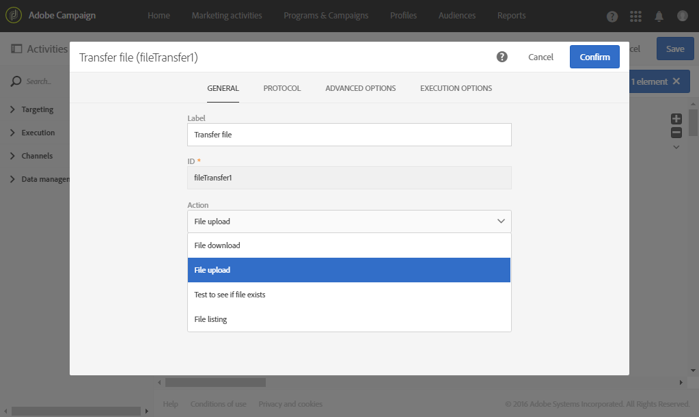

# Extract file

Extract file

## Description

The **Extract file** activity allows you to export data from Adobe Campaign in the form of an external file.

## Context of use

The way in which the data will be extracted is defined when configuring the activity.

>[!CAUTION]
>
>The **Extract file** activity must be placed after a **Query** activity in order to be used.

## Configuration

1. Drag and drop an **Extract file** activity into your workflow.

   

1. Select the activity, then open it using the  

   button from the quick actions that appear.
1. Enter the label of the **Output file**. The label of the file will automatically be completed with the date and time it was created so that it is unique. For example: recipients_20150815_081532.txt for a file generated the 15th of August 2015 at 08:15:32.
1. If you like, you can zip the output file by selecting **Compression** in the **Add a pre-processing step** field. The output file will be compressed into a GZIP file (.gz).
1. Click the   or **Add an element** button to add an output column.

   

   A new window will open.

   

1. Enter an expression. To do this, you can select an existing expression or create a new one using the **expression editor**.
1. Confirm your expression.

   The expression is added to the output columns.

1. Create as many columns as you need. You can edit columns by clicking their expressions and labels.

   If you are exporting profiles and want to use them in an external tool, make sure you export a unique identifier. By default, not all profiles have a unique identifier, depending on the way they are added to the database. For more information, refer to the [Generating a unique ID for profiles](../../developing/using/generating-a-unique-id-for-profiles-and-custom-resources.md) section.

1. Click the **File structure** tab to configure the output, date, and number formats for the file that will be exported.

   Check the **Export labels instead of internal values of enumerations** option in case you export enumeration values. This option allows to retrieve shorter labels that are easy to understand instead of IDs.

1. Confirm the configuration of your activity and save your workflow.

## Example

The following example illustrates how to configure an **Extract file** activity after a **Query** activity.

The aim of this workflow is to export a list of profiles in the form of an external file so that the data can be used outside of Adobe Campaign.

1. Drag and drop an **Extract file** activity into your workflow and place it after the **Query** activity.

   In this example, the query is carried out on all profiles aged 18 to 30.

1. Open the Extract file activity to edit it.
1. Name the output file.
1. Add output columns.

   In this example, the email, age, date of birth, first name and last name of the profiles are added as output columns.

   

1. Click the **File structure** tab to define:

    * CSV output format
    
      

    * Date format
    
      

1. Confirm your activity.
1. Drag and drop a **Transfer file** activity after the **Extract file** activity to recover the extract file on an external account.
1. Open the activity and choose the **File upload** action.

   

1. Select the external account and enter the path of the folder on the server.

   

1. Confirm your activity and save your workflow.
1. Start the workflow.

   When the workflow has been executed correctly, the extracted file is available on the external account.

