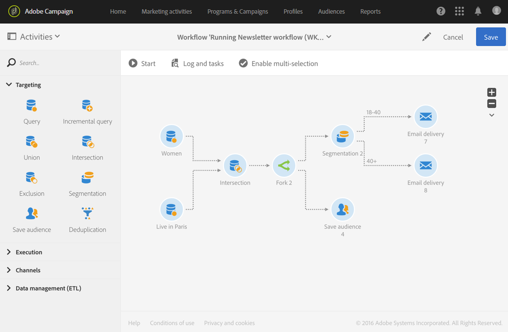

# Fork{#fork}

## Description {#description}

The **[!UICONTROL Fork]** activity allows you to create outbound transitions to start several activities at the same time.

## Context of use {#context-of-use}

The **[!UICONTROL Fork]** activity allows you to carry out several different activities independently within the same workflow.

## Configuration {#configuration}

1. Drag and drop a **[!UICONTROL Fork]** activity into your workflow.
1. Connect it to the other activities that come before it, such as queries.
1. Select the activity, then open it using the  button from the quick actions that appear.
1. Specify the number of outbound transitions by creating, deleting or duplicating them. You can also attribute a name and a label to them.
1. Confirm the configuration of your activity and save your workflow.

## Example {#example}

The following example shows an intersection of two query activities that target profiles from the Adobe Campaign database, in this case, women living in Paris. The fork activity therefore allows you to use several activities at the same time: one that saves the audience to remember the calculated population, and another that segments the population to send two different emails with a targeted content for each segment. The first email is sent to Parisian women aged between 18 and 40 and another targeting Parisian women aged over 40.

