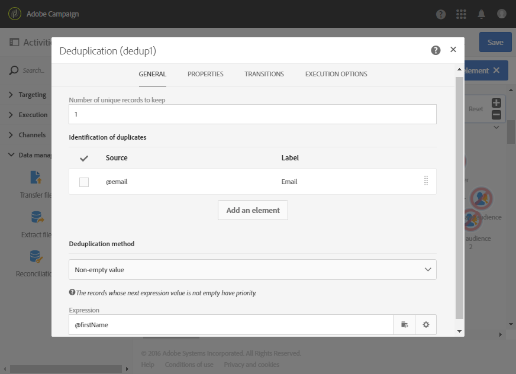

# Identifying duplicates before a delivery {#identifying-duplicates-before-a-delivery}

The following example illustrates a deduplication that lets you exclude the duplicates of a target before sending an email. This means you avoid sending a communication several times to the same profile.

For more on how to use the **[!UICONTROL Deduplication]** activity, refer to [this section](../../automating/using/deduplication.md).

The workflow is made up of:

* A **[!UICONTROL Query]** which allows you to define the target of the email. Here, the workflow targets all profiles aged between 18 and 25 that have been in the client database for more than a year.

  

* A **[!UICONTROL Deduplication]** activity, which allows you to identify the duplicates that come from the preceding query. In this example, only one record is saved for each duplicate. The duplicates are identified using the email address. This means that the email delivery can only be sent once for each email address to be present in the targeting.

  The deduplication method selected is **[!UICONTROL Non-empty value]**. This allows you to ensure that amongst the records kept in case of duplicates, priority is given to those in which the **First name** has been provided. This will make it more coherent if the first name is used in the personalization fields of the email content.

  In addition, an extra transition is added to keep the duplicates and to be able to list them.

  

* An **[!UICONTROL Email delivery]** placed after the main outbound transition of the deduplication. The configuration for email deliveries is detailed in the [Email delivery](../../automating/using/email-delivery.md) section.
* A **[!UICONTROL Save audience]** activity placed after the additional transition of the deduplication to save the duplicates in a **Duplicates** audience. This audience can be reused to directly exclude its members from every email delivery.
