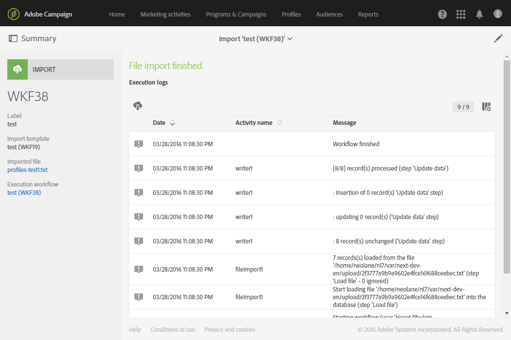

# Importing data with import templates{#importing-data-with-import-templates}

Importing data with import templates

Importing data allows you to collect data to feed your Campaign's database.

Alternatively to [Workflows](../../automating/using/discovering-workflows.md), Adobe Campaign offers a simplified import function that allows the user to manage certain types of import that were defined by an administrator.

The operating principle is as follows: an **administrator** defines and manages import templates (see [Defining import templates](../../automating/using/defining-import-templates.md)). These import templates are then made available to users with simplified views under the **[!UICONTROL Profiles & audiences]** > **[!UICONTROL Imports]** menu.

These users therefore just have to select the type of import they want to carry out and upload the file with the data to import. The workflow defined by the administrator is executed transparently for the user, who can access the details of the result of the import once it has finished.

>[!NOTE]
>
>Import data function can be managed by users with **[!UICONTROL GENERIC IMPORT (import)]** and **[!UICONTROL WORKFLOW (workflow)]** roles. For more on roles, refer to [this section](../../administration/using/list-of-roles.md).

Imports can be filtered according to the template from which they were executed, their execution date, and their execution status.

1. From the imports overview, click the **[!UICONTROL Create]** button. The wizard opens.
1. Select the type of import that you would like to carry out. The import types correspond to the available import templates.
1. If necessary, download the sample file linked to the template to your computer to view the data types expected in the file to be imported.
1. Download the file containing the data to import in the wizard.
1. Start the import. The wizard closes and takes you back to the list of imports carried out with the template used.
1. Refresh your page and select the import that you have just carried out to view the execution detail.

   

The details of the import execution are now available. Both the file that was imported, as well as the file containing the rejected data (data that was not imported), can be downloaded to your computer.
