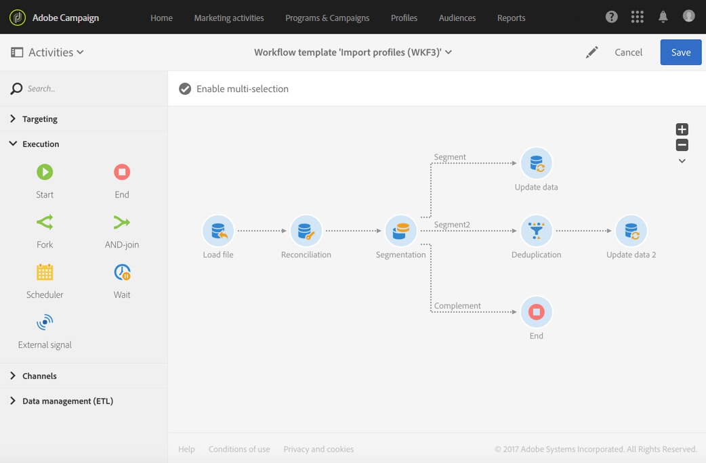
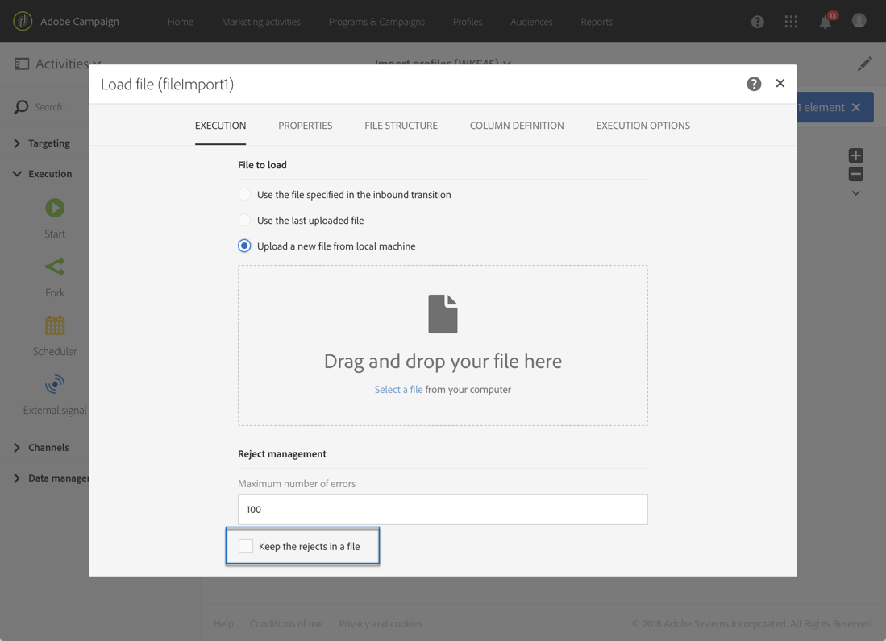
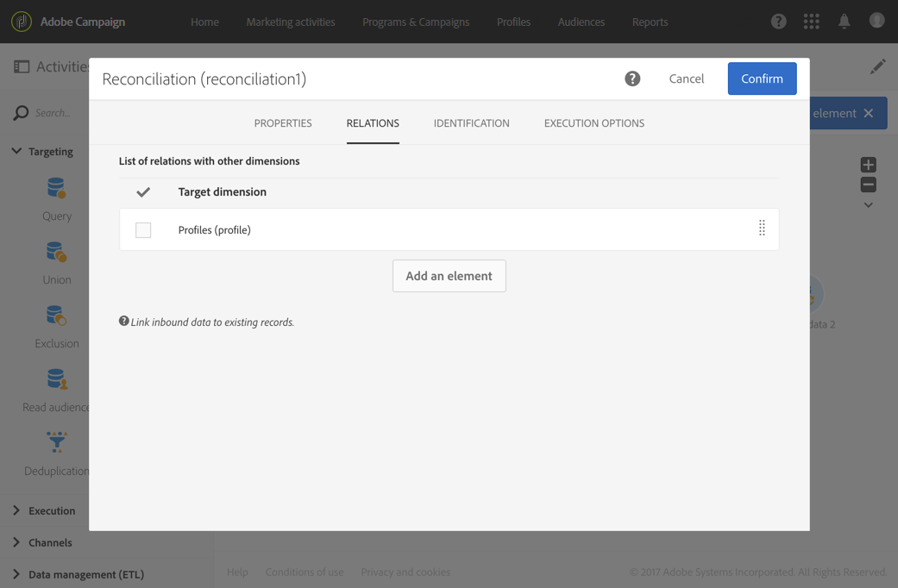
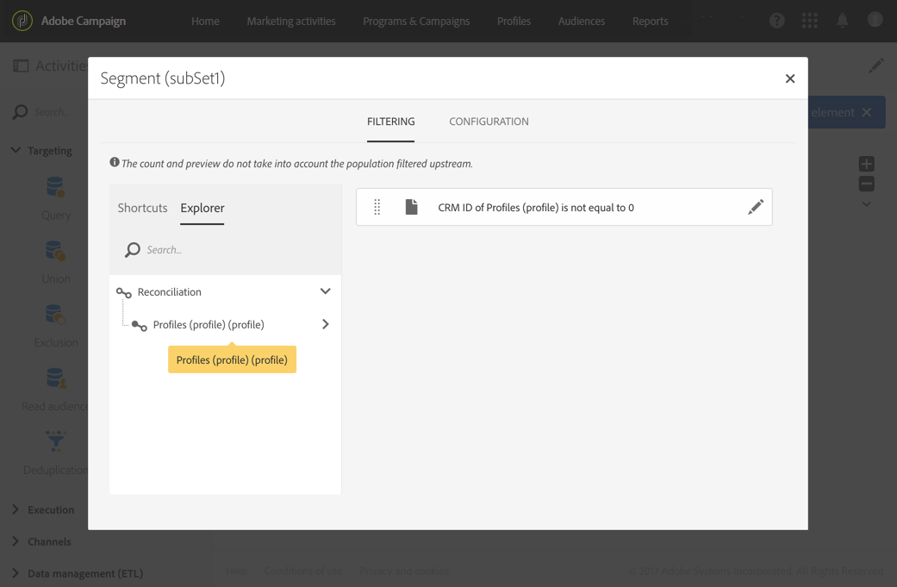
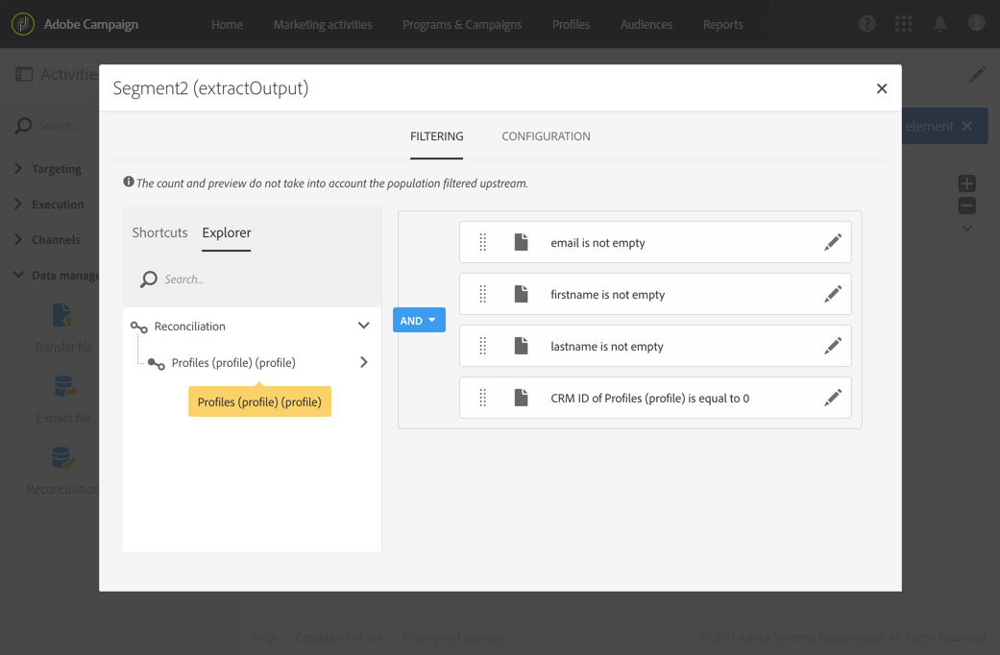
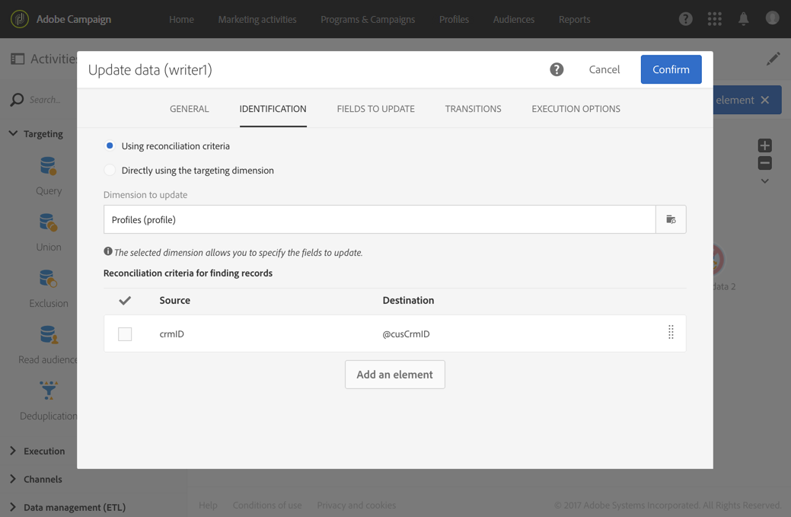
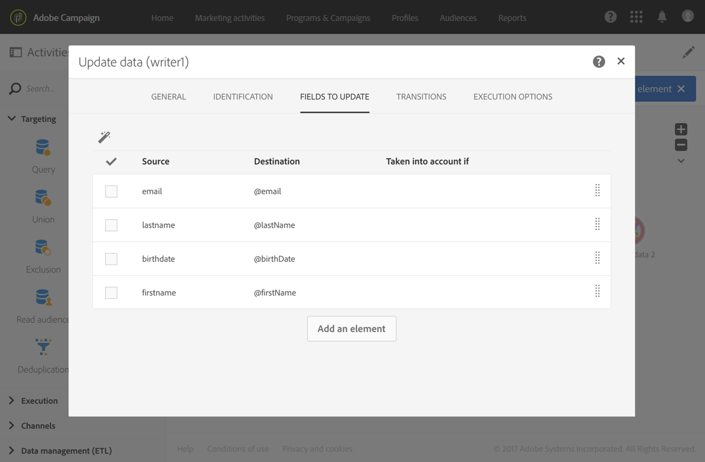
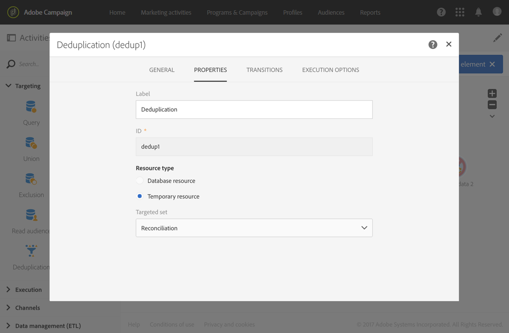
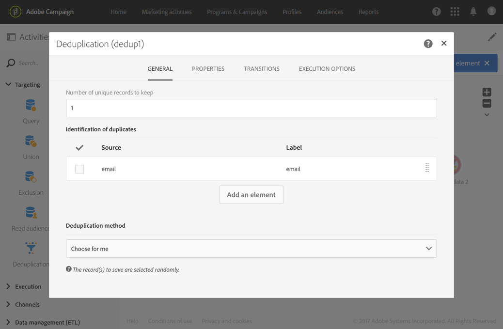
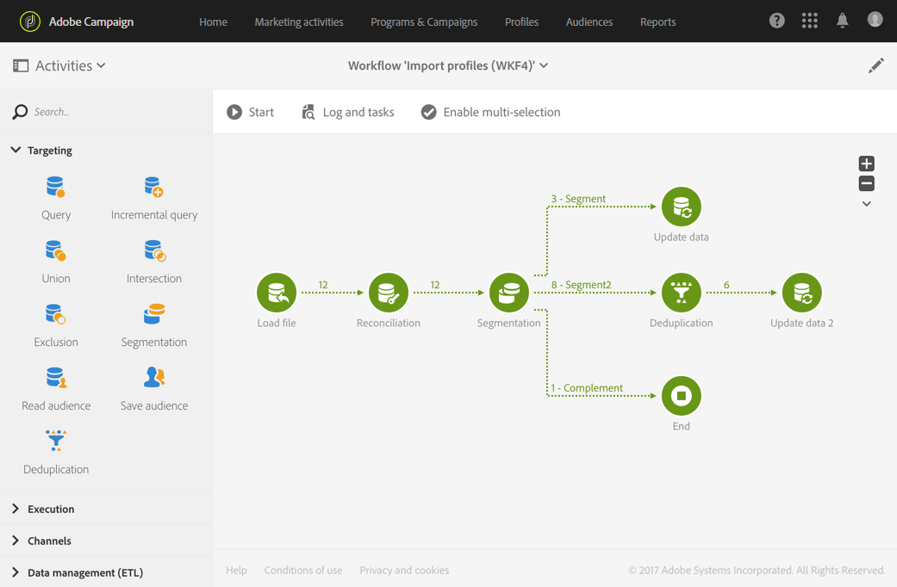

# Importing data{#importing-data}

Importing data

## Collecting data {#collecting-data}

You can collect data from a file to process it and/or to import it in the Adobe Campaign database.

* The **Load file** activity allows you to import data in one structured form to use this data in Adobe Campaign. The data is temporarily imported and another activity is necessary to definitively integrate it in the Adobe Campaign database.
* The **Transfer file** activity allows you to receive or send files, test whether there are files present, or list files in Adobe Campaign.

  You can use this activity before a **Load file** in case you need to retrieve the file from an external source.

## Import best practices {#import-best-practices}

Being cautious and following the few simple rules detailed below will help a lot in ensuring data consistency within the database and in avoiding common errors during database update or data exports.

### Using import templates {#using-import-templates}

Most import workflows should contain the following activities: **Load file**, **Reconciliation**, **Segmentation**, **Deduplication**, **Update data**.

Using import templates makes it very convenient to prepare similar imports and ensure data consistency within the database.

In many projects, imports are built without **Deduplication** activity because the files used in the project do not have duplicates. Duplicates sometimes appear from importing different files. De-duplication is then difficult. Therefore a deduplication step is a good precaution in all import workflows.

Do not rest on assumption that the incoming data is consistent and correct, or that the IT department or Adobe Campaign supervisor will take care of it. During the project, keep the data cleansing in mind. Deduplicate, reconcile, and maintain consistency when you import data.

An example of a generic workflow template designed for importing data is available in the [Example: Import workflow template](../../automating/using/importing-data.md#example--import-workflow-template) section.

>[!NOTE]
>
>You can also use [import templates](../../automating/using/importing-data-with-import-templates.md). They are workflow templates defined by an administrator that, once activated, only offer the possibility to specify the file containing the data to import.

### Using flat file formats {#using-flat-file-formats}

The most efficient format for imports is flat files. Flat files can be imported in bulk mode at the database level.

For example:

* Separator: tab or semicolon
* First line with headers
* No string delimiter
* Date format: YYYY/MM/DD HH:mm:SS

Example of file to import:

```
lastname;firstname;birthdate;email;crmID
Smith;Hayden;23/05/1989;hayden.smith@example.com;124365
Mars;Daniel;17/11/1987;dannymars@example.com;123545
Smith;Clara;08/02/1989;hayden.smith@example.com;124567
Durance;Allison;15/12/1978;allison.durance@example.com;120987
```

### Using compression {#using-compression}

Use zipped files for imports and exports when possible. GZIP is supported by default. You can add pre-processing when importing files or post-processing when extracting data, respectively in the **Load file** and **Extract file** workflow activities.

### Importing in Delta mode {#importing-in-delta-mode}

Regular imports must be done in delta mode. It means that only modified or new data is sent to Adobe Campaign, instead of the whole table every time.

Full imports should be used for initial load only.

### Maintaining consistency {#maintaining-consistency}

To maintain data consistency in the Adobe Campaign database, follow the principles below:

* If the imported data matches a reference table in Adobe Campaign, then it should be reconciled with that table in the workflow. Records that do not match should be rejected.
* Ensure that the imported data is always **"normalized"** (email, phone number, direct mail address) and that this normalization is reliable and will not change over the years. If this is not the case, some duplicates are likely to appear in the database, and as Adobe Campaign does not provide tools to do "fuzzy" matching, it will be very difficult to manage and remove them.
* Transactional data should have a reconciliation key and be reconciled with the existing data in order to avoid creating duplicates.
* **Import related files in order**. If the import is composed of multiple files that depend on each other, the workflow should make sure that the files are imported in the correct order. When a file fails, the other files are not imported.
* **Deduplicate**, reconcile, and maintain consistency when you import data.

## Example: Import workflow template {#example-import-workflow-template}

Using an import template is a best practice if you need to regularly import files with the same structure.

This example shows how to pre-set a workflow that can be reused for importing profiles coming from a CRM in the Adobe Campaign database.

1. Create a new workflow template from **Resources &gt; Templates &gt; Workflow templates**.
1. Add the following activities:

    * **Load file**: Define the expected structure of the file containing the data to import.

      >[!NOTE]
      >
      >You can only import data from a single file. If the workflow has multiple **Load file** activities, the same file will be used each time.

    * **Reconciliation**: Reconcile the imported data with database data.
    * **Segmentation**: Create filters to process records differently depending on whether they could be reconciled or not.
    * **Deduplication**: Deduplicate the data from the incoming file before it is inserted in the database.
    * **Update data**: Update the database with the imported profiles.

   

1. Configure the **Load file** activity:

    * Define the expected structure by uploading a sample file. The sample file should contain only a few lines but all the columns necessary for the import. Check and edit the file format to make sure that the type of each column is set correctly: text, date, integer, etc. For example:

      ```    
      lastname;firstname;birthdate;email;crmID
      Smith;Hayden;23/05/1989;hayden.smith@mailtest.com;123456
      ```

    * In the **File to load** section, select **Upload a new file from the local machine** and leave the field blank. Each time a new workflow is created from this template, you can specify here the file you want, as long at it corresponds to the defined structure.

      You can use any of the options but you have to modify the template accordingly. For example, if you select **Use the file specified in the inbound transition**, you can add a **File Transfer** activity before to retrieve the file to import from a FTP/SFTP server.

      If you want users to be able to download a file containing errors that occurred during an import, check the **Keep the rejects in a file** option and specify the **File name**.
    
      

1. Configure the **Reconciliation** activity. The purpose of this activity in this context is to identify the incoming data.

    * In the **Relations** tab, select **Create element** and define a link between the imported data and the recipients targeting dimension (see [Targeting dimensions and resources](../../automating/using/query.md#targeting-dimensions-and-resources)). In this example, the **CRM ID** custom field is used to create the join condition. Use the field or combination of fields you need as long it allows to identify unique records.
    * In the **Identification** tab, leave the **Identify the document from the working data** option unchecked.

   

1. Configure the **Segmentation** activity to retrieve reconciled recipients in one transition and recipients that could not be reconciled but who have enough data in a second transition.

   The transition with reconciled recipients can then be used to update the database. The transition with unknown recipients can then be used to create new recipient entries in the database if a minimum set of information is available in the file.

   Recipients that cannot be reconciled and do not have enough data are selected in a complement outbound transition and can be exported in a separate file or simply ignored.

    * In the **General** tab of the activity, set the **Resource type** to **Temporary resource** and select **Reconciliation** as the targeted set.
    * In the **Advanced options** tab, check the **Generate complement** option to be able to see if any record cannot be inserted in the database. If you need, you can then apply further processing to the complementary data: file export, list update, etc.
    * In the first segment of the **Segments** tab, add a filtering condition on the inbound population to select only records for which the profile's CRM ID is not equal to 0. This way, data from the file that are reconciled with profiles from the database are selected in that subset.
    
      

    * Add a second segment that selects unreconciled records that have enough data to be inserted in the database. For example: email address, first name and last name. Records that are not reconciled have their profile's CRM ID value equal to 0.
    
      

    * All records that are not selected in the first two subsets are selected in the **Complement**.

1. Configure the **Update data** activity located after the first outbound transition of the **Segmentation** activity configured previously.

    * Select **Update** as **Operation type** since the inbound transition only contains recipients already present in the database.
    * In the **Identification** tab, select **Using reconciliation criteria** and define a key between the **Dimension to update** - Profiles in this case - and the link created in the **Reconciliation** activity. In this example, the **CRM ID** custom field is used.
    
      

    * In the **Fields to update** tab, indicate the fields from the Profiles dimension to update with the value of the corresponding column from the file. If the names of the file columns are identical or almost identical to the names of the recipients dimension fields, you can use the magic wand button to automatically match the different fields.
    
      

      >[!NOTE]
      >
      >If you plan on sending direct mails to these profiles, make sure to include a postal address as this information is essential to the direct mail provider. Also make sure that the **Address specified** box in your profiles' information is checked. To update this option from a workflow, simply add an element to the fields to update, and specify **1** as **Source** and select the **[postalAddress/@addrDefined]** field as **Destination**. For more on direct mail and the use of the **Address specified** option, see [this document](../../channels/using/about-direct-mail.md#recommendations).

1. Configure the **Deduplication** activity located after the transition containing unreconciled profiles:

    * In the **Properties** tab, set the **Resource type** to the temporary resource generated from the **Reconciliation** activity of the workflow.
    
      

    * In this is example, the email field is used to find unique profiles. You can use any field you are sure is filled and part of a unique combination.
    * Choose a **Deduplication method**. In this case, the application decides automatically which records are kept in case of duplicates.

   

1. Configure the **Update data** activity located after the **Deduplication** activity configured previously.

    * Select **Insert only** as **Operation type** since the inbound transition only contains profiles not present in the database.
    * In the **Identification** tab, select **Using reconciliation criteria** and define a key between the **Dimension to update** - Profiles in this case - and the link created in the **Reconciliation** activity. In this example, the **CRM ID** custom field is used.
    
      

    * In the **Fields to update** tab, indicate the fields from the Profiles dimension to update with the value of the corresponding column from the file. If the names of the file columns are identical or almost identical to the names of the recipients dimension fields, you can use the magic wand button to automatically match the different fields.
    
      

      >[!NOTE]
      >
      >If you plan on sending direct mails to these profiles, make sure to include a postal address as this information is essential to the direct mail provider. Also make sure that the **Address specified** box in your profiles' information is checked. To update this option from a workflow, simply add an element to the fields to update, and specify **1** as **Source** and select the **[postalAddress/@addrDefined]** field as **Destination**. For more on direct mail and the use of the **Address specified** option, see [this document](../../channels/using/about-direct-mail.md#recommendations).

1. After the third transition of the **Segmentation** activity, add a **Extract file** activity and a **File transfer** activity if you want to keep track of data not inserted in the database. Configure those activities to export the column you need and to transfer the file on a FTP or SFTP server where you can retrieve it.
1. Add an **End** activity and save the workflow template.

The template can now be used and is available for every new workflow. All is needed is then to specify the file containing the data to import in the **Load file** activity.



